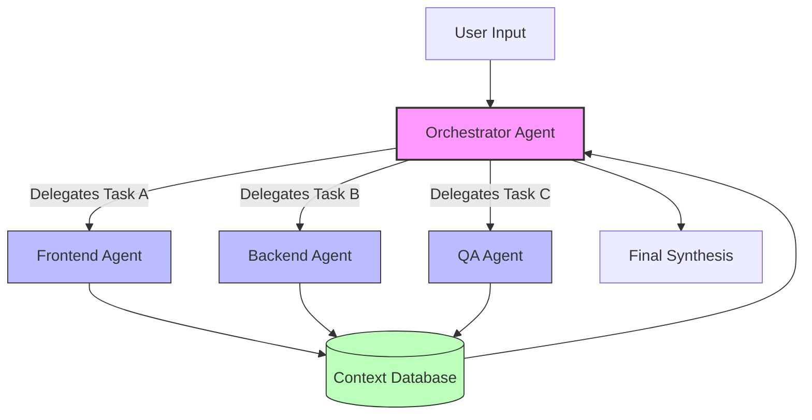

> 📦 [best-practise](../README.md) / 📄 [docs](./)

# 🤖 AI Agent Orchestration Production-Ready Best Practices

In 2026, building effective software demands mastering **AI Agent Orchestration**. This document outlines the **best practices** for designing, scaling, and maintaining autonomous multi-agent systems to ensure predictable outputs in zero-approval environments.

## 🌟 The Rise of Infinite Knowledge Engines

AI Agent Orchestration involves coordinating multiple specialized agents to solve complex tasks. Unlike single-agent systems, orchestration frameworks leverage isolated agents with strict constraints to increase fault tolerance and reduce hallucination.

### Key Orchestration Paradigms

1. **Hierarchical Task Delegation:** A primary manager agent delegates sub-tasks to specialized worker agents.
2. **Swarm Intelligence:** Agents operate peer-to-peer, sharing context via a unified memory bus.
3. **Sequential Pipelines:** Agents act as stages in a pipeline, refining outputs progressively.

---

## 🏗️ Architectural Blueprints for Multi-Agent Systems

Designing robust AI systems requires treating agents as microservices. Each agent must have a defined lifecycle, strict input/output schemas, and deterministic fallback mechanisms.

### 📊 Agent Orchestration Comparison Matrix

| Orchestration Pattern | Complexity | Scalability | Best Use Case | Fault Tolerance |
| :--- | :--- | :--- | :--- | :--- |
| **Hierarchical Manager** | Medium | High | Complex problem solving | High (Manager can retry) |
| **Sequential Pipeline** | Low | Medium | Content generation, ETL | Low (Bottlenecks) |
| **Swarm / P2P** | High | Very High | Real-time negotiation | Very High |
| **Event-Driven Actors** | Very High | Extreme | System monitoring, IoT | Extreme |

### 🧠 System Data Flow (Mermaid Graph)

---

## ⚡ Performance Optimization for Vibe Coding

When orchestrating agents for "Vibe Coding," performance is critical. Agents should not block each other synchronously.

- **Asynchronous Execution:** Ensure worker agents run concurrently using Promises or background queues.
- **Context Pruning:** Agents should only receive relevant context to minimize token usage and latency.
- **Semantic Caching:** Cache common agent responses (using tools like Redis) to bypass expensive LLM calls for repetitive queries.

> [!NOTE]
> Ensure all orchestration logic is explicitly documented in the `AGENTS.md` file of your repository to align all human and machine contributors.

---

## 🛡️ Security and Constraint Enforcement

Agents with execution capabilities must be sandboxed.

- **Zero-Trust Memory:** Agents should authenticate when reading/writing to the shared memory bus.
- **Output Sanitization:** Always validate agent outputs against strict JSON schemas or TypeScript interfaces before executing them.

---

## 📝 Actionable Checklist for 2026 Readiness

- [ ] Transition from single-agent scripts to a robust Orchestration Framework (e.g., hierarchical or event-driven).
- [ ] Implement explicit input/output validation schemas for all agent interactions.
- [ ] Introduce semantic caching for frequently requested agent tasks.
- [ ] Establish a Shared Context Memory Database to eliminate redundant context passing.
- [ ] Ensure all AI-generated code follows the 'Zero-Approval' automated test pipeline before deployment.

[Back to Top](#-ai-agent-orchestration-production-ready-best-practices)