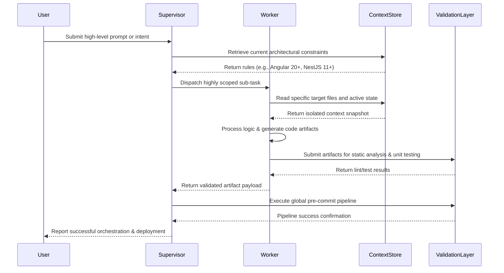

> 📦 [best-practise](../README.md) / 📄 [docs](./)

# 🤖 AI Agent Orchestration + Production-Ready Best Practices

In 2026, **AI Agent Orchestration** relies heavily on deterministic frameworks and strict **best practices**. This document defines the structural guidelines to ensure scalability and maintainability for multi-agent Vibe Coding architectures. Implementing a robust multi-agent system requires strict adherence to project topology, bounded contexts, and explicit state management mechanisms.

---

## 🏗️ Architectural Foundations

Orchestrating multiple AI agents requires a clear delineation of responsibilities, strict state management, and continuous validation. Agents must operate within bounded contexts, preventing scope creep and unhandled side effects. To achieve this, engineers must adopt deterministic patterns that standardize inputs, outputs, and intermediate states.

A primary pattern is the "Supervisor-Worker" model. In this architecture, a central supervisor agent acts as the primary orchestrator, delegating distinct sub-tasks to specialized worker agents. This paradigm ensures that complex, multifaceted operations are systematically broken down into manageable, testable units. Each worker agent executes its assigned task autonomously but reports back to the supervisor in a strictly typed, machine-readable format. This modularization mimics the Feature-Sliced Design (FSD) approach at the code generation level, ensuring that AI reasoning remains highly focused and precise.

Furthermore, integrating a unified context store allows all agents to share a single source of truth. Without a centralized memory mechanism, decentralized agents risk duplicating efforts, misinterpreting dependencies, or generating conflicting logic.

> [!IMPORTANT]
> Always provide an explicit Context Window definition for each agent. Agents lacking bounded context boundaries will hallucinate and deviate from the established architectural constraints, resulting in technical debt.

---

## 📊 Core Orchestration Components

The orchestration ecosystem consists of several critical layers that guarantee robust execution. Proper implementation of these components eliminates common pitfalls associated with autonomous AI generation pipelines.

| Component | Responsibility | Failure Consequence |
| :--- | :--- | :--- |
| **Supervisor Agent** | Task delegation, context routing, intent parsing, and result aggregation. | Total system failure, infinite loops, and execution halts. |
| **Worker Agents** | Specialized execution of scoped sub-tasks (e.g., UI generation, database schemas). | Component-level regressions, partial feature failure. |
| **Context Store** | Distributed memory holding active constraints and the global project state. | Hallucinations, incorrect architectural assumptions. |
| **Validation Layer** | Deterministic syntax checks, testing, and continuous integration evaluation. | Corrupted pipelines, undetected regressions, and deployment blockers. |

---

## 🔄 Agentic Data Flow

The lifecycle of a fully autonomous operation involves continuous feedback loops. Below is the standard sequence diagram for an autonomous Vibe Coding operation driven by a supervisor agent, illustrating the interaction between the system's core components.



---

## 💻 Implementation: Worker Agent Orchestration

Modern multi-agent orchestration demands highly optimized runtime environments. Industry standards mandate utilizing TypeScript 5.5+ and Node.js 24+ to ensure native performance, type safety, and memory efficiency. Below is a foundational implementation pattern for instantiating a deterministically bounded worker agent that interacts with the main context store.

```typescript
// Node.js 24+ / TypeScript 5.5+
import { randomUUID } from 'node:crypto';
import { AgentRunner, OrchestrationContext } from '@vibe-coding/orchestrator';

/**
 * ⚡ Performance Note: Instantiate worker agents asynchronously and execute tasks in parallel
 * when they are non-dependent. Utilize lightweight isolated environments (like WebContainers)
 * to avoid blocking the main event loop. Native Node 24 worker threads should be utilized
 * for heavy processing tasks to guarantee consistent application throughput.
 *
 * 🛡️ Security Note: Never expose raw environment variables directly to worker agents. Pass strictly
 * sanitized API keys and sandbox their filesystem access to the minimum required target directories.
 * Implement rigorous input validation to prevent prompt injection vectors.
 */
export async function spawnWorkerAgent(
    taskId: string,
    context: OrchestrationContext
): Promise<void> {
    const workerId = randomUUID();

    // Initialize the agent with strict architectural boundaries
    const runner = new AgentRunner({
        id: workerId,
        maxTokens: 8192,
        memoryAccess: 'read-only',
        allowedPaths: ['./frontend/src/features/', './backend/src/modules/'],
    });

    try {
        // Execute the isolated action
        const result = await runner.execute({
            intent: taskId,
            injectedContext: context,
            strictMode: true
        });

        console.log(`[Supervisor] Worker ${workerId} completed task ${taskId} successfully. Artifact size: ${result.bytes} bytes.`);
    } catch (error: unknown) {
        console.error(`[Supervisor] Critical failure in Worker ${workerId}:`, error);
        throw new Error('Agent execution systematically halted due to constraint violation.');
    }
}
```

---

## 📝 Actionable Checklist for Orchestration

To finalize your agent orchestration setup and guarantee enterprise-grade Vibe Coding compatibility, ensure you have meticulously completed the following steps:

- [ ] Define the Supervisor-Worker boundaries explicitly, ensuring no overlapping responsibilities.
- [ ] Implement a comprehensive Validation Layer to automatically test AI-generated code prior to any commit operations.
- [ ] Verify that Context Stores do not inadvertently leak sensitive environment variables to public logs.
- [ ] Ensure all independent agents adhere strictly to the project's visual formatting, SEO, and codebase constraint rules.
- [ ] Implement robust error boundaries, automatic retries, and fallback mechanisms to mitigate API rate limits and model degradation.
- [ ] Configure telemetry to monitor token usage and response latency across all active agents.

<br>

[Back to Top](#-ai-agent-orchestration--production-ready-best-practices)
