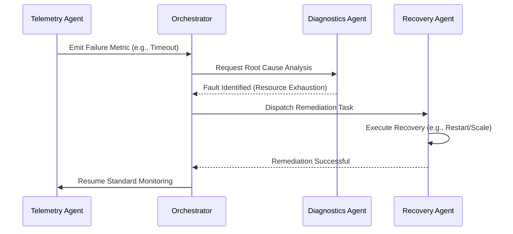

# 🤖 AI Agent Orchestration: Implementing Self-Healing Architectures

In the realm of AI Agent Orchestration, establishing best practices for self-healing architectures is non-negotiable. Self-healing systems autonomously detect, diagnose, and recover from failures, ensuring resilient and deterministic execution in complex Vibe Coding environments without human intervention.

## 📐 The Anatomy of Self-Healing Systems

A robust self-healing architecture integrates continuous monitoring, intelligent error detection, and autonomous remediation workflows. This approach minimizes downtime and prevents cascading failures across interdependent AI agents.

| Component | Responsibility | Failure Action |
| :--- | :--- | :--- |
| **Telemetry Agent** | Monitors system state and logs metrics. | Alerts Orchestrator |
| **Diagnostics Agent** | Analyzes error traces to find root causes. | Isolates fault domain |
| **Recovery Agent** | Executes remediation strategies. | Restores state/retries |
| **Orchestrator** | Coordinates multi-agent workflows. | Re-routes tasks |

---

## 🔄 Self-Healing Remediation Lifecycle



---

## 🛠️ The Pattern Lifecycle

### ❌ Bad Practice
Relying on unchecked, untyped error handling and manual intervention for agent failures.

```typescript
// Anti-pattern: Catching generic errors without remediation logic
async function executeAgentTask(taskData: any) {
  try {
    const result = await agent.run(taskData);
    return result;
  } catch (error: any) {
    console.error("Agent failed:", error.message);
    // Failure is logged but ignored; system remains degraded.
    return null;
  }
}
```

### ⚠️ Problem
> [!IMPORTANT]
> Using `any` undermines type safety, leading to unpredictable runtime behavior. When errors are simply logged without a recovery mechanism, the system becomes fragile. In AI Agent Orchestration, unhandled failures MUST lead to infinite loops, data corruption, or "hallucinations" propagating through the network.

### ✅ Best Practice
Implement structured error boundaries with explicit type guards and automated retry/fallback mechanisms.

```typescript
// Best Practice: Type-safe error handling with self-healing retries
interface TaskResult {
  success: boolean;
  data?: unknown;
}

interface AgentError extends Error {
  code: string;
  retryable: boolean;
}

function isAgentError(error: unknown): error is AgentError {
  return typeof error === 'object' && error !== null && 'code' in error;
}

async function executeAgentTaskWithHealing(taskData: unknown, retries = 3): Promise<TaskResult> {
  for (let attempt = 1; attempt <= retries; attempt++) {
    try {
      // Execute the task with explicit timeouts
      const result = await agent.runSafely(taskData);
      return { success: true, data: result };
    } catch (error: unknown) {
      if (isAgentError(error) && error.retryable && attempt < retries) {
        console.warn(`[Self-Healing] Attempt ${attempt} failed. Retrying in ${attempt * 1000}ms...`);
        await new Promise(resolve => setTimeout(resolve, attempt * 1000));
        continue;
      }

      // Dispatch Diagnostics Agent for fatal errors
      await dispatchDiagnostics(error);
      throw new Error("Agent task failed after exhaustive retries.");
    }
  }
  return { success: false };
}
```

### 🚀 Solution
By replacing `any` with `unknown` and utilizing type guards (`isAgentError`), we enforce strict compile-time checks, ensuring the orchestrator accurately interprets the error state. The exponential backoff loop acts as the primary recovery mechanism, while fatal errors are deterministically routed to a specialized Diagnostics Agent. This encapsulates failures, preventing them from destabilizing the global agent network.

> [!IMPORTANT]
> **Technical Boundary:** Self-healing mechanisms must have a deterministic threshold (e.g., maximum retries). Infinite retry loops without escalating to a human operator or a dedicated diagnostic agent violate Vibe Coding constraints by consuming infinite compute resources.

---

## ✅ Actionable Checklist
- [ ] Implement `unknown` types and explicit Type Guards for all external agent responses.
- [ ] Configure telemetry to track agent success rates and latency.
- [ ] Define explicit `retryable` criteria for transient errors (e.g., network timeouts).
- [ ] Map all fatal errors to automated diagnostic workflows before triggering human alerts.
- [ ] Ensure `sequenceDiagram` definitions lack `classDef` injections to maintain parsing integrity.

[🔝 Back to Top](#)
