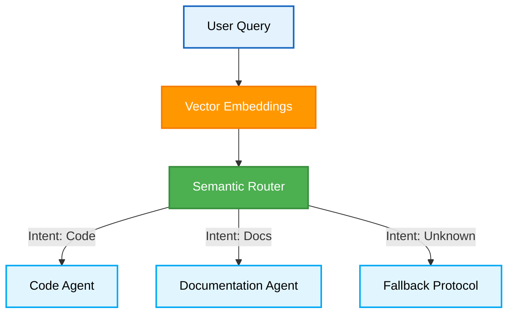
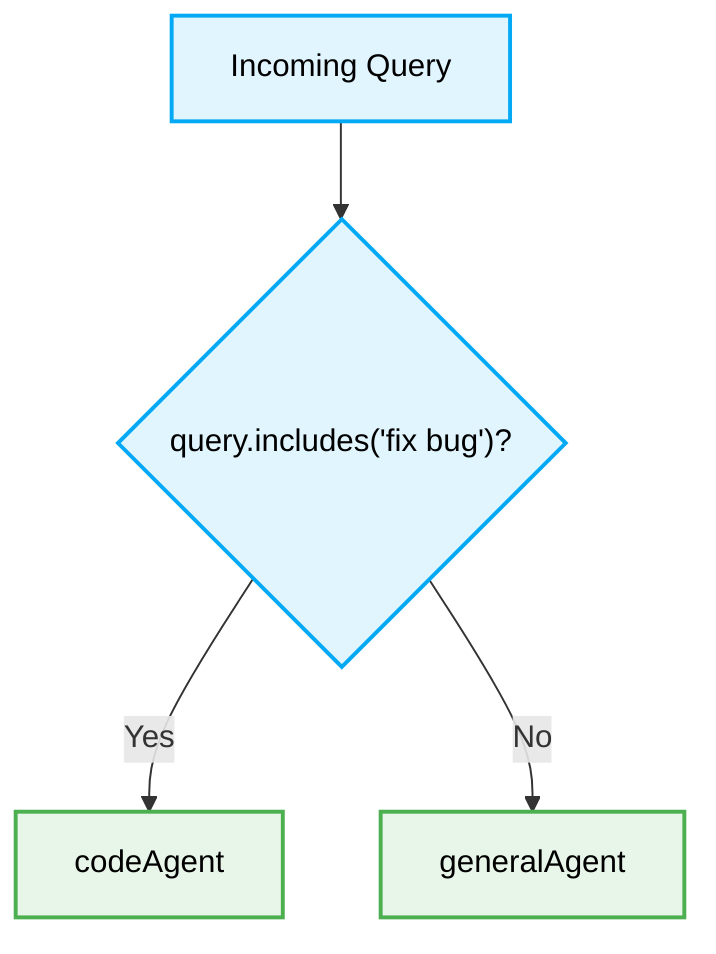

# 🤖 Semantic Routing High-Value Optimization

When configuring Semantic Routing for multi-agent systems, adhering to strict best practices ensures scalable and deterministic execution in AI agent orchestration.

> [!NOTE]
> Semantic Routing is critical for directing LLM queries to the appropriate agent or tool based on embedding proximity, rather than rigid keyword matching.

## 🏗️ Architectural Topology

A robust Semantic Routing architecture isolates intent detection from task execution.



---

## ⚖️ Configuration Constraints

The following constraints define the optimal state for routing systems.

| Component | Constraint | Fallback Strategy |
| :--- | :--- | :--- |
| **Embeddings Model** | Must be statically typed or version-locked | Local lightweight model |
| **Similarity Threshold** | `> 0.85` strictly enforced | Reroute to clarification loop |
| **Latency Limit** | `< 150ms` p95 | Cache frequent queries in Redis |

---

## 🔄 Intent Mapping Pattern

### ❌ Bad Practice

```typescript
function routeQuery(query: string) {
    // Rigid if-else logic fails with varied natural language
    if (query.includes('fix bug')) {
        return codeAgent(query);
    } else {
        return generalAgent(query);
    }
}
```



### ⚠️ Problem

Hardcoded keyword matching ignores semantic intent. It results in brittle routing logic that fails to scale with the complexity of user prompts, leading to high error rates and agent hallucinations when context is misaligned.

### ✅ Best Practice

```typescript
import { SemanticRouter } from 'semantic-router';

async function processQuery(query: unknown) {
    if (typeof query !== 'string') {
        throw new Error('Invalid query type');
    }

    // Leverage vector embeddings for intent classification
    const route = await SemanticRouter.classify(query, { threshold: 0.85 });

    if (route === 'CODE_FIX') {
        return codeAgent(query);
    }

    return generalAgent(query);
}
```

### 🚀 Solution

By utilizing vector embeddings and a dynamic similarity threshold, the system autonomously maps varied phrasing to the correct underlying intent. This guarantees deterministic routing paths and scales effortlessly across multi-agent environments.

---

> [!IMPORTANT]
> Always decouple the semantic router from the execution agents to allow independent scaling.

## ✅ Actionable Checklist

- [ ] Lock the embedding model version to prevent vector drift.
- [ ] Define explicit thresholds for semantic similarity.
- [ ] Implement a fallback agent for low-confidence routing scenarios.
- [ ] Cache highly frequent semantic matches using Redis.

[Back to Top](#)
