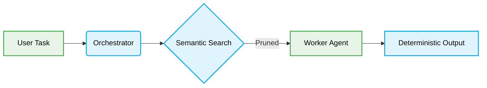

# 🤖 AI Agent Token Optimization Strategies

> 📦 [best-practise](../README.md) / 📄 [docs](./)

In 2026, efficient Token Optimization Strategies are MANDATORY for scaling Multi-Agent Systems. This guide ensures AI Agent Orchestration operates within optimal token limits.

## 1. Context Payload Inflation

### ❌ Bad Practice
```typescript
class Orchestrator {
  async run(task: string, db: Database) {
    const fullDatabaseDump = await db.getAllRecords();
    const prompt = `Solve this: ${task}. Context: ${JSON.stringify(fullDatabaseDump)}`;
    return await llm.predict(prompt);
  }
}
```

### ⚠️ Problem
Injecting unpruned global state into prompts causes immediate context window overflow, leading to unpredictable hallucinations, severe O(n) performance degradation, and massive token cost explosions.

### ✅ Best Practice
```typescript
class Orchestrator {
  async run(task: string, vectorDb: VectorDatabase) {
    const relevantEmbeddings = await vectorDb.query(task, { limit: 5 });
    const prompt = `Solve this: ${task}. Context: ${JSON.stringify(relevantEmbeddings)}`;
    return await llm.predict(prompt);
  }
}
```

### 🚀 Solution
Dynamically pruning context using Semantic Search and Vector databases explicitly limits the input to O(1) relevant context. This strict boundary MUST be enforced to guarantee deterministic outcomes and systemic stability.

> [!IMPORTANT]
> Agents MUST NOT be provided with unpruned context. Only retrieve the minimal viable context.

## 2. Process Flow


