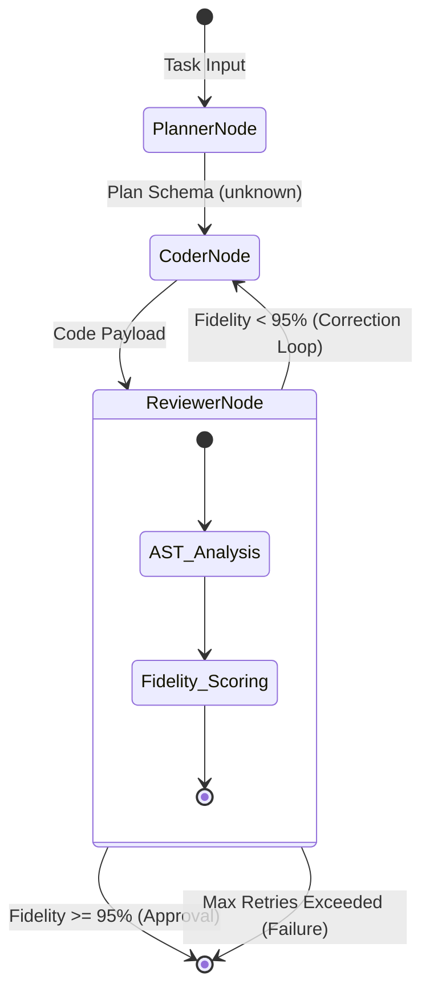

> 📦 [best-practise](../README.md) / 📄 [docs](./)

# 🤖 AI Agent Vibe Coding Graph Orchestration

In the 2026 AI Agent landscape, the transition from linear scripting to dynamic, graph-based orchestration is mandatory. Graph Orchestration enables complex, non-linear multi-agent workflows where agents act as nodes and context transitions act as strictly typed edges. This document establishes the absolute constraints for implementing high-fidelity Vibe Coding Graph Orchestration to ensure deterministic execution and systemic reliability.

---

## 🏗️ Architectural Foundations

Linear orchestrators fail when tasked with dynamic problem solving requiring parallel execution, cyclical reviews, or complex state routing. Graph orchestration models the entire AI agent ecosystem as a Directed Cyclic Graph (DCG) or Directed Acyclic Graph (DAG), enabling granular control over state transitions, context isolation, and parallel worker deployment.

### ❌ Bad Practice

```typescript
// Unstructured, linear agent chaining - prone to context overflow and silent failures
async function runLinearAgents(task: any) {
  const plan = await plannerAgent.run(task);
  // Linear chaining forces all context into the next agent
  const code = await coderAgent.run(plan);
  const testResults = await testerAgent.run(code);

  if (testResults.failed) {
    // Arbitrary retry logic without state bounds
    return coderAgent.run(testResults.errors);
  }
  return code;
}
```

### ⚠️ Problem

Linear agent orchestration creates rigid pipelines that cannot handle dynamic routing, conditional loops, or parallelized tasks. Injecting the entire accumulated context into each subsequent agent leads to "Context Explosion", resulting in non-deterministic hallucinations, degraded reasoning quality, and excessive token consumption. The lack of strict types (`any`) and unstructured retry loops causes cascading system failures.

### ✅ Best Practice

```typescript
import { StateGraph, END } from '@vibe-coding/graph-orchestrator';

// 1. Define Strict State schema
export interface GraphState {
  originalTask: string;
  plan: unknown | null;
  codePayload: unknown | null;
  fidelityScore: number;
  errors: unknown[];
}

// 2. Initialize the Graph
const workflow = new StateGraph<GraphState>({
  originalTask: '',
  plan: null,
  codePayload: null,
  fidelityScore: 0,
  errors: [],
});

// 3. Define Nodes (Agents)
workflow.addNode('planner', plannerAgent.execute);
workflow.addNode('coder', coderAgent.execute);
workflow.addNode('reviewer', reviewerAgent.execute);

// 4. Define Deterministic Edges (Routing)
workflow.addEdge('planner', 'coder');
workflow.addEdge('coder', 'reviewer');

// Conditional Routing based on deterministic state
workflow.addConditionalEdge(
  'reviewer',
  (state: GraphState) => {
    if (state.fidelityScore >= 95) return END;
    if (state.errors.length > 3) return END; // Circuit Breaker
    return 'coder'; // Cyclic Review Loop
  }
);

workflow.setEntryPoint('planner');
export const orchestratorApp = workflow.compile();
```

### 🚀 Solution

Implementing a **Graph-Based Orchestrator** explicitly defines nodes (Agents) and edges (Transitions). This architecture guarantees O(1) relevant context per node, as agents only consume the specific state fields they require. Utilizing conditional routing enables self-healing loops and circuit breakers. Replacing `any` with `unknown` enforces runtime validation, ensuring that state payloads are structurally sound before execution. This approach guarantees highly deterministic, resilient, and scalable AI workflows.

---

## 🔄 Graph Orchestration Topology

The following topology illustrates a production-ready Graph Orchestration pattern, emphasizing cyclic review loops and strict state validation boundaries.



---

## 📊 Vibe Coding Constraints

When deploying Graph Orchestrations, strict alignment with the environment is REQUIRED.

| Architecture Layer | Constraint Responsibility | Failure Consequence |
| :--- | :--- | :--- |
| **Node Execution** | Nodes MUST only mutate their isolated state fields. | Context corruption |
| **Edge Routing** | Conditional edges MUST return deterministic routing signals. | Infinite execution loops |
| **State Validation** | State updates MUST be validated against Type Guards (`unknown`). | Poisoned Graph State |
| **Circuit Breakers** | Cyclic edges MUST implement max-retry thresholds. | Exhausted token budgets |

> [!IMPORTANT]
> Graph nodes MUST NEVER communicate directly with one another. All data transfer MUST occur strictly through the mutation and retrieval of the centralized `GraphState` object to maintain architectural decoupling.

> [!NOTE]
> Ensure the Graph Orchestrator persists its state at each node transition. This provides a deterministic audit log, allowing the workflow to be resumed precisely from the point of failure if interrupted.

---

## 📝 Actionable Execution Checklist

To finalize your deterministic graph orchestrator implementation, complete the following:

- [ ] Define a rigorous `GraphState` interface, utilizing `unknown` for dynamic payloads.
- [ ] Implement nodes that cleanly ingest state and return partial state updates.
- [ ] Configure conditional edges with strict circuit-breaker logic (e.g., `maxRetries`).
- [ ] Map the Mermaid `stateDiagram-v2` execution paths to your automated test coverage.

<br>

[Back to Top](#-ai-agent-vibe-coding-graph-orchestration)
