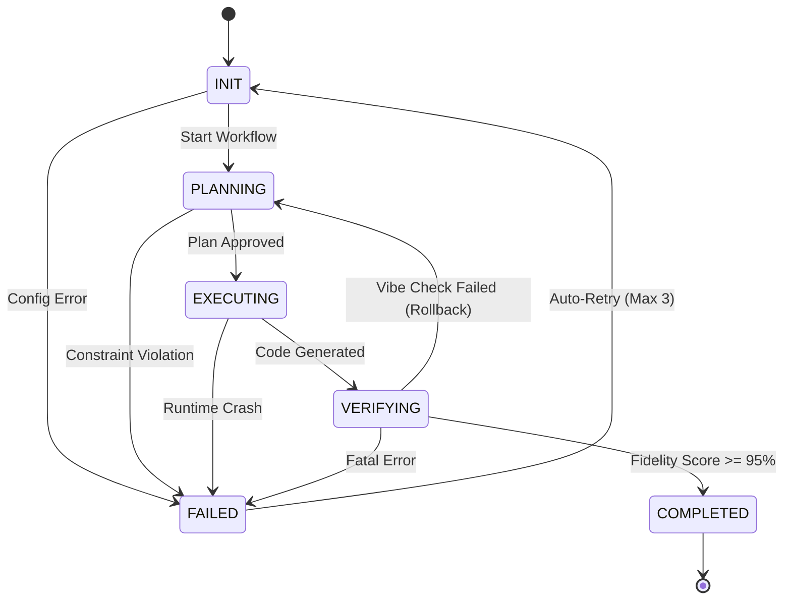

> 📦 [best-practise](../README.md) / 📄 [docs](./)

# 🤖 AI Agent Orchestration: Deterministic State-Space Transitions

In the 2026 AI Agent orchestration landscape, guaranteeing deterministic behavior across parallel multi-agent executions necessitates strict adherence to **Finite State Machine (FSM)** paradigms. This document specifies the architectural constraints for implementing high-fidelity State-Space Transitions to prevent runtime hallucinations and ensure systemic Vibe Coding stability.

---

## 🏗️ Architectural Foundations

When designing AI Agents to manage complex code generation or infrastructure deployment workflows, relying on unstructured, implicit state leads to catastrophic compounding errors. To mitigate this, engineers MUST enforce mathematically formal State-Space Transitions. A well-defined FSM ensures that agents operate only within explicitly permitted states, eliminating ambiguous behaviors.

### ❌ Bad Practice

```typescript
// Implicit, loosely-typed state transition - prone to hallucinations and non-deterministic flows
let agentStatus: any = 'INIT';

export function transitionAgent(newStatus: any, payload: any) {
  // Missing strict state constraints allows arbitrary transitions
  agentStatus = newStatus;
  console.log(`Transitioned to ${agentStatus}`, payload);
}
```

### ⚠️ Problem

Utilizing `any` and unconstrained string assignments creates a fragile state management layer. If a worker agent dynamically generates an invalid state (e.g., `'FAILED_WAITING'`), the system silently accepts it, bypassing error-handling logic. In distributed AI orchestration, this lack of validation causes cascading failures where subsequent agents misinterpret the context.

### ✅ Best Practice

```typescript
import { createStore } from '@vibe-coding/state';

export type AgentState = 'INIT' | 'PLANNING' | 'EXECUTING' | 'VERIFYING' | 'COMPLETED' | 'FAILED';

export interface StatePayload {
  actionId: string;
  metadata: unknown;
}

export const OrchestrationStore = createStore<{ state: AgentState, context: unknown }>({
  initialState: { state: 'INIT', context: null },
  strictMode: true,
});

export async function transitionAgent(newState: AgentState, payload: unknown): Promise<void> {
  const currentState = OrchestrationStore.getState().state;

  // Strict Validation logic using type guards and explicit matrices
  if (typeof payload === 'object' && payload !== null && 'actionId' in payload) {
    if (isValidTransition(currentState, newState)) {
        await OrchestrationStore.dispatch('UPDATE_STATE', { state: newState, context: payload });
    } else {
        throw new Error(`Invalid deterministic state transition from ${currentState} to ${newState}`);
    }
  } else {
    throw new Error('Invalid payload structure for state transition.');
  }
}

// Ensure deterministic transitions
function isValidTransition(current: AgentState, next: AgentState): boolean {
  const transitions: Record<AgentState, AgentState[]> = {
    'INIT': ['PLANNING', 'FAILED'],
    'PLANNING': ['EXECUTING', 'FAILED'],
    'EXECUTING': ['VERIFYING', 'FAILED'],
    'VERIFYING': ['COMPLETED', 'FAILED', 'PLANNING'], // Can rollback to planning
    'COMPLETED': [],
    'FAILED': ['INIT'], // Retry loop
  };
  return transitions[current].includes(next);
}
```

### 🚀 Solution

By formalizing the agent lifecycle into an explicit `AgentState` type and validating transitions against a deterministic matrix (`isValidTransition`), we guarantee execution boundaries. Replacing `any` with `unknown` and implementing Type Guards prevents payload-based context injection vulnerabilities. This provides an impenetrable guardrail, ensuring agents behave synchronously and deterministically.

---

## 🔄 State-Space Transition Flow

The following flow illustrates the permissible transitions an AI Agent must adhere to during Vibe Coding orchestration.



---

## 📊 Vibe Coding Constraints

When deploying this state machine, strict alignment with the environment is REQUIRED.

| Architecture Layer | Constraint Responsibility | Failure Consequence |
| :--- | :--- | :--- |
| **WorkerAgent** | Must only broadcast transitions matching the defined FSM. | Rejection by Supervisor |
| **ValidationLayer** | Guarantees deterministic structural shapes (`unknown` resolution). | Infinite retry loop |
| **ContextStore** | Centralized, immutable ledger tracking State-Space execution. | Synchronization deadlock |
| **Supervisor** | Implements the deterministic fallback/retry logic on `FAILED`. | Orphaned processes |

> [!NOTE]
> Ensure the Context Store persists transition logs asynchronously to allow human maintainers to audit AI Agent orchestration graphs.

> [!IMPORTANT]
> The `ValidationLayer` MUST reject any state change where `metadata` fails to pass rigorous Type Guards. Silent failures in state synchronization are strictly FORBIDDEN in Vibe Coding architectures.

---

## 📝 Actionable Execution Checklist

To finalize your deterministic state machine implementation, complete the following:

- [ ] Implement the `AgentState` union type and remove all string literals for states.
- [ ] Replace all loose `any` payloads with `unknown` and implement corresponding Zod/TypeGuard validation.
- [ ] Define the valid transition matrix inside your orchestrator supervisor logic.
- [ ] Map the Mermaid `stateDiagram-v2` execution paths to your automated test coverage.

<br>

[Back to Top](#-ai-agent-orchestration-deterministic-state-space-transitions)
