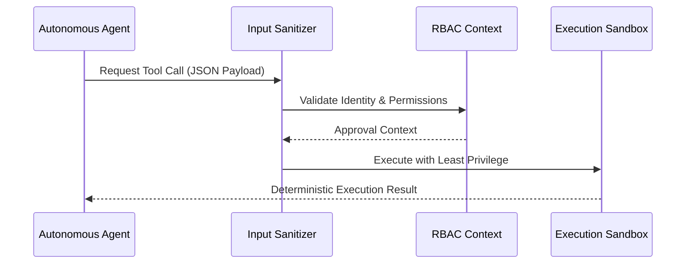
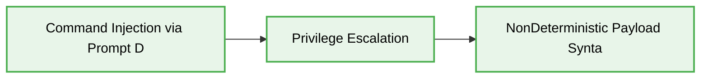
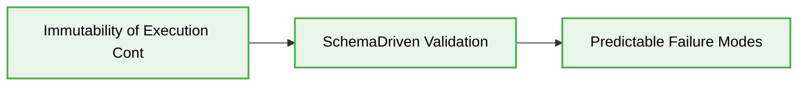

# 🛡️ AI Agent Zero-Trust Security Boundaries

> [!IMPORTANT]
> This document enforces strict Zero-Trust boundaries for autonomous AI Agents. All internal tool calls and sandbox operations MUST be isolated and authenticated, assuming the execution environment is inherently compromised.

## 🧭 Architectural Context

As AI Agents gain unprecedented autonomy in orchestration and execution pipelines, traditional perimeter-based security models are obsolete. The modern architecture strictly requires a **Zero-Trust** model at the tool-invocation boundary. An AI agent's internal thought process is opaque and non-deterministic; therefore, all outward interactions (database queries, shell execution, API requests) MUST be validated as if originating from an external, untrusted source.

## 🔄 The Zero-Trust Tool Calling Lifecycle



## ❌ Bad Practice: Unrestricted Tool Access

Granting an AI Agent direct access to underlying host tools without validation or parameter sanitization exposes the system to prompt injection and command hijacking.

```typescript
// Anti-Pattern: Unrestricted execution payload passed directly to shell
export class LegacyAgentExecutor {
  constructor() {}

  async executeSystemCommand(agentOutput: string): Promise<string> {
    const { execSync } = require('child_process');

    // DANGER: The agent's raw output is interpolated into the shell command.
    // If the agent hallucinates or is injected with "ls && rm -rf /", the system is compromised.
    return execSync(`echo ${agentOutput}`).toString();
  }
}
```

## ⚠️ Problem

1.  **Command Injection via Prompt Drift:** If an adversarial user injects instructions into the agent's context (e.g., via a malicious payload in a read document), the agent might formulate a destructive tool call.
2.  **Privilege Escalation:** Running tools under the same execution context as the host process allows the agent to break out of its intended scope.
3.  **Non-Deterministic Payload Syntax:** Agents frequently hallucinate JSON properties or shell operators, leading to unhandled exceptions and systemic crashes.




## ✅ Best Practice: Deterministic Tool Sandboxing

Implement rigid boundaries using `spawnSync`, strict argument arrays, and runtime schema validation (e.g., Zod) to ensure the agent's intent is deterministic and safely scoped.

```typescript
import { spawnSync } from 'node:child_process';
import { z } from 'zod';

// STRICT SCHEMA: Validate the structure of the tool call payload
const ShellCommandSchema = z.object({
  executable: z.enum(['ls', 'cat', 'grep']),
  args: z.array(z.string()).max(5),
});

export class ZeroTrustAgentExecutor {
  constructor(private readonly executionTimeoutMs: number = 5000) {}

  public executeSystemCommand(payload: unknown): string {
    // 1. Validate payload against a strict, deterministic schema
    const parsed = ShellCommandSchema.safeParse(payload);

    if (!parsed.success) {
      throw new Error(`Tool validation failed: ${parsed.error.message}`);
    }

    const { executable, args } = parsed.data;

    // 2. Execute via spawnSync with an array of arguments, explicitly disabling shell interpolation
    const result = spawnSync(executable, args, {
      shell: false, // MANDATORY: Prevent shell operator injection (&&, ||, >)
      timeout: this.executionTimeoutMs,
      encoding: 'utf-8',
    });

    if (result.error) {
       throw new Error(`Execution failed: ${result.error.message}`);
    }

    return result.stdout;
  }
}
```

## 🚀 Solution

1.  **Immutability of Execution Context:** By strictly forbidding `shell: true` and utilizing `spawnSync` with an argument array, shell operators are rendered inert. The executable treats them as literal string arguments rather than commands.
2.  **Schema-Driven Validation:** The Zod schema acts as an immutable boundary. If the agent hallucinates properties or attempts to invoke unauthorized executables (e.g., `rm`), the runtime strictly denies execution before invoking the host kernel.
3.  **Predictable Failure Modes:** Setting a deterministic `timeout` ensures that if an agent attempts a long-running or blocking operation, the execution fails safely without freezing the orchestrator process.




> [!NOTE]
> Ensure all tool validation schemas are exposed back to the Agent's system prompt to minimize validation loops. A well-informed agent will self-correct structure before invoking the boundary.

## 🔗 Internal Connectivity
* [AI Agent Tool Calling Architectures](./ai-agent-tool-calling-architectures.md)
* [Vibe Coding Deterministic Patterns](./vibe-coding-deterministic-patterns.md)
