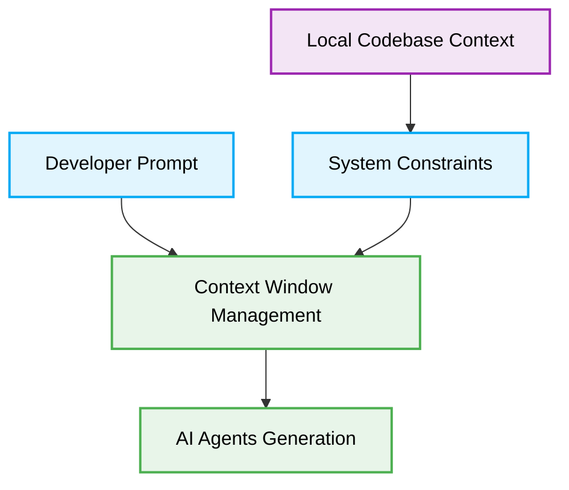

# Antigravity IDE Vibe Coding Best Practices

When using the Antigravity IDE, applying the best practices is essential for efficient vibe coding. By understanding how AI Agents interact with this standalone environment, developers can generate highly optimized, production-ready code.

## Context and Scope

- **Primary Goal:** Provide an actionable guide for using AI Agents within the Antigravity IDE.
- **Target Tooling:** Antigravity IDE.
- **Tech Stack Version:** Agnostic.

  

  **Mastering Vibe Coding with Antigravity**

## Context Window Management for AI Agents

Antigravity IDE is deeply integrated with large context window capabilities. Efficient Context Window Management ensures that the AI Agents do not hallucinate and can precisely follow instructions for vibe coding.

## System Constraints and Memory Strategies

To achieve enterprise-grade scalability, it is important to utilize memory strategies effectively. The following table illustrates the recommended memory strategies inside the Antigravity IDE.

| Strategy Name | Description | Use Case |
| :--- | :--- | :--- |
| **Agentic Rulesets** | Providing static `.agents/rules` files. | High-level system design |
| **Active File Focus** | Keeping only necessary files open. | Direct refactoring |
| **Semantic Search** | Vector search across the codebase. | Broad feature discovery |

## Production-Ready Actionable Checklist

To ensure a smooth vibe coding experience, use this checklist before invoking the AI Agents:

- [ ] Verify that all active tabs in the Antigravity IDE are relevant to the current task.
- [ ] Write precise prompts referencing explicit file paths.
- [ ] Confirm that your local rules files are updated and indexed.
- [ ] Review the generated code against the established architectural patterns.
- [ ] Keep the context window lean to prevent AI memory overflow.
