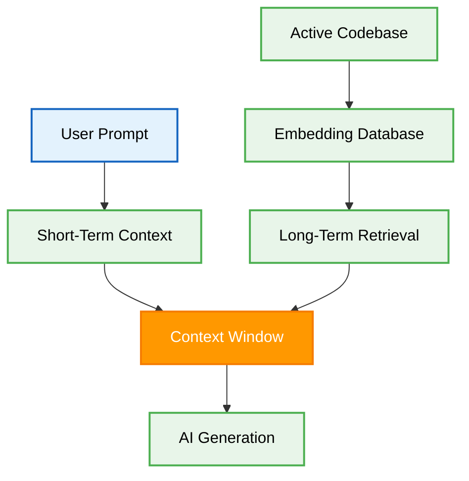

# 🧠 Cursor Memory Structures: Optimizing AI Context

## 📖 1. Introduction to AI Memory Management

In the realm of AI agents, memory management is a critical component for achieving high-quality code generation. Cursor utilizes specific memory structures to maintain context across large codebases. Understanding these structures allows developers to optimize the context window and improve the performance of vibe coding.

## 🏗️ 2. The Architecture of Cursor Memory

Cursor organizes its memory into distinct layers to process user requests efficiently. The following diagram illustrates the flow of context from the user prompt to the final AI generation.

## 📊 3. Types of Memory in Cursor

To effectively manage context, Cursor categorizes memory into different types. Each type serves a specific purpose in the AI generation workflow.

| Memory Type | Description | Retention Period | Optimization Strategy |
| :--- | :--- | :--- | :--- |
| **Short-Term Memory** | The immediate conversational context, including the current prompt and recent interactions. | Session | Keep prompts focused and concise. |
| **Active File Memory** | The contents of the currently open files in the editor. | File open state | Close unnecessary files to free up context. |
| **Long-Term Retrieval** | Indexed codebase files accessed via vector embeddings. | Persistent | Use `.cursorrules` to guide retrieval priority. |

## 🛠️ 4. Best Practices for Vibe Coding

Optimizing memory structures requires a deliberate approach to providing instructions.

1. **Explicit Context:** Always reference specific files or functions when asking the AI to perform a task.
2. **Rule Enforcement:** Utilize `.cursorrules` and `AGENTS.md` to establish global constraints that the AI must follow.
3. **Limit Scope:** Avoid asking the AI to refactor the entire application in a single prompt. Break down tasks into smaller, manageable units.

## ✅ 5. Actionable Checklist for Memory Optimization

Follow these steps to ensure optimal performance when using Cursor:

- [ ] Verify that only relevant files are open in the editor.
- [ ] Define global architectural constraints in the `.cursorrules` file.
- [ ] Structure prompts to include specific file paths and function names.
- [ ] Monitor the context window size to prevent truncation of important information.
- [ ] Review the AI output to confirm that it respects the established memory constraints.
