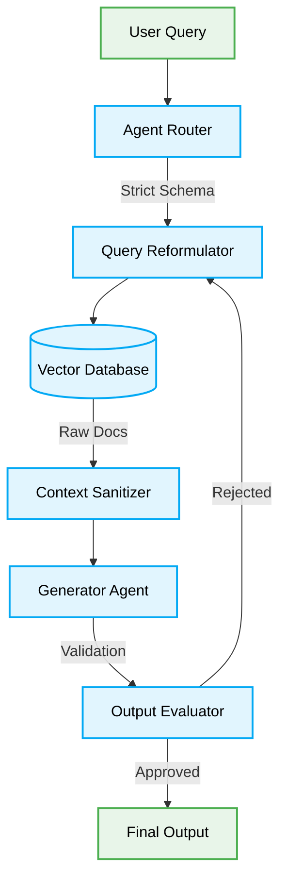

> 📦 [best-practise](../README.md) / 📄 [docs](./)

# 🤖 Vibe Coding Agentic RAG Patterns + Production-Ready Best Practices

In 2026, **Retrieval-Augmented Generation (RAG)** within autonomous Agentic systems MUST strictly adhere to deterministic boundaries. Unbounded RAG implementations lead to severe context window poisoning and unpredictable hallucinations. This document mandates the architectural standards for Agentic RAG pipelines.

---

## 🏗️ Architectural Foundations

Agentic RAG differs from static RAG by incorporating dynamic query reformulation, multi-step retrieval, and self-reflection. To ensure systemic stability, these processes MUST operate within strict, type-safe validation layers.



---

## 🔄 The Pattern Lifecycle

### ❌ Bad Practice

```typescript
// Unbounded Agentic RAG (Context Poisoning Risk)
async function executeRAG(query: any) {
    // Agent blindly constructs a query and retrieves unbounded context
    const docs = await vectorDB.search(query);
    const prompt = `Context: ${docs.join(' ')}\n\nQuery: ${query}`;

    // Unsafe generation relying on arbitrary data
    return await llm.generate(prompt);
}
```

### ⚠️ Problem

The `any` type and unbounded retrieval allow adversarial injection and context overflow. If the retrieved documents contain conflicting instructions or massive irrelevant payloads, the generator agent will hallucinate, leading to critical logic failures in zero-approval workflows.

### ✅ Best Practice

```typescript
// Deterministic Agentic RAG Pipeline
import { z } from 'zod';

const QuerySchema = z.object({
    intent: z.enum(['factual', 'analytical', 'code-generation']),
    parameters: z.record(z.string(), z.unknown()),
    maxTokens: z.number().max(2048)
});

async function executeDeterministicRAG(rawQuery: unknown) {
    // 1. Validate Input strictly
    const validatedQuery = QuerySchema.parse(rawQuery);

    // 2. Reformulate and Retrieve with bounded limits
    const docs = await vectorDB.searchWithConstraints(validatedQuery, { topK: 5 });

    // 3. Sanitize Context (Remove conflicting/injected data)
    const safeContext = contextSanitizer.clean(docs);

    const prompt = `Context: ${safeContext}\n\nQuery: ${validatedQuery.parameters}`;

    // 4. Generate with strict schema output
    const result = await llm.generateStructured(prompt, ExpectedOutputSchema);

    if (!isValidResult(result)) {
        throw new Error('Agent hallucinated. RAG cycle halted.');
    }

    return result;
}
```

### 🚀 Solution

By enforcing structural validation (e.g., Zod) on the initial query and strictly sanitizing the retrieved context, the Agentic RAG pipeline becomes deterministic. The use of `unknown` and explicit type guards prevents injection attacks, while bounding the retrieval (`topK`) ensures O(1) impact on the context window, resulting in resilient and high-fidelity generations.

> [!NOTE]
> **Internal Routing:** For broader orchestration strategies, review [AI Agent Orchestration Patterns](./ai-agent-orchestration-patterns.md).
