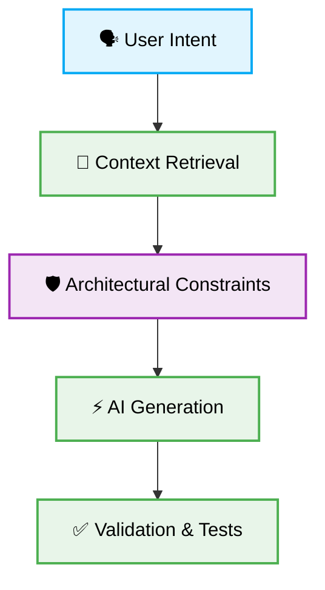

> 📦 [best-practise](../README.md) / 📄 [docs](./)

# 🤖 Vibe Coding Agents: Production-Ready Automation

## 1. 🎯 Context & Scope

- **Primary Goal:** Guide engineers and AI agents on optimizing instruction sets to achieve deterministic, production-ready "Vibe Coding" results.
- **Target Tooling:** Cursor, Windsurf, GitHub Copilot, Antigravity IDE.
- **Tech Stack Version:** Agnostic

> [!IMPORTANT]
> **Vibe Coding Integrity:** Never trust an AI Agent blindly. Always provide strict architectural constraints and explicit context.

---

## 2. 🧠 The "Vibe Coding" Mindset

Vibe Coding shifts the developer's role from writing syntax to managing logic and constraints. By establishing robust meta-instructions, you can direct AI Agents to implement features flawlessly on the first attempt.

### 📊 Agent Capability Matrix

| Agent Characteristic | Advantage in Vibe Coding | Drawback without Context |
| :--- | :--- | :--- |
| **Speed** | Extremely fast code generation. | May introduce untested, legacy APIs. |
| **Refactoring** | Excellent at large-scale structural changes. | Can overwrite existing business logic. |
| **Boilerplate** | Instant scaffolding of complex setups. | Prone to generic, non-scalable patterns. |

---

## 3. 🗺️ Agent Execution Architecture

To harness Vibe Coding effectively, integrate a defined execution pipeline.

---

## 4. ✅ Actionable Checklist for Vibe Coding

Before deploying AI Agents for production tasks, verify the following:

- [ ] Ensure all prompts explicitly reference the required files or functions.
- [ ] Confirm that `.cursorrules` or `.windsurfrules` are active and updated.
- [ ] Restrict the agent's context window to prevent hallucination.
- [ ] Review the generated code specifically for memory leaks or unhandled exceptions.
- [ ] Always write a failing test before instructing the AI to implement the solution.
