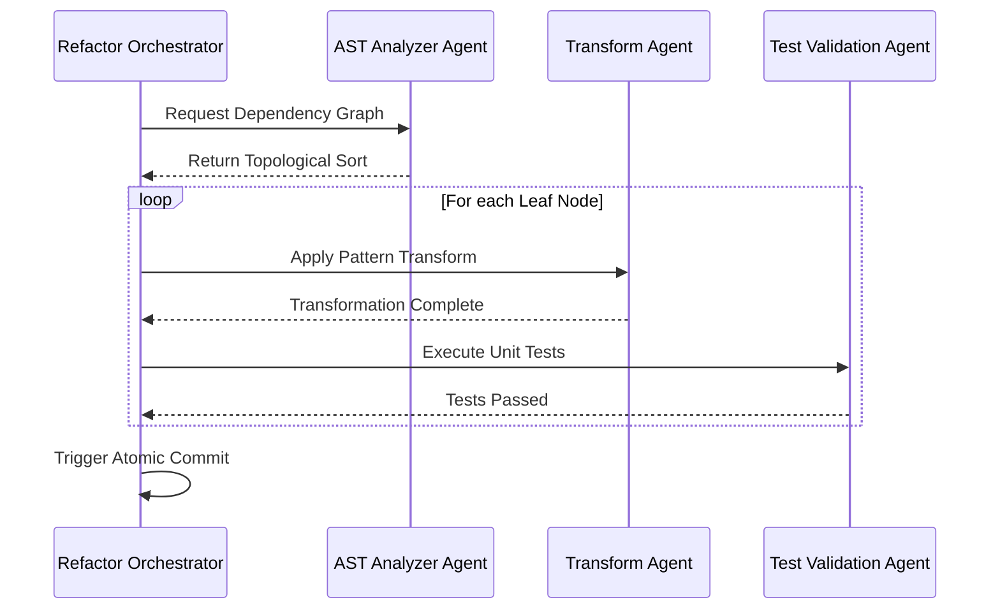

> [!NOTE]
> **Internal Routing:** For more context, refer back to the [docs](./) or [best-practise](../README.md).

# ⚙️ Vibe Coding Automated Refactoring Pipelines: AI Agent Orchestration

In the **Vibe Coding** era, large-scale refactoring is no longer a human-bottlenecked process. Instead, we utilize **Automated Refactoring Pipelines** orchestrated by specialized AI Agents. These pipelines guarantee safe, deterministic transformations of legacy code into modern architectures. This document details the 2026 standard for zero-approval AI refactoring.

## 🌟 The Need for Automated Refactoring

Manual refactoring introduces regressions and is heavily dependent on human context. Autonomous agents, however, can holistically analyze the AST (Abstract Syntax Tree), determine topological sort dependencies, and apply deterministic transforms.

### Core Tenets of Agentic Refactoring

1. **AST-Driven Analysis:** Agents must never perform string-based replace operations. They must parse the AST and manipulate specific nodes.
2. **Topological Execution:** Refactoring must occur from leaf nodes (no dependencies) up to the root to ensure compilation success at every step.
3. **Atomic Commits:** Each logical transformation must be grouped into an atomic commit with verified tests.

## 🏗️ Visual Architecture: Refactoring Orchestration



---

## 🔄 The Pattern Lifecycle: Refactoring Execution

### ❌ Bad Practice

```typescript
// Agent performing dangerous string-based replacements
async function refactorCode(filePath: string) {
    const code = await fs.promises.readFile(filePath, 'utf-8');
    // Using regex to replace 'any' is prone to false positives
    const refactoredCode = code.replace(/: any/g, ': unknown');
    await fs.promises.writeFile(filePath, refactoredCode);
}
```

### ⚠️ Problem

1. **False Positives:** Regex replacements (`/: any/g`) might accidentally modify string literals or comments containing the word "any".
2. **Syntactic Corruption:** String manipulation does not understand code structure, frequently resulting in broken syntax or misaligned brackets.
3. **Lack of Type Checking:** It fails to generate necessary type guards or handle edge cases where `unknown` requires strict type narrowing.

### ✅ Best Practice

```typescript
// Deterministic AST-based refactoring using TS-Morph
import { Project, SyntaxKind } from 'ts-morph';

async function refactorCodeToUnknown(filePath: string): Promise<void> {
    const project = new Project();
    const sourceFile = project.addSourceFileAtPath(filePath);

    // Safely retrieve all instances of 'any' keyword within the AST
    const anyKeywords = sourceFile.getDescendantsOfKind(SyntaxKind.AnyKeyword);

    if (anyKeywords.length === 0) return;

    for (const keyword of anyKeywords) {
        // Find the closest declarator or parameter to safely replace the type
        const parent = keyword.getParent();
        if (parent) {
            keyword.replaceWithText('unknown');
        }
    }

    await sourceFile.save();
}
```

> [!NOTE]
> **Internal Routing:** For more context, refer back to the [docs](./) or [best-practise](../README.md).

### 🚀 Solution

1. **Deterministic Safety:** By leveraging the AST (via `ts-morph`), the agent ensures that only actual type definitions are modified. Comments and string literals remain untouched.
2. **Compilation Integrity:** Replacing specific AST nodes guarantees the structural integrity of the file.
3. **Scalability:** This approach allows for programmatic inclusion of Type Guards and strict narrowing logic specifically tailored to the affected nodes.

---

## 📊 Pipeline Validation Rules

| Phase | Action | Validation Gate |
| :--- | :--- | :--- |
| **Analysis** | Generate Dependency Graph | No circular dependencies detected |
| **Transform** | Modify AST Nodes | No `any` types injected; file compiles |
| **Verification** | Execute Test Suite | 100% test pass rate for modified nodes |

---

## ✅ Actionable Checklist for Implementation

- [ ] Ensure all AI refactoring logic utilizes an AST parser (e.g., `ts-morph`) instead of string manipulation.
- [ ] Implement topological sorting for file processing to avoid circular dependency deadlocks.
- [ ] Incorporate intermediate compilation checks before proceeding to the next node in the graph.
- [ ] Wrap external service initializations in try-catch blocks to ensure resilient imports.

[Back to Top](#)
