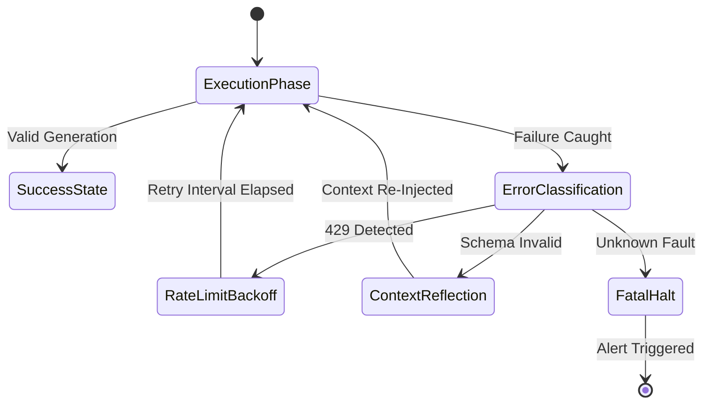
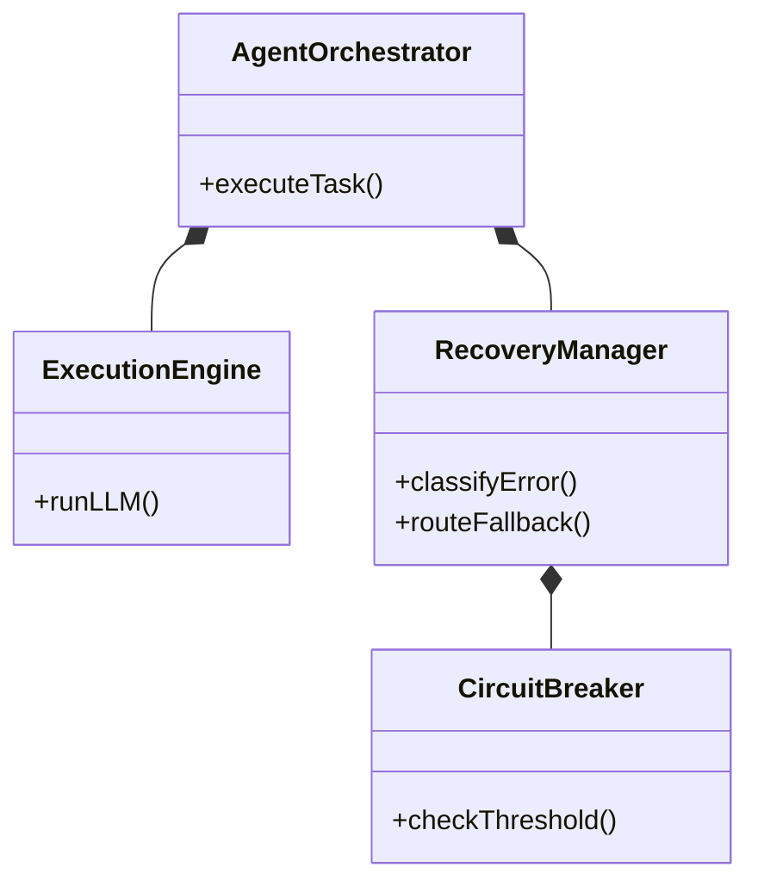

> 📦 [best-practise](../README.md) / 📄 [docs](./)
# 🤖 Vibe Coding Autonomous Error Recovery Architectures

In the 2026 AI orchestration paradigm, agents MUST NOT halt on transient errors or rely on human intervention. Autonomous Error Recovery is the foundational mechanism ensuring multi-agent pipelines (Vibe Coding) self-heal, re-evaluate contexts, and retry executions deterministically.

This document defines the strict, machine-readable rules for building fault-tolerant Agent state machines that intercept failures, classify errors, and seamlessly resume execution paths.

---
## ⚖️ Structural Comparison: Error Handling Topologies

The transition to autonomous agents requires discarding synchronous try/catch paradigms for robust state-machine based recovery models.

| Topology Approach | Fault Tolerance | Scalability | Agent Autonomy | AI Hallucination Risk |
| :--- | :--- | :--- | :--- | :--- |
| Sync Try/Catch | Low | O(1) | None (Halts) | High (Context Loss) |
| Dead Letter Queues | Medium | O(n) | Low (Requires async review) | Medium |
| **State-Machine Recovery** | **High** | **O(1)** | **Absolute (Self-Healing)** | **Zero (Strict Typings)** |

---
## 🏗️ The Pattern Lifecycle: Deterministic Error Bounding

For an agent to recover autonomously, it MUST strictly type incoming errors and map them to actionable fallback states. Relying on loosely typed `any` catch blocks is prohibited as it causes unbounded hallucinations in subsequent logic.

### ❌ Bad Practice
```typescript
// Anti-Pattern: Unbound Catch and Context Loss
async function executeAgentTask(taskData: any) {
    try {
        const result = await llm.generate(taskData.prompt);
        return parseResult(result);
    } catch (error: any) {
        // AI Agent halts or hallucinates due to 'any' type
        console.error("Agent failed", error.message);
        return null; // Silent failure
    }
}
```

### ⚠️ Problem
Using `any` in error catching strips the error of deterministic structure. The AI Agent cannot programmatically differentiate between a `RateLimitError` (which requires backoff) and a `SchemaValidationError` (which requires prompt restructuring). This leads to silent failures, corrupted pipeline states, and loss of execution context.

### ✅ Best Practice
```typescript
// Best-Practice: Strict Typings and Deterministic State Transition
type AgentTaskData = { prompt: string; contextId: string };
type AgentExecutionResult = { success: boolean; data?: unknown; errorCode?: string };

async function executeAgentTask(taskData: AgentTaskData): Promise<AgentExecutionResult> {
    try {
        const result = await llm.generate(taskData.prompt);
        return { success: true, data: parseResult(result) };
    } catch (error: unknown) {
        if (isRateLimitError(error)) {
            // Initiate Exponential Backoff state
            await initiateBackoffSequence(taskData);
            return { success: false, errorCode: 'RATE_LIMIT' };
        }
        if (isSchemaValidationError(error)) {
            // Trigger Context Reformation State
            return triggerSelfReflectionLoop(taskData, error);
        }

        // Critical System Failure Boundary
        return transitionToDeadLetterState(taskData);
    }
}

// Type Guards to enforce runtime safety
function isRateLimitError(error: unknown): error is Error & { status: 429 } {
    return error instanceof Error && 'status' in error && error.status === 429;
}
function isSchemaValidationError(error: unknown): error is Error & { code: 'SCHEMA_FAIL' } {
    return error instanceof Error && 'code' in error && error.code === 'SCHEMA_FAIL';
}
```

### 🚀 Solution
By enforcing `unknown` and utilizing Type Guards, the AI Agent Orchestrator can definitively classify the error. This classification directly drives the state machine's next transition. Instead of halting, the agent routes the failure to a specific recovery node (e.g., Backoff, Self-Reflection), ensuring execution continues autonomously.

---
## 🔄 Autonomous Recovery Workflows

The recovery logic MUST be explicitly modeled to prevent agents from entering infinite retry loops.



> [!NOTE]
> All retry loops MUST implement a deterministic circuit breaker (max `N` retries). An agent failing to recover after `N` attempts MUST transition to `FatalHalt`.

---
## 📂 Recovery Architecture Constraints

Agents orchestrating complex tasks require structured directory compositions to separate execution logic from recovery mechanisms.



> [!IMPORTANT]
> The `RecoveryManager` MUST be a distinct boundary from the `ExecutionEngine`. Tightly coupling business logic with fault tolerance mechanisms violates the Single Responsibility Principle and degrades the predictability of Vibe Coding pipelines.
