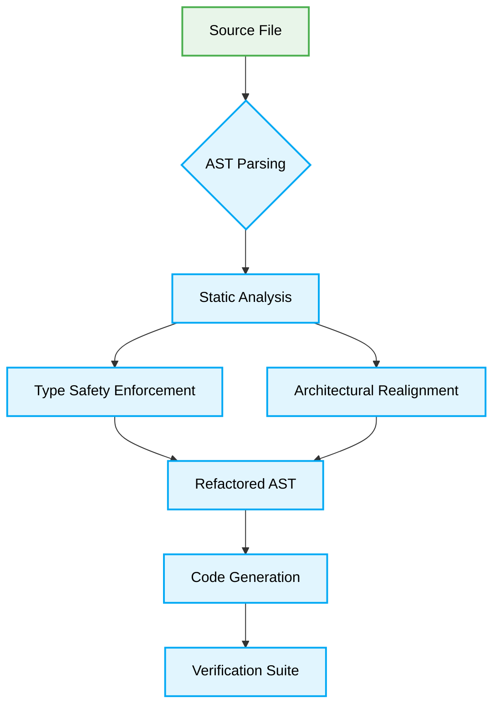

# Vibe Coding Autonomous Refactoring

> [!NOTE]
> This guide outlines the deterministic standards for autonomous code refactoring by AI agents. All operations MUST be idempotent and verified through continuous integration prior to zero-approval commits.

## 🎯 Context & Scope

In the era of autonomous AI-driven development (Vibe Coding), refactoring is no longer a manual chore but a continuous, state-aware process executed by AI agents. This document defines the strict, machine-readable rules for enabling agents to safely restructure architectures, enforce strict type safety, and maintain the systemic integrity of the codebase without human intervention.

## 🧱 Core Principles

1. **Deterministic Execution:** Refactoring MUST rely on AST (Abstract Syntax Tree) transformations rather than regex replacements to ensure semantic correctness.
2. **Zero-Trust Type Safety:** All implicitly dynamic types MUST be replaced with strict interfaces and constrained generics. The `any` type is STRICTLY FORBIDDEN.
3. **Idempotent Operations:** Refactoring scripts MUST produce identical results when run multiple times on the same target.

## 🗺️ Map of Patterns



## 🚧 1. Dynamic Type Elimination

### ❌ Bad Practice

Relying on implicit or explicit `any` types during initial development, allowing unverified data to traverse the application.

```typescript
function processUserData(data: any): any {
  // Implicit trust of incoming data structure
  return { ...data, processed: true };
}
```

### ⚠️ Problem

The `any` type destroys compile-time validation, leading to silent runtime failures. It causes "hallucinations" in AI agents due to the lack of clear type contracts, violating the zero-trust architecture.

### ✅ Best Practice

Enforce strict interfaces and use `unknown` combined with type guard functions to guarantee runtime structure.

```typescript
interface UserData {
  id: string;
  payload: Record<string, unknown>;
}

function isUserData(data: unknown): data is UserData {
  return (
    typeof data === 'object' &&
    data !== null &&
    'id' in data &&
    typeof (data as UserData).id === 'string'
  );
}

function processUserData(data: unknown): UserData {
  if (!isUserData(data)) {
    throw new Error('Invalid UserData structure');
  }
  return { ...data, processed: true } as UserData; // Assuming processed is handled correctly in the real implementation
}
```

### 🚀 Solution

By using `unknown` and a type guard (`isUserData`), we force explicit validation of the data at the boundary. This deterministic approach ensures AI agents have precise schemas to work with, preventing hallucinated types from propagating through the architecture.

> [!IMPORTANT]
> All new documentation blocks MUST utilize `unknown` over `any` and enforce structural integrity through verifiable type guards.
