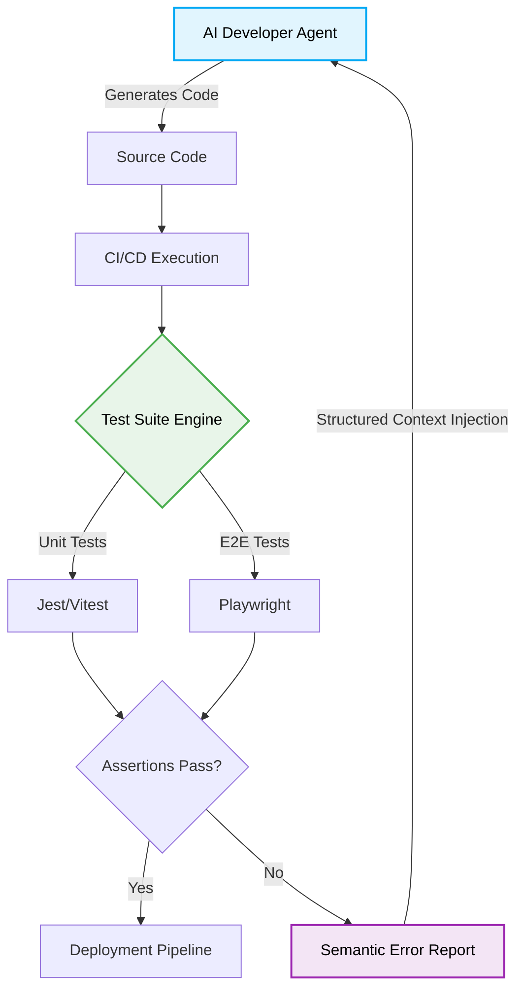

> 📦 [best-practise](../README.md) / 📄 [docs](./)

# 🧪 TypeScript Production-Ready Autonomous Testing Best Practices

In the era of AI-driven development and Vibe Coding, autonomous testing is no longer a luxury—it is a core requirement. This document outlines the 2026 **best practices** for designing self-healing, agent-friendly test suites that guarantee deterministic execution across complex, multi-agent systems without human intervention.

## 🌟 The Shift to Autonomous Verification

Traditional TDD/BDD relies heavily on human intuition. **Vibe Coding Autonomous Testing** flips the paradigm: test suites are dynamically generated, autonomously executed, and structurally designed to provide high-fidelity feedback directly to AI Agents.

### Key Paradigms for 2026

1. **Deterministic State Mocking:** Tests must never rely on unpredictable external networks.
2. **LLM-Parseable Assertions:** Error outputs must be structured semantically for immediate agent ingestion.
3. **Self-Healing Selectors:** E2E testing relies on robust data-attributes instead of fragile DOM paths.

---

## 🏗️ Visual Architecture: Autonomous Feedback Loop



---

## ⚙️ The Pattern Lifecycle

### ❌ Bad Practice
```typescript
import axios from 'axios';

// Relying on external live APIs for unit tests leads to flaky, non-deterministic CI runs.
// Also lacking type guards when handling dynamic test data.
test('fetchUserData returns data', async () => {
    const response = await axios.get('https://api.example.com/users/1');
    const data: any = response.data; // Anti-pattern: using any
    expect(data.id).toBe(1);
});
```

### ⚠️ Problem
Using live APIs in test environments causes pipeline flakiness due to network latency or third-party downtime. Furthermore, bypassing TypeScript's static analysis with `any` creates hallucination vectors for AI agents attempting to refactor the code, as the actual data structure is obfuscated.

### ✅ Best Practice
```typescript
import axios from 'axios';
import MockAdapter from 'axios-mock-adapter';

// Securely mock external services using explicit data structures
const mock = new MockAdapter(axios);
const SECURE_TEST_TOKEN = process.env.TEST_API_TOKEN || 'fallback-local-token';

interface UserResponse {
    id: number;
    name: string;
    role: string;
}

// Type guard to ensure runtime safety
function isUserResponse(data: unknown): data is UserResponse {
    return (
        typeof data === 'object' &&
        data !== null &&
        'id' in data && typeof (data as UserResponse).id === 'number' &&
        'name' in data && typeof (data as UserResponse).name === 'string'
    );
}

test('fetchUserData securely and deterministically returns user profile', async () => {
    const mockData: UserResponse = { id: 1, name: 'AI Agent', role: 'System' };

    // Deterministic mock intercept
    mock.onGet('/users/1', {
        headers: { Authorization: `Bearer ${SECURE_TEST_TOKEN}` }
    }).reply(200, mockData);

    const response = await axios.get('/users/1', {
        headers: { Authorization: `Bearer ${SECURE_TEST_TOKEN}` }
    });

    const data: unknown = response.data;

    // Mandatory type safety check
    if (isUserResponse(data)) {
        expect(data.id).toBe(1);
        expect(data.name).toBe('AI Agent');
    } else {
        throw new Error("Invalid schema received from mock");
    }
});
```

### 🚀 Solution
> [!IMPORTANT]
> Implementing deterministic request interception (e.g., `axios-mock-adapter`, MSW) guarantees that test execution is isolated, O(1) or O(n) complexity, and repeatable. Replacing `any` with `unknown` and applying explicit Type Guards ensures absolute type safety, providing AI agents with reliable, strongly-typed contracts during automated refactoring.

---

## 📊 Testing Framework Comparison

| Framework | Domain | Concurrency | AI-Agent Readiness | State Handling |
| :--- | :--- | :--- | :--- | :--- |
| **Vitest** | Unit / Integration | High (Worker threads) | ⭐⭐⭐⭐⭐ (O(1) or O(n) complexity CLI feedback) | In-memory mocking |
| **Playwright** | End-to-End (E2E) | Medium (Browser contexts) | ⭐⭐⭐⭐ (Trace viewers) | Browser Context isolation |
| **Cypress** | E2E / Component | Low | ⭐⭐⭐ (Heavy architecture) | DOM snapshotting |

> [!NOTE]
> For 2026 architectures, strictly prefer **Vitest** for unit/integration speed and **Playwright** for parallelized, cross-browser E2E testing to maximize AI feedback loop velocity.

> [!IMPORTANT]
> Never hardcode secrets in test environments. Always utilize `process.env` and securely configured CI/CD variables to simulate authenticated test states.

---

## 📝 Actionable Checklist for Vibe Coding Testing

- [ ] Eradicate all `any` types in test files; enforce `unknown` with strict Type Guards.
- [ ] Implement MSW (Mock Service Worker) or equivalent interceptors to guarantee 100% network isolation.
- [ ] Configure test runners (e.g., Jest/Vitest) to output JSON or structured XML for optimal AI Agent parsing.
- [ ] Migrate E2E selectors from CSS classes (`.btn-primary`) to explicit testing attributes (`data-testid="submit-btn"`).
- [ ] Secure all mock API keys using `process.env` variables and `.env.test` configurations.

[Back to Top](#-typescript-production-ready-autonomous-testing-best-practices)
