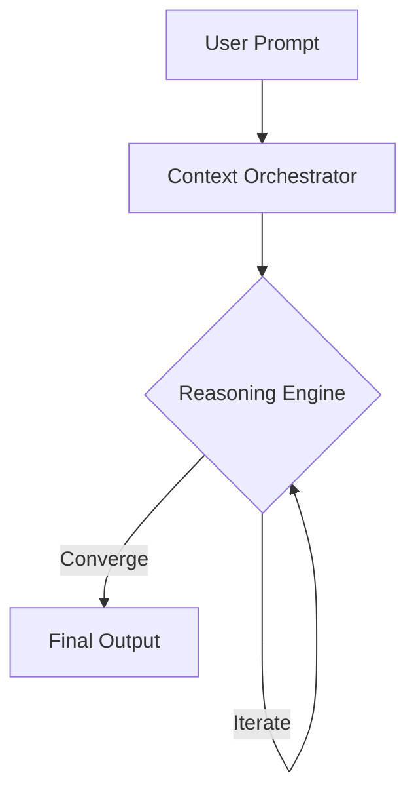

# 🧠 Vibe Coding Cognitive Architectures

> [!IMPORTANT]
> Cognitive architectures are strictly required to ensure AI Agent outputs are deterministic and maintain high fidelity.

## The Pattern Lifecycle

### ❌ Bad Practice
```javascript
// Relying on single-pass context without iterative reasoning
async function generateCode(prompt) {
  return await llm.complete(prompt);
}
```

### ⚠️ Problem
Single-pass generation leads to hallucinations, non-deterministic outputs, and failure to account for complex architectural boundaries.

### ✅ Best Practice
```typescript
// Implementing a multi-agent cognitive loop
interface CognitiveState {
  context: unknown;
  reasoning: string[];
  code: string;
}

async function generateRobustCode(prompt: string): Promise<string> {
  const state: CognitiveState = await orchestrator.initialize(prompt);
  const validatedState = await orchestrator.reason(state);
  return validatedState.code;
}
```

### 🚀 Solution
A multi-agent cognitive loop provides a deterministic state machine. This approach is MANDATORY for ensuring AI Agents follow strict execution paths and adhere to [Architectural Patterns](../architectures/readme.md).

## ⚖️ Structural Comparison: Cognitive Models

| Feature | Single-Pass Model | Cognitive Loop |
| :--- | :--- | :--- |
| **Fidelity** | Low | High |
| **Determinism** | Weak | Strong |
| **Safety** | O(n^2) Risk | O(1) Bounded Risk |

## Cognitive Flow

