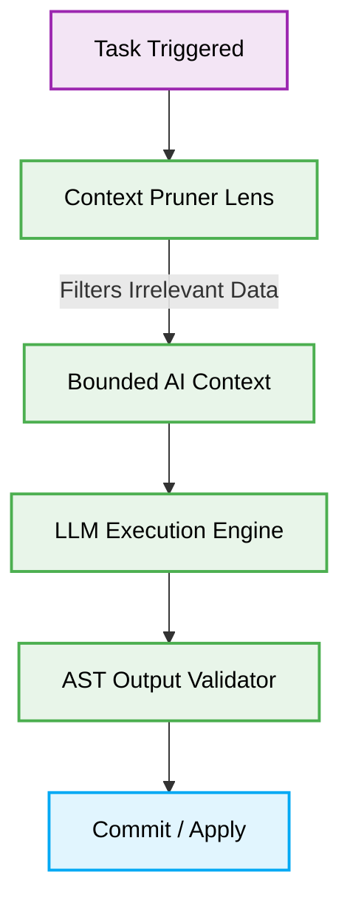

# 🧠 AI Agent Cognitive Load Balancing

[🏠 Back to Root](../README.md)

## 🌟 The Criticality of Cognitive Load Balancing in AI Contexts

In modern Vibe Coding ecosystems, LLMs (Large Language Models) serve as the primary execution engine for code generation, system analysis, and autonomous refactoring. However, AI Agents possess a finite "cognitive load"—constrained by context windows, token limits, and attention degradation. Pushing massive, unstructured codebases into an agent's context inevitably leads to hallucinations, missing logic, and degraded execution fidelity.

**Cognitive Load Balancing** is the architectural practice of structuring inputs, deterministic states, and workflow boundaries so that an AI Agent receives exactly the context it needs to perform a task with zero ambiguity—no more, no less.

---

## 🔄 The Pattern Lifecycle: Managing Agent Context

### ❌ Bad Practice

Dumping an entire monolithic state or deeply nested object directly into an LLM prompt without filtering out irrelevant data.

```typescript
// Anti-pattern: Overloading context with irrelevant state
async function generateComponentCode(agentContext: any): Promise<string> {
    // Passing the entire application configuration and global state
    // This wastes tokens and confuses the AI's attention mechanism
    const response = await aiProvider.generate({
        prompt: "Refactor the Button component.",
        context: {
            ...agentContext.globalStore, // Includes user sessions, DB configs, irrelevant modules
            targetFile: "Button.tsx"
        }
    });
    return response.text;
}
```

### ⚠️ Problem

> [!IMPORTANT]
> **Context Poisoning & Attention Degradation**

When an AI Agent is exposed to massive, untyped `any` objects containing orthogonal domain data, its attention mechanism degrades. It will likely hallucinate connections between unrelated configurations (e.g., mixing user session logic into a pure UI component refactor) and consume excessive API quotas. This breaks deterministic execution and violates the Zero-Trust Security Boundary principle.

### ✅ Best Practice

Implement a strict Context Pruner or "Lens" that extracts only the specific slice of state required for the target operation, strongly typed to ensure structural integrity.

```typescript
// Best Practice: Deterministic Context Slicing
import { AIContextSlice, UIComponentMetadata } from '@/shared/types';

// Enforce strict boundaries on what the Agent can "see"
interface ButtonRefactorContext extends AIContextSlice {
    componentData: UIComponentMetadata;
    designTokens: Record<string, string>;
}

async function generateComponentCode(metadata: UIComponentMetadata, tokens: Record<string, string>): Promise<string> {
    // 1. Construct the precise cognitive lens
    const cognitiveLens: ButtonRefactorContext = {
        componentData: metadata,
        designTokens: tokens
    };

    // 2. Execute with bounded context
    const response = await aiProvider.generate({
        prompt: `Refactor the ${metadata.name} component. Follow standard design tokens.`,
        context: cognitiveLens
    });

    return response.text;
}
```

### 🚀 Solution

By implementing **Deterministic Context Slicing**, we guarantee that the AI Agent focuses 100% of its computational attention on the specific problem domain.
1. **Security:** Eliminates the risk of exposing sensitive database connections or global states to an untrusted inference environment.
2. **Performance:** Drastically reduces token payload size, lowering API costs and accelerating response latency.
3. **Fidelity:** Prevents context poisoning, ensuring the generated output remains highly deterministic, testable, and strictly aligned with the target component's architecture.

---

## 📊 Cognitive Load Distribution Flow


