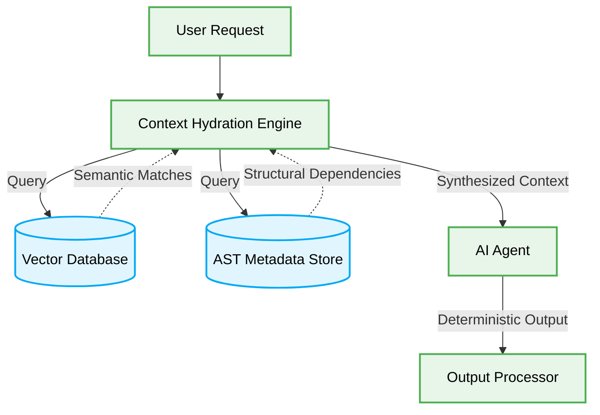

# 💧 Vibe Coding Context Hydration Patterns

## 🎯 Context & Scope

- **Primary Goal:** Document and execute the best practices for deterministic context hydration in AI agent workflows, ensuring token efficiency and minimizing hallucinations.
- **Target Tooling:** AI Agents (Cursor, Windsurf, Jules) and Human Developers.
- **Tech Stack Version:** Agnostic

<div align="center">
  

  **Deterministic blueprints for scalable, orchestrated AI context injection.**
</div>

---

## 🗺️ Map of Patterns (Context Hydration Modules)

This architecture defines the operational boundaries for context hydration in multi-agent workflows, specifically optimizing for context windows, token efficiency, and deterministic output.

- 🌊 **Data Flow:** Storage-to-Context execution paths.
- ⚖️ **Trade-offs:** Latency vs. Precision.
- 🛠️ **Implementation Guide:** Rules for defining strict context boundaries.



## 🚀 The Core Philosophy

Context hydration is the process of dynamically injecting relevant, high-fidelity information into an AI agent's context window precisely when needed. It rejects the monolithic "dump everything" approach in favor of surgical, intent-driven context retrieval.

> [!IMPORTANT]
> **AI Constraint:** Agents MUST NOT assume implicit context. All required context MUST be explicitly hydrated and validated via strict schemas before task execution begins.

---

## 1. Context Hydration Strategy

### ❌ Bad Practice

```typescript
class NaiveAgentContext {
  constructor(private readonly llm: LLMClient) {}

  async executeTask(userPrompt: string, globalState: unknown) {
    // ⚠️ Injecting massive, unfiltered global state into the prompt
    const prompt = `
      Task: ${userPrompt}
      Entire Codebase Context: ${JSON.stringify(globalState)}
    `;

    const response = await this.llm.generate(prompt);
    return response;
  }
}
```

### ⚠️ Problem

Injecting massive, unfiltered state (`globalState`) leads to "Context Overload." The LLM's attention mechanism becomes diluted, leading to hallucinations, degraded reasoning, and exponentially higher token costs. The agent struggles to isolate the relevant signal from the noise, breaking the deterministic execution guarantee.

### ✅ Best Practice

```typescript
interface HydrationRequest {
  intent: string;
  scope: string[];
}

interface HydratedContext {
  files: Record<string, string>;
  dependencies: string[];
  typeDefinitions: string;
}

class ContextHydrator {
  async hydrate(request: HydrationRequest): Promise<HydratedContext> {
    // 1. Fetch only precisely requested scopes
    return {
      files: await this.fetchFiles(request.scope),
      dependencies: await this.analyzeDependencies(request.scope),
      typeDefinitions: await this.extractTypes(request.scope)
    };
  }

  private async fetchFiles(scope: string[]): Promise<Record<string, string>> { /* ... */ return {}; }
  private async analyzeDependencies(scope: string[]): Promise<string[]> { /* ... */ return []; }
  private async extractTypes(scope: string[]): Promise<string> { /* ... */ return ""; }
}

class PrecisionAgent {
  constructor(
    private readonly llm: LLMClient,
    private readonly hydrator: ContextHydrator
  ) {}

  async executeTask(userPrompt: string, intent: string, requiredScope: string[]) {
    // 1. Surgically hydrate ONLY the necessary context
    const context: HydratedContext = await this.hydrator.hydrate({
      intent,
      scope: requiredScope
    });

    if (!this.isValidContext(context)) {
        throw new Error("Hydrated context failed validation schema");
    }

    // 2. Inject structured, verified context
    const prompt = `
      Task: ${userPrompt}
      Target Files: ${JSON.stringify(context.files)}
      Type Definitions: ${context.typeDefinitions}
    `;

    return this.llm.generate(prompt);
  }

  private isValidContext(context: unknown): context is HydratedContext {
     return typeof context === 'object' && context !== null && 'files' in context && 'typeDefinitions' in context;
  }
}
```

### 🚀 Solution

By implementing a dedicated `ContextHydrator`, the agent surgically retrieves only the precise files, dependencies, and type definitions required for the specific `intent`. Using type guards (`isValidContext`) ensures the hydrated context meets strict structural requirements before LLM invocation. This approach guarantees O(1) relevant context, minimizing token usage and enforcing deterministic, high-fidelity reasoning.

---

## 🛠️ Under the Hood: Mechanics of Hydration Validation

The critical mechanism making context hydration reliable is the validation step. When context is retrieved from vector databases or file systems, it is inherently untyped (`unknown`).

1. **Schema Definition:** Define strict TypeScript interfaces for expected context shapes.
2. **Type Guards:** Implement runtime type guards (`isValidContext(context: unknown): context is HydratedContext`) to enforce structural integrity.
3. **Fail-Fast:** If hydration returns malformed or insufficient data, throw an error immediately rather than proceeding with degraded context. This prevents silent failures and hallucinatory code generation.
