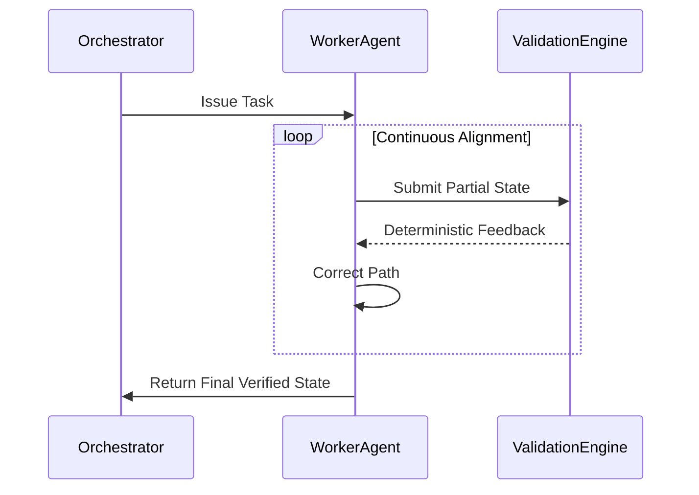

> [!NOTE]
> **Internal Routing:** For more context, refer back to the [Vibe Coding Overview](../README.md#the-vibe-coding-value-proposition).

# 🔄 Vibe Coding: Continuous Alignment Loops

In a multi-agent orchestration environment, state drift and hallucination compounding are massive risks. A **Continuous Alignment Loop** architecture ensures that agents constantly verify their current execution state against a deterministic ground truth or master orchestrator, preventing cascading failures.

## 🌟 Context & Scope

- **Primary Goal:** Prevent state drift and hallucination compounding in multi-agent workflows.
- **Mechanism:** Implement periodic, deterministic self-correction and validation loops.



## 1. Static Execution vs. Continuous Alignment

### ❌ Bad Practice
```typescript
class StaticWorkerAgent {
  async executeComplexTask(prompt: string) {
    // Agent attempts a long-running, multi-step task without intermediate checks
    const finalResult = await this.llm.generate(prompt);

    // Assumes final result is perfect after 1000s of tokens
    return finalResult;
  }
}
```

### ⚠️ Problem
Executing a monolithic prompt for a complex task without intermediate validation guarantees **hallucination compounding**. If the agent makes a mistake in step 1 of a 10-step process, all subsequent steps will be fundamentally flawed, leading to massive token waste and unpredictable output.

### ✅ Best Practice
```typescript
class AlignedWorkerAgent {
  constructor(private readonly validator: DeterministicValidator) {}

  async executeComplexTask(steps: TaskStep[]) {
    let currentState = {};

    for (const step of steps) {
      // 1. Generate partial result
      const partialResult = await this.llm.generate(step.prompt, currentState);

      // 2. Continuous Alignment: Validate immediately
      const alignmentCheck = this.validator.validate(partialResult, step.schema);

      if (!alignmentCheck.isValid) {
        // 3. Self-Correction: Fix the error before proceeding
        currentState = await this.selfCorrect(partialResult, alignmentCheck.errors);
      } else {
        currentState = { ...currentState, ...partialResult };
      }
    }

    return currentState;
  }
}
```

### 🚀 Solution
Implementing a **Continuous Alignment Loop** forces the agent to validate its output deterministically at every logical step. This prevents compounding errors, ensures the agent stays strictly aligned with the architectural constraints, and drastically improves the reliability of long-running Vibe Coding operations by replacing "hope" with mathematical validation.
