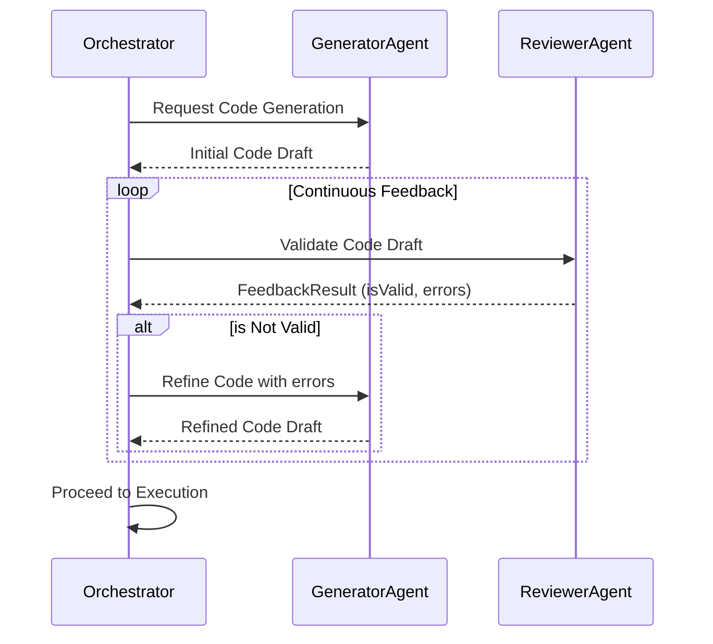

> 📦 [best-practise](../README.md) / 📄 [docs](./)
# 🔄 Vibe Coding Continuous Feedback Loops

In 2026, autonomous systems heavily rely on Continuous Feedback Loops during Vibe Coding. It is mandatory to establish mechanisms where AI Agents iteratively validate their outputs before final synthesis.

## ⚙️ Feedback Loop Architecture

### ❌ Bad Practice
```typescript
async function generateAndExecuteCode(prompt: string): Promise<void> {
    const code = await aiAgent.generateCode(prompt);
    // Anti-pattern: Executing immediately without continuous feedback validation
    eval(code);
}
```

### ⚠️ Problem
Executing code immediately without continuous validation leads to catastrophic hallucinations. When an agent hallucinates an API method, the immediate `eval` will crash the application. This lacks security boundaries and completely destroys runtime performance by introducing unrecoverable errors.

### ✅ Best Practice
```typescript
interface FeedbackResult {
    isValid: boolean;
    errors: string[];
    suggestedFixes: string[];
}

function isFeedbackResult(data: unknown): data is FeedbackResult {
    return (
        typeof data === 'object' &&
        data !== null &&
        'isValid' in data && typeof (data as FeedbackResult).isValid === 'boolean' &&
        'errors' in data && Array.isArray((data as FeedbackResult).errors) &&
        'suggestedFixes' in data && Array.isArray((data as FeedbackResult).suggestedFixes)
    );
}

async function generateWithFeedbackLoop(prompt: string): Promise<string> {
    let code = await aiAgent.generateCode(prompt);
    let attempts = 0;
    const MAX_ATTEMPTS = 3;

    while (attempts < MAX_ATTEMPTS) {
        const rawFeedback: unknown = await aiReviewer.analyze(code);

        if (isFeedbackResult(rawFeedback)) {
            if (rawFeedback.isValid) {
                return code;
            }
            code = await aiAgent.refineCode(code, rawFeedback.errors, rawFeedback.suggestedFixes);
        } else {
            throw new Error("Invalid feedback format received from AI Reviewer.");
        }
        attempts++;
    }
    throw new Error("Failed to generate valid code within maximum feedback iterations.");
}
```

### 🚀 Solution
Implementing a continuous feedback loop guarantees that an independent reviewer agent validates the output. By utilizing `unknown` instead of `any` and enforcing strict Type Guards (`isFeedbackResult`), the system achieves memory safety and deterministic behavior. This architecture drastically reduces security vulnerabilities associated with arbitrary code execution and improves overall system performance by catching flaws during the generative phase rather than at runtime.

## 📡 Request-Response Lifecycle



> [!NOTE]
> **Internal Routing:** For more context, refer back to the [Vibe Coding Agents](./vibe-coding-agents.md) index.
