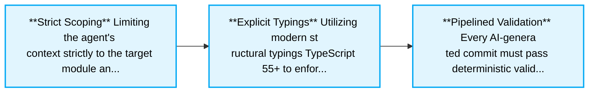
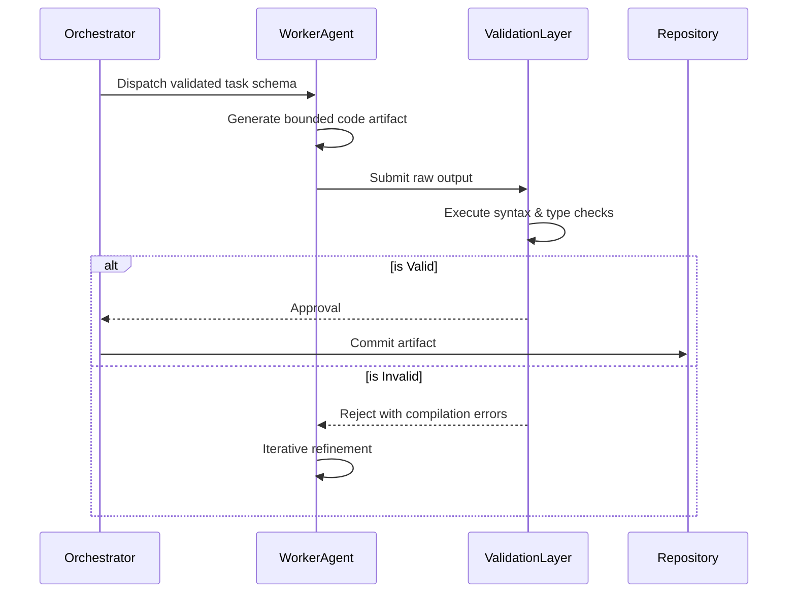

> 📦 [best-practise](../README.md) / 📄 [docs](./)

# 🤖 Vibe Coding Deterministic Generation Patterns + Production-Ready Best Practices

In 2026, **AI Agent Orchestration** dictates the future of software development, where developers operate as orchestrators and supervisors. To guarantee robust and predictable AI-driven outputs (also known as "Vibe Coding"), engineers must adopt deterministic generation patterns. This architectural guide codifies the strict guidelines and structural constraints required for agents to produce scalable, high-fidelity code.

---

## 🏗️ Architectural Foundations

Achieving determinism in AI code generation relies heavily on bounded contexts, explicit type definitions, and systemic feedback loops. When these constraints are missing, AI agents naturally drift toward generating technically plausible but structurally unsound code. Deterministic patterns force agents to adhere to strict validation checks, bounded task definitions, and clear orchestration hierarchies.

### The Deterministic Context Cycle

1. **Strict Scoping**: Limiting the agent's context strictly to the target module and its immediate dependencies.
2. **Explicit Typings**: Utilizing modern structural typings (TypeScript 5.5+) to enforce I/O schemas.
3. **Pipelined Validation**: Every AI-generated commit must pass deterministic validation steps.



> [!IMPORTANT]
> A critical failure in multi-agent orchestration is context leakage. Unbounded prompts allow an agent to hallucinate new abstractions that clash with the system's core architecture. Deterministic boundaries resolve this by treating every generation task as a functional pure component.

---

## 🔄 The Pattern Lifecycle

The repository enforces a strict four-step deterministic lifecycle for all code modifications. This guarantees consistency and establishes a machine-readable protocol for AI validation.

### ❌ Bad Practice

```typescript
// Unbounded AI task execution (Context Leakage)
async function generateComponent(prompt: any) {
    const aiResponse = await llm.complete(prompt);
    fs.writeFileSync('./src/Component.tsx', aiResponse);
}
```

### ⚠️ Problem

The `any` type here reflects an unbounded input structure. The `generateComponent` function assumes the AI will return a perfect, properly formatted React component. In practice, this results in syntax errors, hallucinated package imports, and unvalidated logic being committed directly to the file system, leading to broken builds.

### ✅ Best Practice

```typescript
// Strictly typed deterministic validation pipeline
import { z } from 'zod';

const TaskSchema = z.object({
    taskType: z.enum(['component', 'service', 'hook']),
    context: z.string(),
    strictMode: z.boolean()
});

async function generateComponent(taskParams: unknown) {
    // 1. Validate Input
    const validatedParams = TaskSchema.parse(taskParams);

    // 2. Execute bounded AI task
    const aiResponse = await llm.complete(validatedParams.context);

    // 3. Static Output Validation
    if (!isValidSyntax(aiResponse)) {
        throw new Error('Agent hallucinated invalid syntax. Halting execution.');
    }

    // 4. Commit safely
    fs.writeFileSync('./src/Component.tsx', aiResponse);
}
```

### 🚀 Solution

By defining explicit schemas (e.g., using `zod`), treating arbitrary inputs as `unknown` rather than `any`, and introducing a deterministic validation step before the commit, we establish a hard boundary. This approach ensures systemic stability by converting probabilistic AI generation into a deterministic software engineering process.

---

## 📊 Core Pattern Mapping

Different scenarios require varying levels of orchestration and structural boundaries.

| Orchestration Pattern | Complexity | Bounded Context Type | Failure Rate Risk |
| :--- | :--- | :--- | :--- |
| **Strict Pure Generation** | Low | Single Module Isolation | Low |
| **Cross-Module Refactor** | Medium | Dependency Graph Snapshot | Medium |
| **Architectural Bootstrap** | High | Global System Ruleset | High |

---

## 🧠 System Architecture Execution Flow

The following sequence details how a deterministic agent pipeline guarantees validated code artifacts.



---

## 📝 Actionable Checklist for Deterministic Patterns

To ensure your infrastructure supports high-fidelity AI generation, execute the following steps:

- [ ] Remove all instances of the `any` type from agent I/O schemas and replace them with `unknown` and proper Type Guards.
- [ ] Implement strict JSON-schema or Zod validation for all inputs to worker agents.
- [ ] Configure isolated, bounded contexts to prevent cross-module hallucinations.
- [ ] Enforce automated static analysis tools (linting, syntax validation) as a prerequisite to saving AI-generated code.
- [ ] Verify that every documented pattern strictly adheres to the four-step (Bad -> Problem -> Best -> Solution) architecture cycle.

<br>

[Back to Top](#-vibe-coding-deterministic-generation-patterns--production-ready-best-practices)
