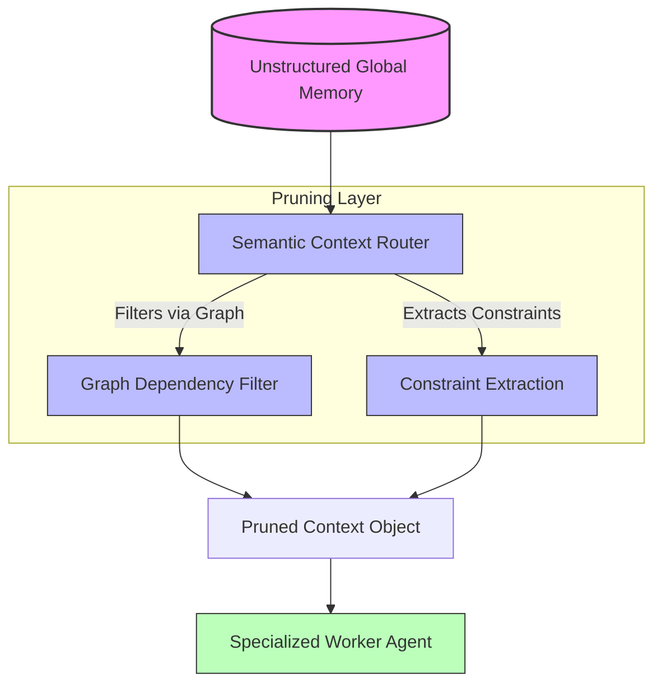

# ✂️ Vibe Coding Dynamic Context Pruning

In multi-agent environments, context window limitations and token costs are significant constraints. Passing raw, unfiltered repository data or deep conversational histories to specialized worker agents leads to degraded reasoning and hallucinations. This document establishes the deterministic patterns for **Dynamic Context Pruning**, ensuring agents receive exactly what they need—and nothing more.

## The Pattern Lifecycle

### ❌ Bad Practice

Passing the entire application state or unstructured project history directly to worker agents.

```typescript
// ❌ Anti-pattern: Sending a raw blob of state without semantic filtering
async function delegateTaskToWorker(workerAgent: Worker, state: any) {
  // state contains everything: users, logs, global config, raw text
  const prompt = `Solve this issue based on the current context: ${JSON.stringify(state)}`;
  return workerAgent.execute(prompt);
}
```

### ⚠️ Problem

The `state` object contains dense, irrelevant information for the specific worker's task. This bloats the LLM's context window, increasing latency, driving up token costs unnecessarily, and diluting the model's attention mechanism (the "needle in a haystack" problem), which frequently results in hallucinations or context collapse during zero-approval operations.

### ✅ Best Practice

Implement explicit, type-safe semantic routing to prune the context object before delegation, wrapping context bounds in defined schemas.

```typescript
// ✅ Best-practice: Type-safe Context Pruning using strict interfaces
interface PrunedContext {
  taskTarget: string;
  relevantCodeSnippets: string[];
  constraints: string[];
}

function pruneContextForWorker(state: unknown, targetPath: string): PrunedContext {
  // Verify 'state' structure via type guards (implementation omitted for brevity)
  if (typeof state !== 'object' || state === null) {
      throw new Error('Invalid state structure.');
  }

  // Extract only the necessary domains based on the target
  const pruned: PrunedContext = {
    taskTarget: targetPath,
    relevantCodeSnippets: extractRelevantSnippets(state, targetPath),
    constraints: extractConstraints(state, targetPath)
  };
  return pruned;
}

async function delegateTaskToWorker(workerAgent: Worker, state: unknown, targetPath: string) {
  const optimizedContext = pruneContextForWorker(state, targetPath);
  const prompt = `Solve this issue. Constraints: ${JSON.stringify(optimizedContext)}`;
  return workerAgent.execute(prompt);
}
```

### 🚀 Solution

By deterministically isolating specific state fragments tailored to a worker agent’s mandate, we maintain high token efficiency (O(1) memory transfer latency for pruned trees) and focus the LLM's attention mechanism strictly on the domain problem. Using `unknown` and type guards guarantees runtime safety when ingesting unpredictable global states, preventing execution failures.

---

## 🏗️ Structural Flow of Pruning



> [!IMPORTANT]
> The Context Pruning logic MUST be executed synchronously before any cross-agent IPC (Inter-Process Communication) to prevent blocking the event loop with oversized payloads.
