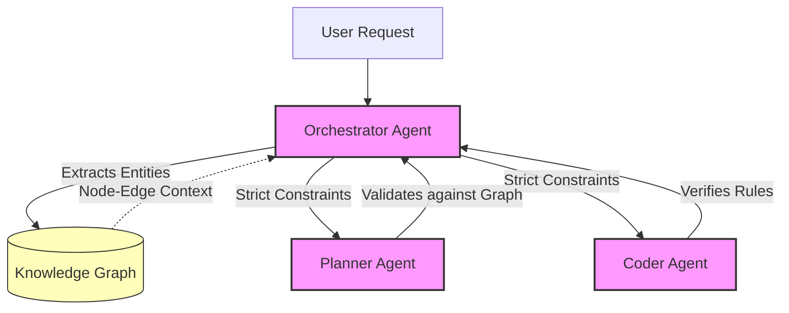

> 📦 [best-practise](../README.md) / 📄 [docs](./)

# 🌐 Vibe Coding Knowledge Graph Orchestration

In the 2026 Vibe Coding ecosystem, unstructured context injection via large vector stores often leads to AI Agent hallucinations due to missing semantic links. Knowledge Graph Orchestration (KGO) mandates the usage of structured, node-edge relationships to provide autonomous AI Agents with high-fidelity, highly constrained context retrieval.

## 🌟 The Rationale for Graph-Based Context

Linear context windows fail when analyzing deeply nested architectural constraints. Knowledge Graphs allow an orchestrator agent to traverse explicitly defined bounds (e.g., "If `Frontend` -> `React`, then enforce `State Management` rules"). This deterministic topology guarantees that agents only access relevant best-practise sub-graphs.

> [!IMPORTANT]
> **Nexus Integrity Constraint:** Every agentic query MUST originate from a verified node in the Knowledge Graph. Unbound similarity searches are strictly FORBIDDEN in multi-agent orchestration.

---

## 🏗️ Architectural Foundations

### ❌ Bad Practice

```typescript
class UnstructuredAgentContext {
  constructor(private readonly vectorDB: VectorStore) {}

  async generateCode(featureRequest: string) {
    // Arbitrary similarity search retrieves disconnected chunks of documentation
    const unstructuredContext = await this.vectorDB.similaritySearch(featureRequest, { k: 5 });

    // Agent attempts to vibe-code based on disjointed text fragments
    return await this.llm.invoke(`Context: ${unstructuredContext}\nTask: ${featureRequest}`);
  }
}
```

### ⚠️ Problem

Injecting raw similarity search results into an agent's prompt creates a fragmented context window. For example, the vector store might return a React UI snippet alongside a MongoDB backend configuration simply because both mention "user data". This lack of semantic relationships (edges) forces the LLM to guess architectural boundaries, leading to fatal execution hallucinations.

### ✅ Best Practice

```typescript
import { GraphClient } from '@vibe-coding/kg';

export interface GraphQueryPayload {
  domain: string;
  technology: string;
}

export class StructuredGraphContext {
  constructor(private readonly graphDB: GraphClient) {}

  async retrieveDeterministicContext(payload: GraphQueryPayload): Promise<unknown> {
    // Explicit traversal: Match Domain -> Requires -> Technology -> Implements -> Rule
    const query = `
      MATCH (d:Domain {name: $domain})-[:REQUIRES]->(t:Technology {name: $technology})
      MATCH (t)-[:IMPLEMENTS]->(r:Rule)
      RETURN r.definition AS constraint
    `;

    const structuredContext = await this.graphDB.query(query, payload);

    if (!structuredContext || structuredContext.length === 0) {
      throw new Error(`Graph Context Miss: No architectural rules found for ${payload.domain}/${payload.technology}`);
    }

    return structuredContext;
  }
}
```

> [!NOTE]
> **Internal Routing:** [Vibe Coding Agent Memory Management](./ai-agent-memory-architectures.md)

### 🚀 Solution

By structuring agent context via Knowledge Graphs (e.g., using Cypher queries), we transform ambiguous prompts into deterministic instructions. The graph explicitly links domains, technologies, and rules. If an orchestration worker attempts to vibe-code a feature, the KGO strictly filters out unrelated nodes. Replacing `any` returns with `unknown` and verifying the structured query guarantees O(1) impact on unrelated architectural layers and ensures Vibe Coding state transitions are unpolluted.

---

## 🧠 Multi-Agent Knowledge Traversal

The following illustrates how an Orchestrator manages worker agents querying the Knowledge Graph.



## 📝 Actionable Checklist for KGO Implementation

- [ ] Transition from raw vector similarity searches to graph-based deterministic querying.
- [ ] Define explicit relationships (`REQUIRES`, `IMPLEMENTS`, `CONSTRAINS`) for your project architecture.
- [ ] Implement strict Type Guards on all responses returned from the Knowledge Graph.
- [ ] Ensure the orchestration pipeline explicitly fails (`Graph Context Miss`) instead of hallucinating if no nodes match the query.

<br>

[Back to Top](#-vibe-coding-knowledge-graph-orchestration)
