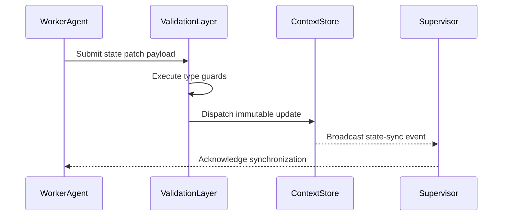

> 📦 [best-practise](../README.md) / 📄 [docs](./)

# 🤖 TypeScript Autonomous Multi-Agent State Sync

In 2026, **AI Agent Orchestration** demands rigorous implementation of deterministic **best practices**. This guide provides the foundational patterns for implementing TypeScript multi-agent state synchronization within the context of Vibe Coding. Maintaining an isolated, strictly-typed Context Store ensures that parallel worker agents operate synchronously without side effects.

---

## 🏗️ Architectural Foundations

When multiple autonomous agents participate in a Vibe Coding pipeline, isolated state instances inevitably lead to race conditions. The primary mechanism for ensuring consistency is a centralized, distributed Context Store.

### ❌ Bad Practice
```typescript
// Local mutable state - prone to context drift in multi-agent environments
let globalAgentContext: any = {};

export function updateAgentState(taskId: string, payload: any) {
  globalAgentContext[taskId] = payload;
}
```

### ⚠️ Problem
Using unstructured, mutable state and the `any` type leads to AI hallucinations. In distributed AI orchestration architectures, multiple agents writing to an un-synchronized local object causes race conditions, ultimately corrupting the generated code pipeline.

### ✅ Best Practice
```typescript
import { createStore } from '@vibe-coding/state';

export interface AgentPayload {
  taskId: string;
  diff: string;
  bytes: number;
}

export const OrchestrationStore = createStore<Record<string, unknown>>({
  initialState: {},
  strictMode: true,
});

export async function updateAgentState(taskId: string, payload: unknown): Promise<void> {
  if (typeof payload === 'object' && payload !== null && 'diff' in payload) {
    await OrchestrationStore.dispatch('UPDATE_TASK', { [taskId]: payload });
  } else {
    throw new Error('Invalid payload structure received from worker agent.');
  }
}
```

### 🚀 Solution
By enforcing an immutable state container and strict type guards with `unknown`, we establish a deterministic boundary. This guarantees that all agents interpret the orchestration data identically, eliminating context drift and ensuring predictable code generation.

---

## 🔄 Agentic Data Flow

The sequence of synchronization requires validation gates to verify state immutability.



---

## 📊 State Management Components

| Component | Responsibility | Failure Consequence |
| :--- | :--- | :--- |
| **WorkerAgent** | Executes localized vibe coding logic | Stale context rendering |
| **ValidationLayer** | Guarantees deterministic input shapes | Pipeline corruption |
| **ContextStore** | Centralized, immutable single source of truth | Multi-agent hallucinations |
| **Supervisor** | Orchestrates tasks based on synced state | Infinite loops |

> [!NOTE]
> Ensure the Context Store is backed by a persistent layer like Redis if your orchestration spans multiple server instances.

> [!IMPORTANT]
> The ValidationLayer must reject any payload failing structural schema validation. Silent failures in state synchronization are unacceptable in Vibe Coding.

---

## 📝 Actionable Checklist

To finalize your multi-agent synchronization mechanism, verify the following:

- [ ] Ensure all local mutable state objects are replaced with an immutable Context Store.
- [ ] Replace all instances of `any` with `unknown` and implement corresponding type guards.
- [ ] Implement the `ValidationLayer` to rigorously inspect incoming agent payloads.
- [ ] Map the Mermaid `sequenceDiagram` to your actual telemetry logs to verify the event flow.

<br>

[Back to Top](#-typescript-autonomous-multi-agent-state-sync)