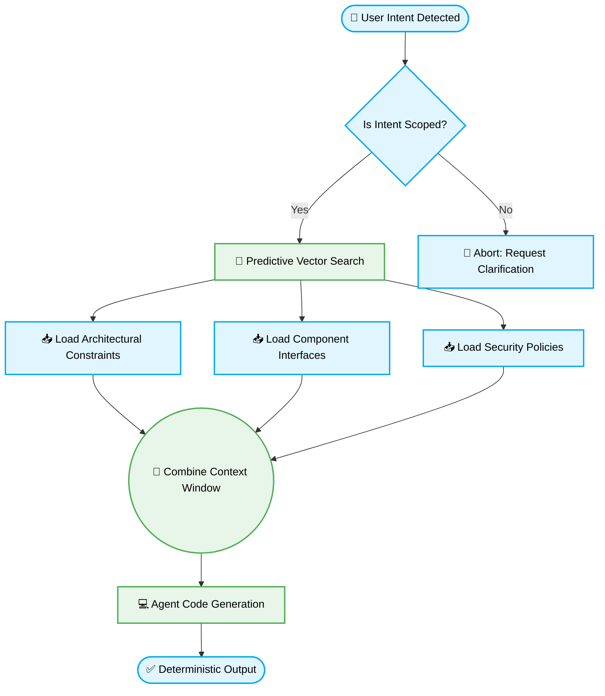

> 📦 [best-practise](../README.md) / 📄 [docs](./)

# 🔮 Vibe Coding: Predictive Context Orchestration

Predictive Context Orchestration is a foundational 2026 paradigm within the Vibe Coding ecosystem. It mandates that multi-agent systems and IDE assistants preemptively inject surrounding architectural rules and state constraints *before* code generation begins. By anticipating dependencies, agents avoid structural deviations, eliminate "hallucination loops," and ensure deterministic feature implementation.

---

## 🏗️ Architectural Concept

Unlike reactive context fetching (where an agent asks for files after throwing an error), **Predictive Orchestration** proactively maps the logical dependencies of a given instruction and loads the necessary constraints automatically.

### 📊 Context Retrieval Lifecycle (Mermaid Flowchart)



> [!NOTE]
> The primary mechanism for Predictive Context Orchestration is the exact configuration of `.agents/rules/*.md` and strictly typed AST boundaries in TypeScript.

---

## 📐 Structural Comparison

| Strategy | Execution Flow | AI Agent Result | Predictability |
|:---|:---|:---|:---:|
| **Reactive Context** | Agent generates -> Linter fails -> Agent requests `types.ts` -> Fixes code. | Fragmented, resource-heavy (multiple API calls). | 🔴 Low |
| **Predictive Context** | Intent detected -> Agent pre-loads `types.ts` & `security.md` -> Code generated. | Deterministic, adheres to Layer Isolation immediately. | 🟢 High |

---

## 🔄 The Pattern Lifecycle: Enforcing Contextual Strictness

When instructing agents to implement data ingestion pipelines, it is vital to mandate explicit type guard validations. If an agent infers data structures without a strict schema, it operates outside of Predictive Context Orchestration.

### ❌ Bad Practice

```typescript
// The agent generates code assuming the payload structure without predictive enforcement
function processPredictivePayload(payload: any) {
    // ⚠️ RISK: Agent hallucinates that `payload` has a 'contextId' property
    console.log(`Processing orchestration for: ${payload.contextId}`);
}
```

### ⚠️ Problem

Using `any` effectively strips the predictive capabilities of the compiler and the AI Agent. The agent can synthesize code that compiles but inherently fails at runtime if the upstream system alters the data structure. It represents a total failure of architectural determinism.

### ✅ Best Practice

```typescript
// Define a strict schema that the Agent must predictably parse
interface PredictiveContextPayload {
    contextId: string;
    orchestrationState: 'active' | 'standby';
}

// Ensure the agent applies type guards to validate external data
function isPredictiveContext(data: unknown): data is PredictiveContextPayload {
    return (
        typeof data === 'object' &&
        data !== null &&
        'contextId' in data &&
        typeof (data as Record<string, unknown>).contextId === 'string' &&
        'orchestrationState' in data
    );
}

function processPredictivePayload(payload: unknown) {
    if (isPredictiveContext(payload)) {
        console.log(`Processing orchestration for: ${payload.contextId}`);
    } else {
        throw new Error("Invalid Context Payload: Orchestration aborted.");
    }
}
```

### 🚀 Solution

By defining explicit `interface` structures and utilizing `unknown` paired with precise Type Guards, the AI Agent is forced to logically infer the validation pathways. Predictive Context Orchestration ensures that the agent maps the system boundaries *before* processing, resulting in deterministic, strictly typed code execution that cannot bypass structural rules.

---

## ⚡ Execution Mandate & Checklist

To implement Predictive Context Orchestration in your Vibe Coding workflow, strictly adhere to the following checklist:

- [ ] Define bounded contexts and explicit interfaces using TypeScript 5+ (`interface` for structure, `type` for unions).
- [ ] Replace all `any` usages with `unknown` and implement robust Type Guards.
- [ ] Group constraint documentation functionally (e.g., `./architectures/fsd/layer-isolation.md`).
- [ ] Enforce bi-directional dependency mapping so agents pre-fetch interfaces proactively.
- [ ] Validate AST schema rules using `vibe-check-runner.js` to ensure the structure is immune to agent hallucinations.

---
> 🔙 Return to [Root Repository](../README.md)
