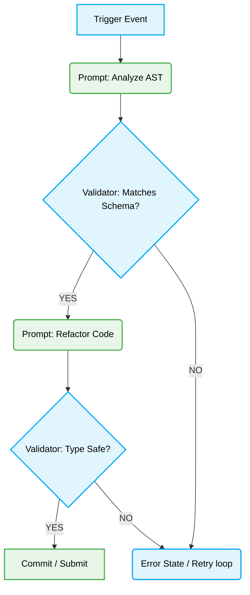

# 🤖 Vibe Coding Prompt Chain Validation

## 🎯 Context & Scope

In the context of highly autonomous AI Agent operations (Vibe Coding), single-shot prompts are rarely sufficient for complex architectural or systemic changes. Systems require "Prompt Chains"—sequences of tasks where the output of one LLM call directly dictates the input and context of the next.

If these prompt chains are not deterministically validated at each transition boundary, hallucinations cascade. A slight hallucination at Step 1 geometrically compounds by Step 5, resulting in destructive autonomous code modifications or logical regressions. This document mandates the strict deterministic validation required for safe prompt chain execution.

## 🧱 Core Principles

1.  **Strict State Boundary Checks**: Every prompt execution must be wrapped in a deterministic state parser that validates output schemas before permitting chain advancement.
2.  **Graceful Degradation**: If an output violates the validation AST, the state machine must gracefully retry (with feedback) or fallback, rather than forwarding malformed data.
3.  **Auditability Trace**: Each prompt transition requires logging its input state, LLM response, and deterministic validation result for post-mortem analysis.

## 📐 Architecture Diagram



## 🚧 Strict Pattern Implementation

### ❌ Bad Practice

Failing to strictly type the LLM output boundaries. The system trusts that the LLM returned JSON and passes it blindly to the next step.

```typescript
// Anti-pattern: Blindly chaining prompts without structural validation
async function executeChain(codeSnippet: string) {
    const analysisResponse = await llm.prompt(`Analyze this code: ${codeSnippet}`);

    // BAD: Assumes analysisResponse is perfectly formatted JSON
    const parsedData = JSON.parse(analysisResponse);

    const finalCode = await llm.prompt(`Refactor based on analysis: ${parsedData.recommendation}`);
    return finalCode;
}
```

### ⚠️ Problem

If the LLM returns conversational filler (e.g., "Here is your JSON: {...}"), `JSON.parse` immediately throws a fatal exception. If it returns valid JSON but with a hallucinated key (e.g., `suggested_fix` instead of `recommendation`), `parsedData.recommendation` resolves to `undefined`. The second prompt then executes with "Refactor based on analysis: undefined", leading to catastrophic hallucinated code generation that might be autonomously committed.

### ✅ Best Practice

Employing Zod (or equivalent AST schemas) for runtime boundary validation before advancing the chain.

```typescript
import { z } from 'zod';

// Define the absolute structural requirement
const AnalysisSchema = z.object({
  recommendation: z.string().min(10),
  riskLevel: z.enum(['low', 'medium', 'high']),
});

type AnalysisContext = z.infer<typeof AnalysisSchema>;

async function executeChain(codeSnippet: string): Promise<string> {
    const analysisResponse = await llm.prompt(`Analyze this code, output strict JSON: ${codeSnippet}`);

    let validatedData: AnalysisContext;
    try {
      // 1. Sanitize input (strip markdown blocks if present)
      const rawJson = extractJsonFromMarkdown(analysisResponse);

      // 2. Deterministic Structural Validation
      validatedData = AnalysisSchema.parse(JSON.parse(rawJson));
    } catch (error) {
      // 3. Chain Halt & Recovery
      throw new PromptChainBoundaryError("LLM hallucinated output schema.", error);
    }

    // 4. Safe Chain Advancement
    const finalCode = await llm.prompt(`Refactor based on analysis: ${validatedData.recommendation}`);
    return finalCode;
}

// Helper to ensure deterministic JSON parsing
function extractJsonFromMarkdown(str: string): string {
    const match = str.match(/```json\n([\s\S]*?)\n```/);
    return match ? match[1] : str;
}
```

### 🚀 Solution

By defining an explicit `AnalysisSchema` using Zod, we enforce rigid Type Safety at the prompt transition boundary.
1. **Sanitization:** We predict LLM behavioral quirks (markdown wrapping) and normalize the data.
2. **Validation:** `AnalysisSchema.parse()` guarantees that not only is the output valid JSON, but it strictly contains the required `recommendation` string.
3. **Safety:** If the LLM hallucinates, an explicit error halts the chain, preventing cascading failure and protecting the repository from autonomous corruption. This makes the system deterministically resilient.

> [!IMPORTANT]
> The `extractJsonFromMarkdown` utility is critical. Modern LLMs frequently wrap raw JSON responses in markdown backticks even when instructed otherwise.

> [!NOTE]
> For complex chains, consider implementing a `retry` loop in the `catch` block that feeds the Zod validation error back to the LLM so it can correct its own structural hallucination.

---

## 🛠 Under the Hood

Prompt chain validation relies heavily on execution environments treating LLM output as untrusted user input.

### Edge Case Handling

1. **Schema Evolution Mismatches:** When you update `AnalysisSchema`, cached LLM responses in test environments will suddenly fail. Ensure your test suites invalidate cached LLM outputs when schema boundaries change.
2. **Context Window Saturation:** If the `validatedData` object is too large, it may push the subsequent prompt beyond token limits. Implement dynamic context pruning before serializing `validatedData` into the next prompt.
3. **Recursive Hallucination Loops:** If implementing a retry mechanism on failure, strict boundaries must be placed. For instance: `MAX_RETRIES = 3`. If an LLM cannot conform to the schema after three guided attempts, the agent must escalate to human intervention or gracefully abandon the task, preventing infinite token burning.
