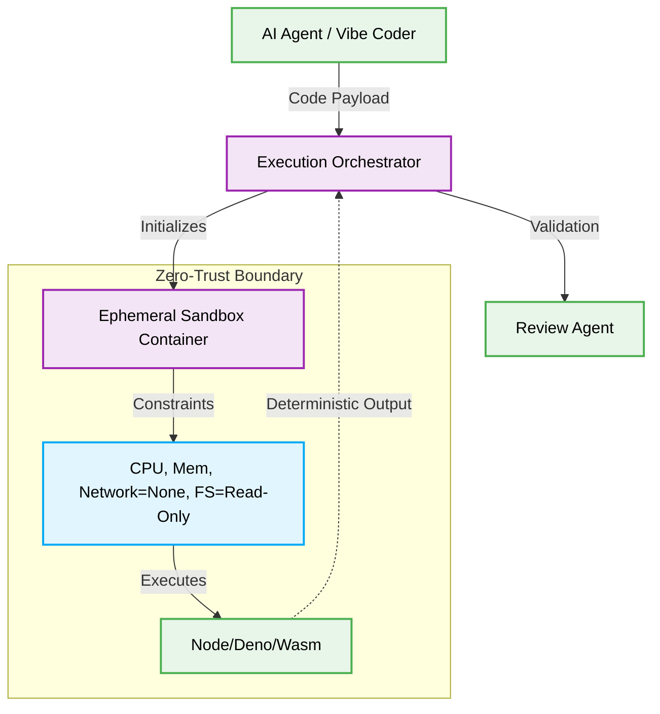

# 🛡️ Vibe Coding: Secure Sandbox Execution

> [!NOTE]
> **Internal Routing:** [Back to Root](../README.md)

## 🌟 The Criticality of Secure Sandbox Execution

In the 2026 landscape of Vibe Coding, AI Agents routinely generate and execute code autonomously. A critical requirement for this workflow is ensuring that agent-generated artifacts cannot compromise the host system. **Secure Sandbox Execution** mandates that all autonomous executions occur within strictly isolated, ephemeral environments with zero-trust network policies and bounded resource limits.

Failing to sandbox AI execution leads to direct vulnerabilities, where a hallucinated command or maliciously crafted payload can escalate privileges, leak sensitive environment variables, or corrupt root system directories.

---

## 🔄 The Pattern Lifecycle: Agent Execution Isolation

### ❌ Bad Practice

Allowing an AI Agent to execute shell commands directly on the host system without process isolation or resource constraints.

```typescript
// Anti-pattern: Unbounded native execution
import { exec } from 'child_process';

class VulnerableAgentExecutor {
  async runGeneratedCode(agentCode: string) {
    // FATAL RISK: Executing untrusted code natively on the host
    return new Promise((resolve, reject) => {
      exec(`node -e "${agentCode}"`, (error, stdout, stderr) => {
        if (error) {
          console.error(`Execution error: ${error}`);
          return reject(error);
        }
        resolve(stdout);
      });
    });
  }
}
```

### ⚠️ Problem

The `VulnerableAgentExecutor` allows the agent to execute any Node.js code natively. If the agent hallucinates an import like `fs.rmSync('/', { recursive: true })` or attempts to read `.env` files via `process.env`, it will succeed because it inherits the host application's permissions. This approach violates the principle of least privilege and introduces a catastrophic attack vector.

### ✅ Best Practice

Isolating execution using ephemeral containers or secure runtimes (like Deno's permission system or specialized WebAssembly sandboxes) with strict network, file system, and CPU/Memory limits.

```typescript
// Best Practice: Isolated, restricted Sandbox execution
import { execFile } from 'child_process';
import { v4 as uuidv4 } from 'uuid';

interface ExecutionResult {
  stdout: string;
  stderr: string;
  exitCode: number;
}

class SecureSandboxExecutor {
  async runSafely(agentCode: unknown): Promise<ExecutionResult> {
    if (typeof agentCode !== 'string') {
        throw new Error("Invalid code format provided by Agent.");
    }

    const executionId = uuidv4();
    const sandboxArgs = [
      'run',
      '--rm', // Ephemeral container
      '--network', 'none', // Zero-trust network access
      '--memory', '256m', // Bounded resources
      '--cpus', '1',
      '--read-only', // Immutable root filesystem
      'sandbox-runtime:latest',
      'node',
      '-e',
      agentCode
    ];

    return new Promise((resolve, reject) => {
      execFile('docker', sandboxArgs, { timeout: 5000 }, (error: unknown, stdout, stderr) => {
        // Safe handling of execution, even if timeout occurs
        resolve({
          stdout: String(stdout),
          stderr: String(stderr),
          exitCode: (error as any)?.code ?? 0
        });
      });
    });
  }
}
```

> [!NOTE]
> **Internal Routing:** [Back to Root](../README.md)

### 🚀 Solution

By utilizing containerization mechanisms (e.g., Docker, Firecracker, or WebAssembly), `SecureSandboxExecutor` ensures that agent-generated logic runs in a vacuum. Network access is disabled (`--network none`), the filesystem is read-only, and computational resources are strictly limited. This guarantees deterministic, safe execution where agent hallucinations cannot escape the sandbox boundary, preserving systemic integrity and adhering to zero-trust principles.

---

## 🗺️ Execution Flow



> [!IMPORTANT]
> **Hard Constraint:** Under no circumstances should an AI agent process be granted raw execution access to the host's `child_process.exec` without a robust sandboxing layer. This is non-negotiable for Vibe Coding in production environments.
