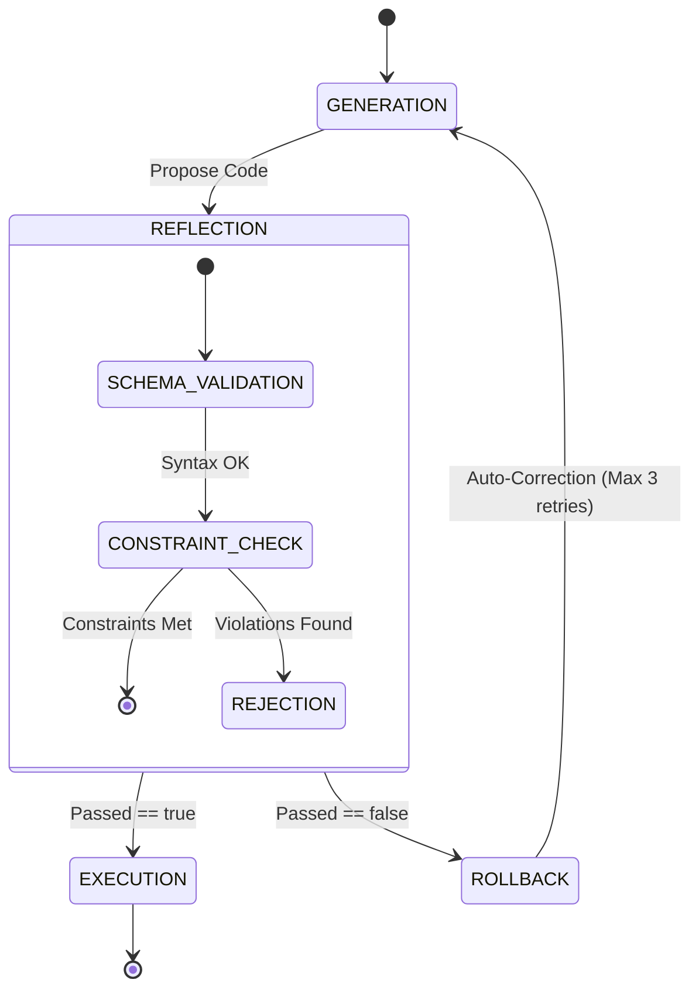

> 📦 [best-practise](../README.md) / 📄 [docs](./)

# 🤖 AI Agent Orchestration: Deterministic Self-Reflection Loops

In the 2026 AI Agent orchestration landscape, the capacity for an agent to evaluate and correct its own proposed solutions before execution is critical for preventing compounding errors. This document specifies the architectural constraints for implementing high-fidelity Deterministic Self-Reflection Loops, ensuring agents validate their outputs against strict deterministic boundaries prior to committing code or state changes.

---

## 🏗️ The Pattern Lifecycle

When implementing self-correction, unstructured or conversational reflection prompts lead to hallucinations and circular logic. Self-reflection MUST be implemented as a rigid, programmatic evaluation phase.

### ❌ Bad Practice

```typescript
// Unstructured reflection - prone to AI hallucination and non-deterministic logic
async function reviewGeneratedCode(code: string): Promise<string> {
  const prompt = `Review the following code and fix any issues you find:\n${code}`;
  const response = await aiModel.generate(prompt);
  return response.text; // Blindly returning the unverified output
}
```

### ⚠️ Problem

Providing an open-ended prompt without specific evaluation criteria guarantees non-deterministic outputs. The AI might introduce new bugs, modify functional logic, or simply echo back the original code with hallucinated commentary. This conversational approach lacks type safety, structural validation, and explicit rollback mechanisms, leading to execution drift in autonomous systems.

### ✅ Best Practice

```typescript
import { createValidator } from '@vibe-coding/validation';
import { type ReflectionResult } from './types';

// Deterministic validation rules
const strictRules = [
  'Zero `any` usage',
  'Strict FSD import paths',
  'No synchronous file operations'
];

export async function executeDeterministicReflection(
  proposedCode: string,
  context: unknown
): Promise<ReflectionResult> {
  // Enforce structured output via Zod schemas or similar guarantees
  const reflectionSchema = createValidator<ReflectionResult>({
    passed: 'boolean',
    violations: 'array',
    remediatedCode: 'string | null'
  });

  const structuredPrompt = `
    Evaluate the proposed code against these MANTADORY constraints: ${strictRules.join(', ')}.
    Return a STRICT JSON object matching this schema: ${reflectionSchema.getShape()}.
    Code: ${proposedCode}
  `;

  const response = await aiModel.generateWithSchema(structuredPrompt, reflectionSchema);

  if (!response.passed && response.violations.length > 0) {
    throw new Error(`Self-Reflection Failed: ${response.violations.join(', ')}`);
  }

  return response;
}
```

### 🚀 Solution

By formalizing the reflection process into a deterministic evaluation function (`executeDeterministicReflection`), we enforce explicit programmatic boundaries. The model is constrained to return a structured payload matching a predefined schema. This strictly typed approach prevents conversational hallucinations and guarantees that the orchestration system can cleanly handle failures, log exact violations, and trigger controlled rollback workflows. This deterministic pattern provides unparalleled resilience compared to open-ended conversational evaluation.

---

## 🔄 Self-Reflection Workflow

The following process diagram outlines the necessary steps for implementing a deterministic self-reflection loop.



> [!NOTE]
> Establish a strict retry limit (e.g., maximum 3 attempts) for the self-reflection rollback loop to prevent infinite generation cycles and excessive API consumption.

> [!IMPORTANT]
> A self-reflection module MUST throw a strongly typed error containing the specific constraint violations when `passed` is `false`. Silent failure handling is STRICTLY FORBIDDEN.

---

## 📊 Evaluation Boundaries

To ensure systemic stability, ensure your self-reflection loops evaluate the following orthogonal categories independently:

| Validation Category | Deterministic Metric | Failure Action |
| :--- | :--- | :--- |
| **Type Safety** | 0 usages of `any`, explicit return types | Hard Reject |
| **Architectural Layering** | Dependencies strictly follow FSD/DDD | Hard Reject |
| **Execution Safety** | No forbidden functions (e.g., `execSync`) | Hard Reject + Alert |

<br>

[Back to Top](#-ai-agent-orchestration-deterministic-self-reflection-loops)
