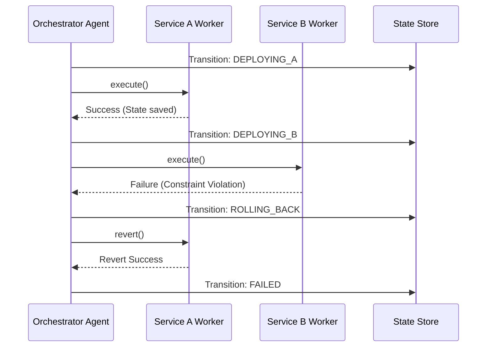

> 📦 [best-practise](../README.md) / 📄 [docs](./)

# 🤖 AI Agent Orchestration: State Rollback Mechanisms

In the 2026 AI Agent orchestration landscape, multi-agent workflows executing complex system changes must be equipped with deterministic **State Rollback Mechanisms**. When an AI Agent hallucinates, encounters an infrastructure constraint, or triggers a cascading failure, the system MUST be able to regress to a known safe state immediately without leaving fragmented artifacts.

---

## 🏗️ Architectural Foundations

When designing AI Agents that alter infrastructure, state, or source code, implicit assumption of forward-only progress leads to catastrophic failures. Engineers MUST enforce compensatory actions (Sagas or Revert blocks) mapped to each executed state transition.

### ❌ Bad Practice

```typescript
export async function executeDeployment(agentPayload: any) {
  // Implicit forward-only execution without rollback
  await deployServiceA(agentPayload.serviceAConfig);

  // If service B fails, Service A is left running in a broken overall system state
  await deployServiceB(agentPayload.serviceBConfig);

  console.log('Deployment complete!');
}
```

### ⚠️ Problem

Utilizing unbounded payloads (`any`) and implicit execution logic ensures that if an operation fails midway, the system is left in an inconsistent, undefined state. In Vibe Coding orchestrations, if an AI agent partially applies codebase transformations or provisions infrastructure and crashes, a human developer is forced to manually identify and revert the fragmented state, defeating the purpose of autonomy.

### ✅ Best Practice

```typescript
import { createStore } from '@vibe-coding/state';

export type DeploymentState = 'IDLE' | 'DEPLOYING_A' | 'DEPLOYING_B' | 'ROLLING_BACK' | 'SUCCESS' | 'FAILED';

export interface RollbackPayload {
  transactionId: string;
  metadata: unknown;
}

export const OrchestrationStore = createStore<{ state: DeploymentState, context: unknown }>({
  initialState: { state: 'IDLE', context: null },
  strictMode: true,
});

export async function executeDeployment(payload: unknown): Promise<void> {
  const transactionId = generateTransactionId();
  const context = validatePayload(payload); // Ensures shape via TypeGuards

  try {
    await transitionAgent('DEPLOYING_A', { transactionId, metadata: context.serviceA });
    await deployServiceA(context.serviceA);

    await transitionAgent('DEPLOYING_B', { transactionId, metadata: context.serviceB });
    await deployServiceB(context.serviceB);

    await transitionAgent('SUCCESS', { transactionId, metadata: null });
  } catch (error) {
    // Deterministic Rollback invocation
    await triggerRollback(transactionId);
  }
}

async function triggerRollback(transactionId: string): Promise<void> {
  await transitionAgent('ROLLING_BACK', { transactionId, metadata: null });

  // Execute mapped compensations
  if (await isServiceADeployed(transactionId)) {
    await revertServiceA(transactionId);
  }
  if (await isServiceBDeployed(transactionId)) {
    await revertServiceB(transactionId);
  }

  await transitionAgent('FAILED', { transactionId, metadata: null });
}

async function transitionAgent(newState: DeploymentState, payload: unknown): Promise<void> {
  // Validate unknown payload via strict TypeGuards
  if (typeof payload === 'object' && payload !== null && 'transactionId' in payload) {
    await OrchestrationStore.dispatch('UPDATE_STATE', { state: newState, context: payload });
  } else {
    throw new Error('Invalid rollback payload structure.');
  }
}
```

### 🚀 Solution

By implementing explicit Saga-based rollback mechanisms, we guarantee system fidelity. We replace `any` with `unknown` and enforce strict Type Guards during transition to prevent context pollution. If a step fails, the orchestrator explicitly enters a `ROLLING_BACK` state and triggers inverse operations (compensating transactions) for any successfully completed previous steps. This ensures that the system always returns to a deterministic, clean state without human intervention.

---

## 🔄 Rollback Execution Flow

The following sequence illustrates the deterministic execution and subsequent rollback path when an AI Agent encounters a validation failure mid-workflow.



> [!NOTE]
> **Internal Routing:** For more context on deterministic boundaries, refer back to the [AI Agent Orchestration Index](./ai-agent-orchestration.md).

> [!IMPORTANT]
> A worker agent MUST NOT attempt to self-heal during a rollback sequence. The rollback is an absolute regression to a safe state managed exclusively by the Supervisor or Orchestrator.
