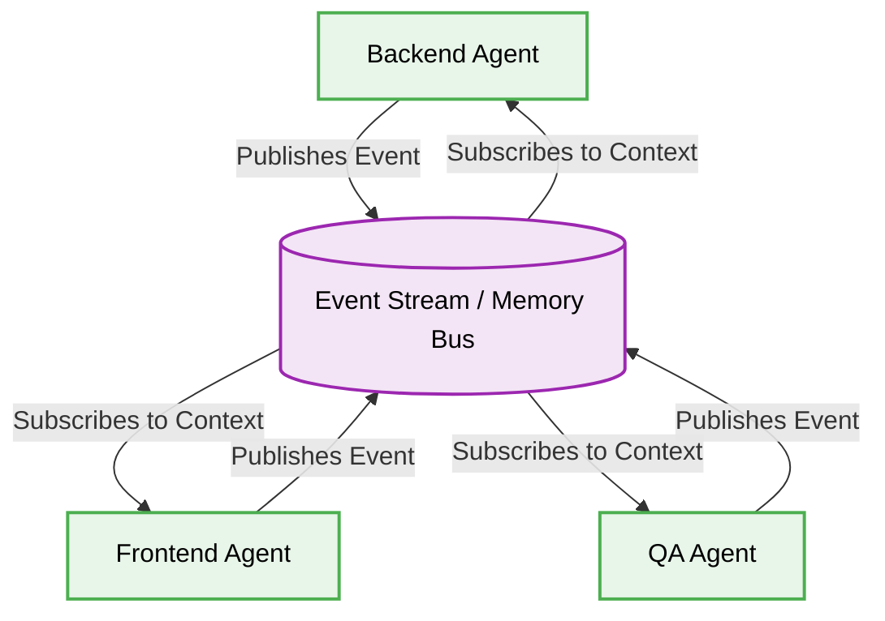

> 📦 [best-practise](../README.md) / 📄 [docs](./)

# 🐝 Swarm Intelligence Architectures for AI Agent Orchestration

In the hyper-accelerated landscape of 2026, centralized AI orchestration often creates a bottleneck. To ensure real-time negotiation and extreme fault tolerance, systems must migrate toward **Swarm Intelligence Architectures**. This paradigm shifts the orchestrator's role from micromanagement to goal definition, empowering specialized agents to self-organize, resolve conflicts, and collectively synthesize a solution.

---

## 🌟 The Decentralization of Vibe Coding

> [!IMPORTANT]
> Swarm Intelligence relies on Peer-to-Peer (P2P) communication over a highly regulated unified memory bus. By eliminating the Single Point of Failure (SPOF) present in Hierarchical Manager patterns, swarm systems MUST seamlessly scale to manage complex, non-linear development tasks.

> [!IMPORTANT]
> The fundamental requirement for a successful Swarm Architecture is the enforcement of a strict structural contract. Agents must be incapable of mutating the shared context without adhering to deterministic I/O schemas.

### 📊 Comparative Analysis: Swarm vs Hierarchical

| Metric | Swarm Intelligence (P2P) | Hierarchical Orchestrator |
| :--- | :--- | :--- |
| **Fault Tolerance** | Extreme (Agents self-heal and replace peers) | Medium (Dependent on Manager health) |
| **Complexity** | Very High | Medium |
| **Execution Speed** | Ultra-Fast (Parallelized negotiation) | Slower (Sequential delegation) |
| **Best Use Case** | Ambiguous, multi-disciplinary problem solving | Well-defined, predictable pipelines |

---

## 🏗️ P2P Memory Bus Architecture

For agents to collaborate effectively without a central manager, they must utilize a deterministic, event-driven context database.



---

## 🔄 The Pattern Lifecycle: Enforcing Strict Types in P2P Communication

When building swarm networks, the primary failure mode is unvalidated message passing. Below is the deterministic lifecycle to secure inter-agent communication.

### ❌ Bad Practice

```typescript
// Unsafe peer-to-peer message broadcasting
class SwarmAgent {
    public broadcast(message: any): void {
        eventBus.emit('agent_message', message);
    }

    public onMessage(payload: any): void {
        console.log("Processing:", payload.data); // Risk of undefined payload structure
    }
}
```

### ⚠️ Problem

Utilizing the `any` type in P2P agent communication destroys type safety. Agents broadcasting malformed data will trigger cascading Runtime Exceptions across the swarm. Without strict contracts, AI hallucinations rapidly propagate, causing the entire system to crash or produce invalid architectural decisions.

### ✅ Best Practice

```typescript
import { z } from 'zod';

const AgentMessageSchema = z.object({
    senderId: z.string().uuid(),
    intent: z.enum(['proposal', 'rejection', 'synthesis']),
    payload: z.record(z.string(), z.unknown()),
    timestamp: z.number()
});

class DeterministicSwarmAgent {
    public broadcast(message: unknown): void {
        const validatedMessage = AgentMessageSchema.parse(message);
        eventBus.emit('agent_message', validatedMessage);
    }

    public onMessage(rawPayload: unknown): void {
        if (rawPayload && typeof rawPayload === 'object' && 'payload' in rawPayload) {
            const safePayload = rawPayload as z.infer<typeof AgentMessageSchema>;
            // Deterministic processing using Type Guards
            this.handleIntent(safePayload.intent, safePayload.payload);
        }
    }

    private handleIntent(intent: string, data: Record<string, unknown>): void {
        // Safe execution logic here
    }
}
```

### 🚀 Solution

> [!IMPORTANT]
> By implementing `unknown` and applying structural validation schemas (like Zod) coupled with Type Guards, we create a deterministic airgap. The swarm becomes resilient against hallucinations because malformed messages are rejected at the memory bus boundary before they MUST contaminate the execution context of peer agents. This architectural approach guarantees systemic stability.

---

## 📝 Actionable Checklist for Swarm Integration

- [ ] Migrate from a centralized manager to a Pub/Sub Memory Bus architecture for multi-agent workflows.
- [ ] Strictly define agent intents (`proposal`, `rejection`, `synthesis`) to standardize negotiation.
- [ ] Replace all `any` types in agent communication layers with `unknown` and implement robust Type Guards.
- [ ] Enforce schema validation on all events published to the memory bus.
- [ ] Ensure agents are idempotent to handle duplicate event processing securely.

<br>

[Back to Top](#-swarm-intelligence-architectures-for-ai-agent-orchestration)
