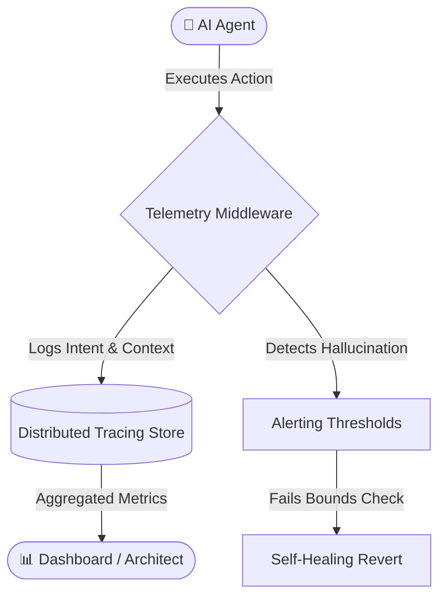
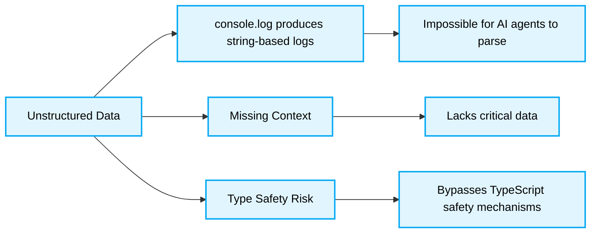

> 📦 [best-practise](../README.md) / 📄 [docs](./)

# 📡 Vibe Coding Telemetry Patterns: AI Agent Observability

In the paradigm of **Vibe Coding** and AI Agent Orchestration, traditional logging is insufficient. Autonomous agents operating at scale require **Deterministic Telemetry pipelines** to track intent, state transformations, and hallucination bounds in real-time. This document outlines the 2026 architectural standards for Agent Observability.

## 🌟 The Need for Deterministic Telemetry

When multi-agent systems interact asynchronously, standard debugging becomes obsolete. We must shift from "What went wrong?" to "Why did the agent decide to execute this state mutation?". Telemetry for Vibe Coding necessitates structured, machine-parseable data streams.

### Core Paradigms for 2026

1. **Intent-Based Logging:** Logs must capture the LLM's *reasoning* alongside the action.
2. **Context Snapshots:** Capture immutable snapshots of the agent's context window at the time of execution.
3. **Hallucination Detection:** Implement automated bounds-checking and record semantic deviations.

```mermaid
stateDiagram-v2
    direction LR
    classDef default fill:#e1f5fe,stroke:#03a9f4,stroke-width:2px,color:#000;

    IntentLogging: Intent-Based Logging
    ContextSnapshot: Context Snapshots
    HallucinationCheck: Hallucination Detection

    IntentLogging --> ContextSnapshot
    ContextSnapshot --> HallucinationCheck
```

> [!IMPORTANT]
> To maintain deterministic observability, telemetry streams must strictly serialize LLM context windows to prevent parsing exceptions downstream.

---

## 🏗️ Visual Architecture: Telemetry Data Flow



---

## 🔄 The Pattern Lifecycle: Agent Telemetry

### ❌ Bad Practice

```typescript
// Relying on unstructured, human-centric logging for AI Agents
async function generateComponent(prompt: string) {
    console.log(`Starting to generate component with prompt: ${prompt}`);
    try {
        const response = await ai.generate(prompt);
        console.log("Component generated successfully!");
        return response;
    } catch (error: any) {
        console.error("Agent failed to generate component:", error.message);
        throw error;
    }
}
```

### ⚠️ Problem

1. **Unstructured Data:** `console.log` produces string-based logs that are impossible for other AI agents to parse for self-healing or performance tuning.
2. **Missing Context:** The log lacks critical data such as model version, temperature, token usage, and system prompt constraints.
3. **Type Safety Risk:** Using `error: any` bypasses TypeScript's safety mechanisms, leading to unpredictable runtime crashes if the `error` object lacks a `message` property.




### ✅ Best Practice

```typescript
// Deterministic, structured telemetry with strict type safety
import { trace } from '@opentelemetry/api';

interface AgentTelemetryPayload {
    agentId: string;
    model: string;
    intent: string;
    tokenUsage: number;
    success: boolean;
    contextSnapshotId: string;
}

async function generateComponent(prompt: string, contextId: string): Promise<string> {
    const tracer = trace.getTracer('vibe-coding-agent');
    return tracer.startActiveSpan('generateComponent', async (span) => {
        try {
            span.setAttribute('agent.intent', 'ui_generation');
            span.setAttribute('agent.context_id', contextId);

            const response = await ai.generate(prompt);

            const payload: AgentTelemetryPayload = {
                agentId: 'ui-architect-01',
                model: 'gpt-4.5-turbo',
                intent: 'generate_react_component',
                tokenUsage: response.usage.totalTokens,
                success: true,
                contextSnapshotId: contextId
            };

            span.addEvent('agent_execution_complete', payload as unknown as Record<string, unknown>);
            span.end();
            return response.text;
        } catch (error: unknown) {
            span.setAttribute('error', true);
            if (error instanceof Error) {
                span.recordException(error);
                span.setAttribute('error.message', error.message);
            } else {
                span.setAttribute('error.message', 'Unknown agent hallucination or failure');
            }
            span.end();
            throw error;
        }
    });
}
```

### 🚀 Solution

1. **Structured Tracing:** Utilizing OpenTelemetry allows AI Agents and orchestration platforms to systematically query the execution graph and understand exactly where a logic branch failed.
2. **Type-Safe Error Handling:** By utilizing `unknown` and an explicit `instanceof Error` check, we guarantee runtime safety and prevent secondary crashes during error handling.
> [!IMPORTANT]
> 3. **Contextual Immutability:** Recording the `contextSnapshotId` ensures we MUST perfectly recreate the agent's exact state at the time of execution for deterministic debugging.

> [!NOTE]
> Ensure that your OpenTelemetry collector is configured to accept custom metrics related to token consumption and hallucination scores.

---

## 📊 Telemetry Component Responsibility

| Component | Responsibility | Action on Failure |
| :--- | :--- | :--- |
| **Span Attribute** | Defines the exact operational bounds and intent. | Agent context is marked as 'unbounded'. |
| **Event Payload** | Captures structured data regarding token usage and model state. | Metrics ingestion drops the malformed packet. |
| **Exception Record** | Safely captures stack traces and LLM semantic failures. | Triggers the agent self-healing rollback. |

---

## ✅ Actionable Checklist for Telemetry Integration

- [ ] Replace all `console.log` statements within Agent logic with structured OpenTelemetry spans.
- [ ] Ensure every LLM interaction logs token usage and model metadata.
- [ ] Implement strict type guards (`error: unknown`) for all external API calls.
- [ ] Record a `contextSnapshotId` for every multi-turn agent interaction.
- [ ] Set up automated alerting for threshold breaches (e.g., token limits exceeded, repeated hallucinations).

[Back to Top](#)
