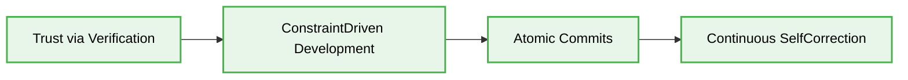
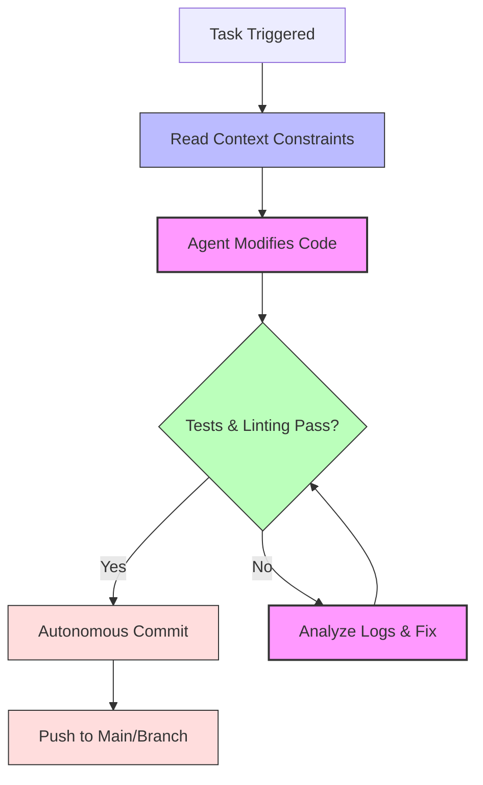
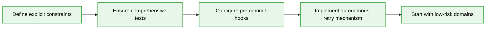

> 📦 [best-practise](../README.md) / 📄 [docs](./)
# ⚡ Vibe Coding: Zero-Approval Workflows

In the 2026 AI Agent landscape, the evolution of Vibe Coding necessitates **Zero-Approval Workflows**. This paradigm allows trusted AI agents to execute, verify, and commit changes autonomously, minimizing human bottlenecks while ensuring systemic integrity. This document outlines the architectural patterns and constraints required for safe, autonomous code evolution.
## 🌟 The Philosophy of Zero-Approval

A Zero-Approval Workflow does not mean zero oversight; it means **deterministic automated oversight**. Instead of human review blocking every trivial commit, rigorous CI/CD pipelines, strict architectural constraints (`.cursorrules`, `agents.md`), and deterministic validation gates act as the approving authority.

### Key Tenets

1.  **Trust via Verification:** Agents earn execution rights through comprehensive test coverage.
2.  **Constraint-Driven Development:** AI agents must operate within strict, pre-defined boundaries (e.g., specific folders, architectural layers).
3.  **Atomic Commits:** Changes must be small, isolated, and reversible.
4.  **Continuous Self-Correction:** Agents must be capable of parsing error logs and iteratively fixing failing pipelines.

---
## 🏗️ Architectural Blueprint for Autonomy

To achieve a true zero-approval state, the infrastructure must provide immediate, high-fidelity feedback to the AI agent.

### 📊 Autonomous Workflow Stages

| Stage | Responsibility | Mechanism | Failure Action |
| :--- | :--- | :--- | :--- |
| **1. Intent Parsing** | Understand the goal and locate constraints. | Parse `AGENTS.md` and relevant `.md` files. | Request human clarification. |
| **2. Local Execution** | Implement the feature/fix. | Modify codebase. | N/A |
| **3. Static Analysis** | Ensure code quality and style adherence. | ESLint, Prettier, SonarQube. | Auto-fix or rewrite. |
| **4. Test Execution** | Verify logic against regressions. | Jest, Playwright, Vitest. | Iterate locally based on logs. |
| **5. Autonomous Commit** | Push verified code to the repository. | Git CLI. | Revert and notify. |

### 🧠 Zero-Approval Data Flow (Mermaid Graph)

---
## 🛡️ Implementing Safety Constraints

Allowing agents to operate autonomously requires strict guardrails.

-   **Directory Scoping:** Restrict agents to specific directories (e.g., an agent updating documentation cannot modify `./backend`).
-   **Immutable Build Artifacts:** Agents must understand that files in `dist/` or `build/` are untouchable and must edit the source files.
-   **Resource Limits:** Cap the number of retry attempts during self-correction to prevent infinite loops and API token drain.

> [!NOTE]
> The `pre-commit` hook is the ultimate gatekeeper in a Zero-Approval workflow. Ensure it runs all critical linters and tests before allowing the `git commit` to proceed.
---
## 📝 Actionable Checklist for Implementation

- [ ] Define explicit, machine-readable constraints in an `AGENTS.md` file.
- [ ] Ensure comprehensive unit and integration tests exist for the target domain.
- [ ] Configure `pre-commit` hooks using tools like Husky to enforce static analysis locally.
- [ ] Implement an autonomous retry mechanism for the AI agent to handle test failures.
- [ ] Start by enabling zero-approval for low-risk domains like documentation updates (`feat(docs)`).

[Back to Top](#-vibe-coding-zero-approval-workflows)
