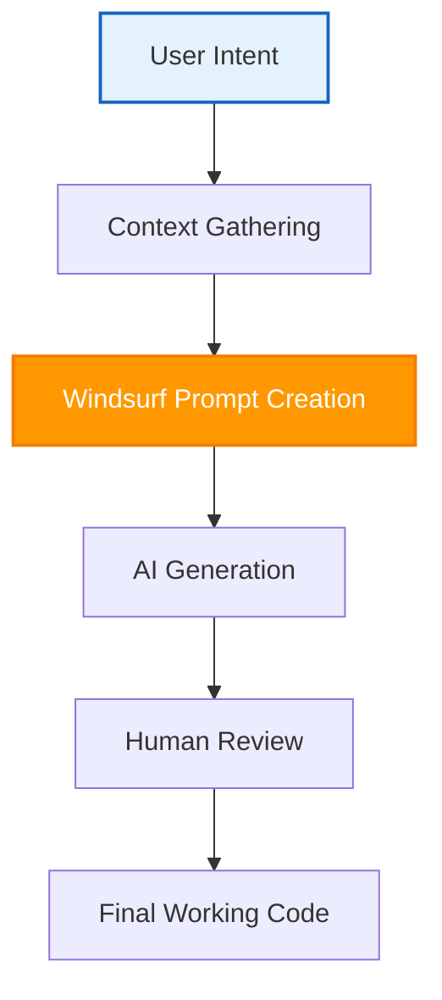

# 🏄 Windsurf Advanced Usage Hints: Mastering Vibe Coding

## 📖 1. Introduction to Windsurf AI Agents

Windsurf is a powerful tool for developers who use AI agents to write code. By understanding how Windsurf works, you can improve your vibe coding workflow. Vibe coding allows you to build software by giving intent-based instructions to an AI agent. This guide provides advanced usage hints to help you get the best results from Windsurf, optimize the context window, and manage memory limits.

## 🏗️ 2. The Windsurf Vibe Coding Workflow

To get good code from Windsurf, you need a clear process. The AI agent needs the right context window to understand what you want. The following diagram shows the best workflow for sending instructions to the Windsurf AI agent.

## 🧠 3. Managing Memory Limits and Context Size

One of the biggest challenges in vibe coding is managing the AI memory limits. If you give the AI agent too much information, it might forget important details in the context window. If you give it too little, it will make mistakes.

Here is a comparison of different ways to manage the context window and memory limits in Windsurf:

| Context Strategy | When to Use | Impact on AI Generation Quality |
| :--- | :--- | :--- |
| **Direct File Reference** | When working on a single file or component. | High accuracy, low memory usage. |
| **Global Rulesets (.windsurfrules)** | When you want to enforce project-wide rules. | Consistent style, medium memory usage. |
| **Full Folder Search** | When you do not know where a code bug is located. | Low accuracy, high memory usage. |

## 💡 4. Advanced Usage Hints for Prompt Creation

To make Windsurf AI agents generate perfect code, follow these simple rules for vibe coding:

1. **Be Specific:** Tell the AI agent exactly which file to change. For example, say "Update the button component in `src/button.tsx`" instead of "Change the button".
2. **Use Clear English:** Write your prompts in simple, direct language. Avoid using complex phrasing.
3. **Limit the Context Window:** Close unnecessary files to keep the context window small and avoid reaching memory limits.

## ✅ 5. Actionable Checklist for Windsurf Vibe Coding Success

Follow these steps every time you start a new vibe coding session with Windsurf:

- [ ] Write a clear and simple prompt that states your exact goal for the AI agent.
- [ ] Open only the files that the AI agent needs to read in the context window.
- [ ] Add a `.windsurfrules` file to your project to set global constraints.
- [ ] Check the generated code for errors before accepting the changes.
- [ ] Keep your context window small by closing old chat sessions to avoid memory limits.