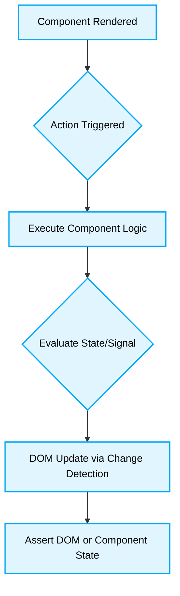

# 🧪 Angular Testing Best Practices

[⬆️ Back to Top](#)
# 📖 Context & Scope
- **Primary Goal:** Establish definitive standards for testing Angular 20+ applications in a Zoneless, signals-driven ecosystem.
- **Target Tooling:** Cursor, Windsurf, Antigravity.
- **Tech Stack Version:** Angular 20+

> [!IMPORTANT]
> **Strict Constraints for AI:**
> - **Always** favor integration testing of the DOM over testing isolated component class logic.
> - **Never** bypass the Angular `TestBed`; embrace the `ComponentFixture` to verify actual rendering.

---

## 🚀 I. Testing Signals

### 🚨 1. Testing Component State Without Rendering
> [!NOTE]
> **Context:** Testing a component that uses `signal()` and `computed()` for state management.
### ❌ Bad Practice
```typescript
it('should increment the counter', () => {
  const component = new CounterComponent();
  component.increment();
  expect(component.count()).toBe(1);
});
```
### ⚠️ Problem
Instantiating the class directly bypasses Angular's Change Detection, dependency injection, and DOM synchronization. It verifies the class logic but guarantees nothing about whether the template actually displays the updated state.
### ✅ Best Practice
```typescript
it('should render incremented counter on click', async () => {
  await TestBed.configureTestingModule({ imports: [CounterComponent] }).compileComponents();
  const fixture = TestBed.createComponent(CounterComponent);

  fixture.componentRef.setInput('initialCount', 0);
  fixture.detectChanges();

  const button = fixture.debugElement.query(By.css('button'));
  button.triggerEventHandler('click', null);
  fixture.detectChanges();

  const text = fixture.debugElement.query(By.css('.count')).nativeElement.textContent;
  expect(text).toContain('1');
});
```



### 🚀 Solution
Always use `TestBed` to create the component. Simulate user interactions via the DOM, run `detectChanges()`, and assert against the rendered output to ensure both the signal and the template are synchronized correctly.

---

## 🔒 II. Mocking Dependencies

### 🚨 2. Over-Mocking the Framework
> [!NOTE]
> **Context:** Injecting dependencies in tests.
### ❌ Bad Practice
```typescript
// Complex manual mocking of HttpClient
const mockHttp = {
  get: () => of({ data: 'fake' })
};

TestBed.configureTestingModule({
  providers: [{ provide: HttpClient, useValue: mockHttp }]
});
```
### ⚠️ Problem
Creating manual mocks for complex framework services like `HttpClient` is error-prone, hard to maintain, and often fails to replicate actual edge cases (e.g., HTTP errors, headers).
### ✅ Best Practice
```typescript
import { provideHttpClient } from '@angular/common/http';
import { provideHttpClientTesting, HttpTestingController } from '@angular/common/http/testing';

beforeEach(() => {
  TestBed.configureTestingModule({
    providers: [
      provideHttpClient(),
      provideHttpClientTesting()
    ]
  });
});

it('should fetch data', () => {
  const httpMock = TestBed.inject(HttpTestingController);
  // Execute call, then:
  const req = httpMock.expectOne('/api/data');
  req.flush({ data: 'real-like' });
});
```
### 🚀 Solution
Utilize built-in testing utilities provided by Angular (`HttpTestingController`, `RouterTestingHarness`). They provide reliable, standardized APIs for asserting and mocking framework-level interactions.

---
[⬆️ Back to Top](#)
