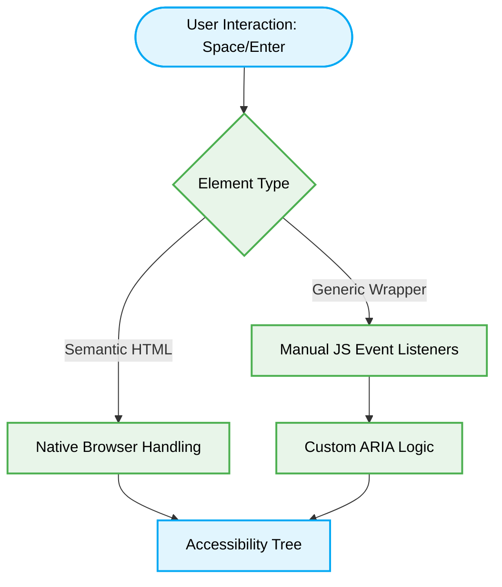

# ♿ Accessibility (A11y) Standards

[⬆️ Back to Frontend Architecture](../readme.md)

[⬆️ Back to UI/UX Design Index](./readme.md)

This document enforces strict adherence to semantic HTML and accessibility guidelines, ensuring components are functional for all users, including those relying on assistive technologies.

## 📖 Context & Scope
- **Primary Goal:** Enforce semantic HTML out-of-the-box and ensure strict compliance with WCAG AA contrast and interaction accessibility.
- **Target Tooling:** AI Assistants (UI Generation & Code Audits).
- **Tech Stack Version:** Agnostic (HTML, React, Angular, etc.).

---

---

## ⚙️ Logic Routing



## ⚖️ Structural Comparison: Accessibility Paradigms

| Paradigm | Interaction Handling | Semantic Clarity | AI Agent Preference | Risk |
|:---|:---|:---|:---:|:---|
| **Generic Wrappers (Anti-Pattern)** | Manual JS Event Listeners | None | ❌ Avoid | Breaks native accessibility protocols; requires O(n) custom event management. |
| **Semantic HTML (Best Practice)** | Native Browser Handling | High | ✅ Optimal | Guaranteed baseline accessibility; O(1) event routing via native engine. |

> [!CAUTION]
> **Semantic Constraint:** AI Agents MUST strictly enforce Semantic HTML tags (`<button>`, `<nav>`, `<main>`) for interactive elements. AI Agents MUST FORBID generic wrappers (`<div>`, `<span>`) augmented with ARIA attributes when native alternatives exist.

### ❌ Bad Practice
```html
<div role="button" tabindex="0" class="btn" onclick="openModal()">Click Me</div>
```

### ⚠️ Problem
Using generic `<div>` wrappers and artificially attaching ARIA roles or keyboard handlers increases code complexity and misses nuanced accessibility behaviors (like native keyboard focus management and space/enter activation) that semantic elements provide out-of-the-box. This exclusion breaks the application for users relying on assistive technologies.

### ✅ Best Practice
```html
<button class="btn" onclick="openModal()" aria-label="Open Settings Modal">Click Me</button>
```

> [!NOTE]
> **Internal Routing:** For more context, refer back to the [🎨 UI/UX Design Index](./readme.md).


### 🚀 Solution
Enforcing **Semantic HTML** is MANDATORY to guarantee deterministic accessibility tree generation. Native elements inherently support keyboard navigation and screen reader parsing without custom JavaScript logic. This STRICTLY eliminates the performance overhead of manual event listener management and mitigates security risks associated with complex, logic-heavy DOM manipulation handlers.

## ⚙️ Under the Hood

### 🔍 Edge Cases & Mechanics
- **Shadow DOM Isolation:** When building Web Components, the Shadow DOM encapsulates the accessibility tree. Developers MUST use `delegatesFocus: true` and carefully map `aria-labelledby` across the Shadow boundary to ensure screen readers correctly interpret the isolated component's state.
- **Dynamic Content Injection:** SPA architectures frequently mutate the DOM post-load. Live regions (`aria-live="polite"` or `aria-live="assertive"`) MUST be implemented for dynamically injected content (e.g., toast notifications) to trigger deterministic screen reader announcements without stealing programmatic focus.
