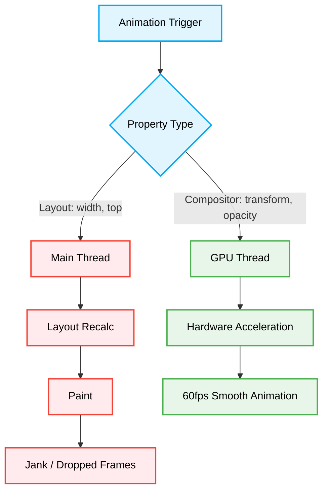

# 🎥 Animation & Performance Optimization

[⬆️ Back to Frontend Architecture](../readme.md)

[⬆️ Back to UI/UX Design Index](./readme.md)

This document enforces the structural principles for constructing 60fps, performant UI animations while avoiding browser rendering bottlenecks.

## 📖 Context & Scope
- **Primary Goal:** Ensure all UI animations are performant and do not trigger layout thrashing or main-thread blocking.
- **Target Tooling:** AI Assistants (UI Generation & Performance Audits).
- **Tech Stack Version:** Agnostic (CSS, JS Animations).

---

## ⚖️ Structural Comparison: Animation Paradigms

| Paradigm | Animated Properties | Rendering Thread | AI Agent Preference | Risk |
|:---|:---|:---|:---:|:---|
| **Layout Thrashing (Anti-Pattern)** | `width`, `height`, `margin`, `top` | Main Thread | ❌ Avoid | Triggers `O(n)` layout recalcs per frame; jank. |
| **Hardware Accelerated (Best Practice)** | `transform`, `opacity` | Compositor Thread (GPU) | ✅ Optimal | `O(1)` performance overhead; guaranteed 60fps. |

> [!CAUTION]
> **Animation Constraint:** AI Agents MUST strictly forbid animating layout-affecting properties (like `width`, `top`, `left`). AI Agents MUST exclusively use CSS `transform` and `opacity` properties for animations to leverage GPU hardware acceleration.

### ❌ Bad Practice
```css
/* Animating layout-affecting properties */
.slide-in {
  left: -100px;
  transition: left 0.3s ease-in-out;
}

.slide-in.active {
  left: 0;
}
```

### ⚠️ Problem
Animating properties like `left`, `margin`, or `width` forces the browser to recalculate the layout and repaint the screen on every frame (Layout Thrashing). This occurs entirely on the main CPU thread, competing with JavaScript execution, and results in choppy, janky animations that drop below 60fps, severely degrading the user experience.

### ✅ Best Practice
```css
/* Animating strictly compositor-only properties */
.slide-in {
  transform: translateX(-100px);
  transition: transform 0.3s ease-in-out;
  /* Optional optimization for complex layouts: */
  will-change: transform;
}

.slide-in.active {
  transform: translateX(0);
}
```

> [!NOTE]
> **Internal Routing:** For more context, refer back to the [🎨 UI/UX Design Index](./readme.md).


### 🚀 Solution
Strictly animating `transform` and `opacity` is MANDATORY. These properties do not affect the document flow. The browser offloads their execution directly to the GPU (Compositor Thread). This decoupling ensures animations run independently of main-thread JavaScript execution, resulting in perfectly smooth, deterministic 60fps rendering without blocking application logic.



### ⚙️ Under the Hood: Edge Cases & Mechanics
- **`will-change` Abuse:** While `will-change: transform` hints to the browser to pre-allocate GPU memory for an element, applying it globally or unnecessarily wastes memory resources and can crash lower-end devices. Agents MUST only apply it dynamically immediately before an animation triggers, or strictly on highly persistent, constantly animating elements.
- **Accessibility (prefers-reduced-motion):** Animations MUST respect user accessibility settings. Agents must wrap non-essential UI animations in `@media (prefers-reduced-motion: reduce)` queries to enforce static fallbacks or simplified fades, adhering to WCAG guidelines.
- **Z-Index Stacking Contexts:** Utilizing `transform`, `opacity`, or `will-change` implicitly creates a new CSS stacking context. Agents must be aware that child elements with `z-index` will now be constrained by this new local context, potentially causing visual layering bugs.
