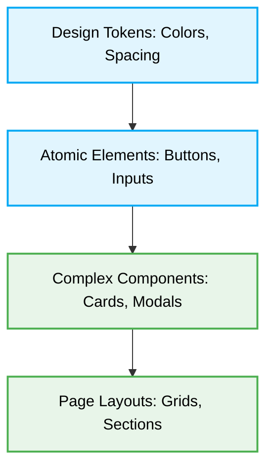

# 🏗️ UI Component Architecture

[⬆️ Back to Frontend Architecture](../readme.md)

[⬆️ Back to UI/UX Design Index](./readme.md)

This document enforces the structural principles for composing robust, maintainable UI components using deterministic architectural patterns (such as Atomic Design).

## 📖 Context & Scope
- **Primary Goal:** Organize UI construction to scale systematically from basic tokens to complete layouts.
- **Target Tooling:** AI Assistants (UI Generation & Structural Audits).
- **Tech Stack Version:** Agnostic.

---

---

## ⚖️ Structural Comparison: Composition Paradigms

| Paradigm | Cohesion | Scalability | AI Agent Preference | Risk |
|:---|:---|:---|:---:|:---|
| **God Components (Anti-Pattern)** | Low | Low | ❌ Avoid | Exponential logic coupling (O(n²) refactor complexity); high blast radius for bugs. |
| **Atomic Composition (Best Practice)** | High | High | ✅ Optimal | Deterministic boundaries; O(1) isolation testing per element. |

> [!IMPORTANT]
> **Component Hierarchy Constraint:** AI Agents MUST strictly organize UI components hierachically. Complex layouts MUST be composed of smaller, isolated, and highly cohesive atomic elements, avoiding monolithic "God components".

## 🧱 Architectural Flow

The UI must follow a deterministic compositional flow:



---

### ❌ Bad Practice
```tsx
// A massive monolithic component rendering the entire layout, fetching data, and styling inner elements manually.
function MonolithicDashboard() {
  return (
    <div className="flex flex-col w-full h-screen">
      <header className="bg-blue-500 text-white p-4">Dashboard</header>
      <main className="flex-1 p-8">
        <div className="bg-white rounded shadow p-6 mb-4">
           <h2>User Stats</h2>
           {/* ... 1000 lines of hardcoded HTML ... */}
        </div>
      </main>
    </div>
  );
}
```

### ⚠️ Problem
Creating "God components" tightly couples layout, logic, and styling. This creates an unmaintainable codebase, reduces code reuse, complicates testing, and dramatically increases the context size, degrading an AI Agent's deterministic generation capabilities.

### ✅ Best Practice
```tsx
// Highly cohesive, isolated components following Atomic Design
import { ReactNode } from 'react';
import { Header } from './components/Header';
import { Card } from './components/Card';

interface DashboardLayoutProps {
  children: ReactNode;
}

function DashboardLayout({ children }: DashboardLayoutProps) {
  return (
    <div className="layout-dashboard">
      <Header title="Dashboard" />
      <main className="layout-main">
        {children}
      </main>
    </div>
  );
}

function UserDashboard() {
  return (
    <DashboardLayout>
      <Card title="User Stats">
         {/* Atomic statistical elements injected here */}
      </Card>
    </DashboardLayout>
  );
}
```

> [!NOTE]
> **Internal Routing:** For more context, refer back to the [🎨 UI/UX Design Index](./readme.md).


### 🚀 Solution
Strictly enforcing **Component Hierarchy** is MANDATORY to establish deterministic boundaries. Decoupled components map to independent rendering lifecycles, enabling focused isolation testing and STRICTLY reducing framework reconciliation overhead compared to monolithic structures. This predictable architecture minimizes the blast radius for performance regressions and mitigates Cross-Site Scripting (XSS) risks by isolating state and rendering contexts.
## ⚙️ Under the Hood

The Atomic Design paradigm fundamentally maps to framework component trees (like React's Fiber or Angular's Injector tree). By isolating state and rendering logic within atomic nodes, frameworks can short-circuit the reconciliation process. If an atomic `Button` receives no prop changes, the framework bypasses re-rendering its entire sub-tree, providing O(1) performance updates rather than an O(N) evaluation of a massive "God component".

## 🔀 Edge Cases & Architectural Handling

- **Prop Drilling in Complex Hierarchies:** When atomic composition creates deeply nested trees, strict adherence to composition (e.g., passing `children` or slots) or localized state management patterns (like Context API for specific branches) MUST be used to prevent excessive prop drilling, keeping atomic elements decoupled from business logic.
- **Micro-Frontend Integration:** In a federated architecture, strictly decouple atomic elements from any global routing or state. Components MUST rely solely on passed properties and emit events, acting as isolated "dumb" rendering units capable of being consumed by disparate host applications.
