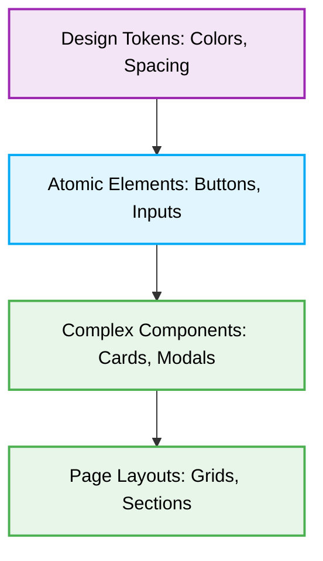

# 🏗️ UI Component Architecture

[⬆️ Back to UI/UX Design Index](./readme.md)

This document enforces the structural principles for composing robust, maintainable UI components using deterministic architectural patterns (such as Atomic Design).

## 📖 Context & Scope
- **Primary Goal:** Organize UI construction to scale systematically from basic tokens to complete layouts.
- **Target Tooling:** AI Assistants (UI Generation & Structural Audits).
- **Tech Stack Version:** Agnostic.

---

> [!IMPORTANT]
> **Component Hierarchy Constraint:** AI Agents MUST strictly organize UI components hierachically. Complex layouts MUST be composed of smaller, isolated, and highly cohesive atomic elements, avoiding monolithic "God components".

## 🧱 Architectural Flow

The UI must follow a deterministic compositional flow:



---

### ❌ Bad Practice
```javascript
// A massive monolithic component rendering the entire layout, fetching data, and styling inner elements manually.
function MonolithicDashboard() {
  return (
    <div className="flex flex-col w-full h-screen">
      <header className="bg-blue-500 text-white p-4">Dashboard</header>
      <main className="flex-1 p-8">
        <div className="bg-white rounded shadow p-6 mb-4">
           <h2>User Stats</h2>
           {/* ... 1000 lines of hardcoded HTML ... */}
        </div>
      </main>
    </div>
  );
}
```

### ⚠️ Problem
Creating "God components" tightly couples layout, logic, and styling. This creates an unmaintainable codebase, reduces code reuse, complicates testing, and dramatically increases the context size, degrading an AI Agent's deterministic generation capabilities.

### ✅ Best Practice
```javascript
// Highly cohesive, isolated components following Atomic Design
import { Header } from './components/Header';
import { Card } from './components/Card';

function DashboardLayout({ children }) {
  return (
    <div className="layout-dashboard">
      <Header title="Dashboard" />
      <main className="layout-main">
        {children}
      </main>
    </div>
  );
}

function UserDashboard() {
  return (
    <DashboardLayout>
      <Card title="User Stats">
         {/* Atomic statistical elements injected here */}
      </Card>
    </DashboardLayout>
  );
}
```

### 🚀 Solution
Strictly enforcing **Component Hierarchy** and composition isolates responsibilities. Granular, decoupled components scale reliably, permit extensive reuse, and provide deterministically predictable architectural contexts, heavily optimizing an AI Agent's capacity to safely audit and refactor the interface.
