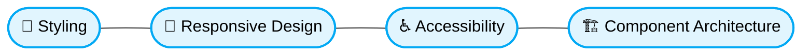

# 🚀 Fundamentals

[⬆️ Back to Top](./readme.md)

## ⚡ I. Fundamentals

### 🚨 1. Hardcoded Styling Values
> [!NOTE]
> **Context:** Defining UI styles globally or locally.

### ❌ Bad Practice
```css
.button {
  background-color: #007bff;
  padding: 10px 20px;
  border-radius: 4px;
}
```

### ⚠️ Problem
Hardcoded values create an inflexible system. They make dark-mode implementation nearly impossible without complex overrides, break responsiveness, and cause visual inconsistencies across the application. AI Agents cannot deterministically apply standard project themes when encountering arbitrary hex codes or pixel values.

### ✅ Best Practice
```css
.button {
  background-color: var(--color-primary);
  padding: var(--spacing-sm) var(--spacing-md);
  border-radius: var(--radius-sm);
}
```

> [!NOTE]
> **Internal Routing:** For more context, refer back to the [🎨 Frontend Architecture](../readme.md).


### 🚀 Solution
Strictly utilize Design Tokens for all styling. This ensures a deterministic, highly cohesive design system. By relying on CSS variables or framework tokens, updates propagate instantly across the app, allowing agents to reliably structure layouts without guessing aesthetic intent.


## 🧠 Core Visual Architecture




---
