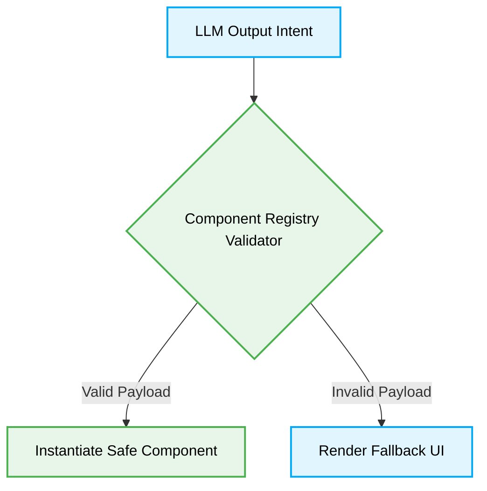

# 🤖 Generative UI Rules & Constraints

[⬆️ Back to Frontend Architecture](../readme.md)

[⬆️ Back to UI/UX Design Index](./readme.md)

This document enforces the strict standards for building and orchestrating AI-driven Generative UI components, ensuring deterministic parsing and rendering safety.

## 📖 Context & Scope
- **Primary Goal:** Ensure Generative UI components are safely dynamically generated without compromising architectural integrity.
- **Target Tooling:** AI Assistants (UI Generation).
- **Tech Stack Version:** Agnostic (React Server Components, v0, etc.).

---

## ⚡ 1. Dynamic UI Generation

### 🚨 1. Unsanitized Dynamic Execution
> [!NOTE]
> **Context:** Receiving dynamic UI payloads from an LLM.

### ❌ Bad Practice
```tsx
function DynamicComponent({ uiPayload }: { uiPayload: string }) {
  // Dangerously rendering raw HTML directly from an AI response
  return <div dangerouslySetInnerHTML={{ __html: uiPayload }} />;
}
```

### ⚠️ Problem
Directly rendering raw string outputs from an AI (or any external source) via `dangerouslySetInnerHTML` is a critical security vulnerability. It exposes the application to severe Cross-Site Scripting (XSS) attacks, breaks component lifecycle management, and creates non-deterministic rendering states that hallucinating AI Agents might exploit or corrupt.

### ✅ Best Practice
```tsx
import { Suspense } from 'react';
import { SafeComponentMapper } from './components/mapper';

function DynamicComponent({ componentName, props }: { componentName: string, props: unknown }) {
  return (
    <Suspense fallback={<LoadingSkeleton />}>
      <SafeComponentMapper name={componentName} payload={props} />
    </Suspense>
  );
}
```

> [!NOTE]
> **Internal Routing:** For more context, refer back to the [🎨 UI/UX Design Index](./readme.md).

### 🚀 Solution
Strictly mapping AI intents to predefined, statically analyzed component registries (e.g., `SafeComponentMapper`) is MANDATORY. This ensures that only trusted, pre-compiled React/UI components are instantiated. It strictly neutralizes XSS risks by avoiding raw DOM injection and forces the LLM to adhere to deterministic typed prop interfaces, significantly improving rendering performance and overall application resilience.

---

## 🧠 Structural Workflow


