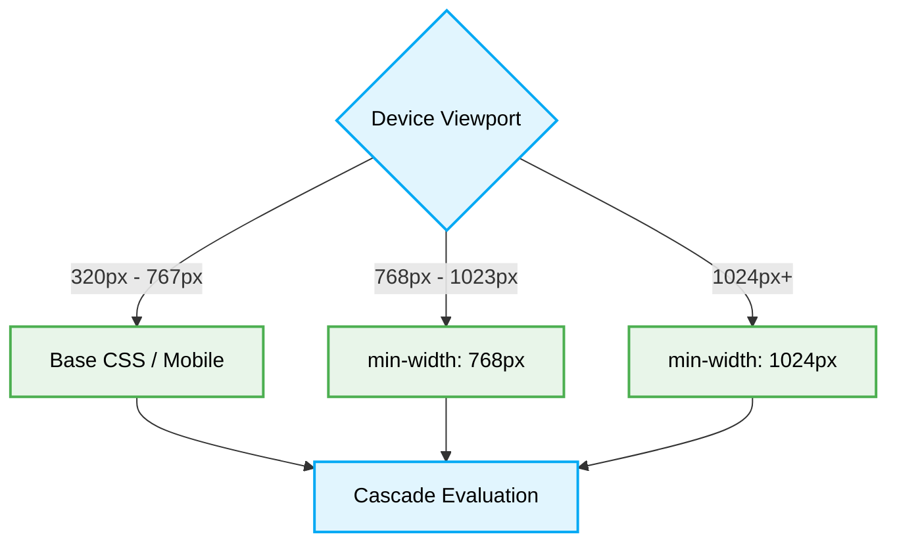

# 📱 Responsive & Adaptive Design Principles

[⬆️ Back to Frontend Architecture](../readme.md)

[⬆️ Back to UI/UX Design Index](./readme.md)

This document enforces the strict standards for building fluid, universally adaptable layouts using a mobile-first approach.

## 📖 Context & Scope
- **Primary Goal:** Ensure layouts are fluid and responsive across all viewports (`320px` to desktop) without horizontal scrolling or breakage.
- **Target Tooling:** AI Assistants (UI Generation & CSS Audits).
- **Tech Stack Version:** Agnostic (CSS, SCSS, Tailwind, Material UI, etc.).

---

---
## ⚙️ Logic Routing



## ⚖️ Structural Comparison: Responsive Paradigms

| Paradigm | Default Viewport | Scaling Mechanism | AI Agent Preference | Risk |
|:---|:---|:---|:---:|:---|
| **Desktop-First (Anti-Pattern)** | Desktop (`> 1024px`) | `max-width` constraints down to mobile. | ❌ Avoid | Breaks mobile layouts; complex media queries. |
| **Mobile-First (Best Practice)** | Mobile (`< 768px`) | `min-width` progressive enhancements. | ✅ Optimal | Deterministic scaling; highly predictable CSS context. |

> [!IMPORTANT]
> **Mobile-First Constraint:** AI Agents MUST strictly apply a mobile-first approach. Define base CSS for mobile screens and progressively enhance the layout for larger viewports using `min-width` media queries. Always prefer relative units (`rem`, `%`) over absolute units (`px`).

### ❌ Bad Practice
```css
.container {
  width: 960px;
}

@media (max-width: 768px) {
  .container {
    width: 100%;
  }
}
```

### ⚠️ Problem
A desktop-first approach with absolute units (`px`) often leads to horizontal scrolling on mobile devices and rigid layouts that break unpredictably on intermediate screen sizes.

### ✅ Best Practice
```css
.container {
  width: 100%;
  padding: 1rem;
}

@media (min-width: 768px) {
  .container {
    max-width: 48rem;
    padding: 2rem;
  }
}
```

> [!NOTE]
> **Internal Routing:** For more context, refer back to the [🎨 UI/UX Design Index](./readme.md).


### 🚀 Solution
Implementing a **Mobile-First Approach** using relative units is MANDATORY. Enforcing base constraints on mobile and dynamically scaling upward STRICTLY limits layout shift (CLS) and reduces the CSS parser's evaluation overhead. This unified cascading structure inherently standardizes deterministic scaling properties, ensuring robust layout performance and mitigating the risk of unpredictable rendering states.

## ⚙️ Under the Hood

### 🔍 Edge Cases & Mechanics
- **Sub-Pixel Rendering Issues:** When using percentage-based widths or fractional `rem` values, browsers calculate sub-pixels. This can cause grid alignment errors or wrapping on certain devices. Using CSS Grid with `fr` units or `calc()` functions with explicit roundings mitigates layout breaking in flex containers.
- **Viewport Height Variations:** On mobile browsers, the URL bar dynamically hides/shows, changing the viewport height. Relying on `100vh` leads to hidden content. Developers MUST use `dvh` (dynamic viewport height) or implement JS workarounds for `vh` variables to ensure bottom-anchored UI components remain visible during scrolling.
