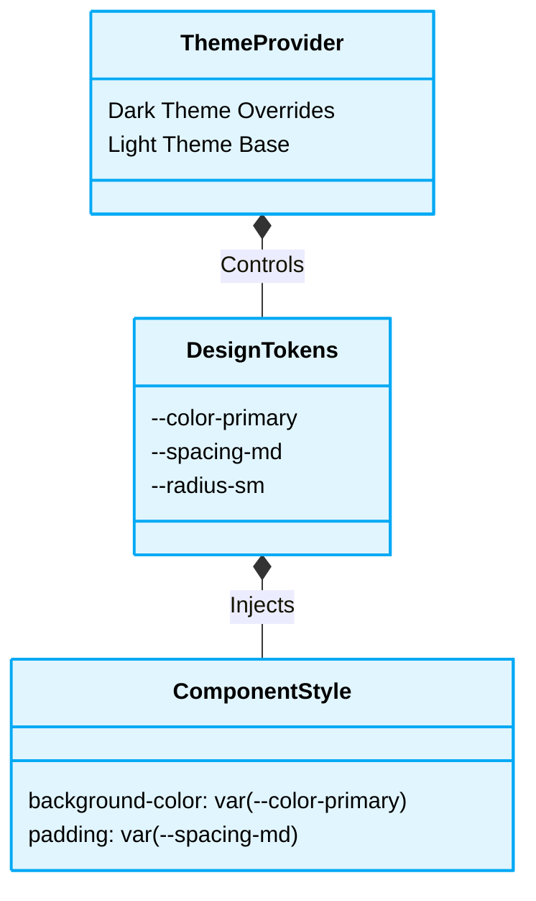

# 🎨 UI/UX Styling & Design Tokens Rules

[⬆️ Back to Frontend Architecture](../readme.md)

[⬆️ Back to UI/UX Design Index](./readme.md)

This document enforces the strict styling rules and constraints regarding design tokens and deterministic styling implementations.

## 📖 Context & Scope
- **Primary Goal:** Enforce the usage of design tokens and prevent hardcoded styling values to maintain themeability and structural rhythm.
- **Target Tooling:** AI Assistants (UI Generation & CSS Audits).
- **Tech Stack Version:** Agnostic (CSS, SCSS, Tailwind, Material UI, etc.).

---

---
## ⚙️ Logic Routing



## ⚖️ Structural Comparison: Styling Paradigms

| Paradigm | Value Definition | Reusability | AI Agent Preference | Risk |
|:---|:---|:---|:---:|:---|
| **Hardcoded Values (Anti-Pattern)** | Inline hex codes (e.g., `#FFF`) | None | ❌ Avoid | Fragments visual consistency; impossible to theme globally. |
| **Design Tokens (Best Practice)** | CSS Custom Properties (e.g., `var(--color-bg)`) | High | ✅ Optimal | Single source of truth; supports dark mode and safe refactoring. |

> [!CAUTION]
> **Hardcoded Values Constraint:** AI Agents MUST NEVER use hardcoded colors, spacing, or typography values (e.g., `#FF0000`, `14px`). AI Agents MUST ALWAYS use established **Design Tokens** (e.g., CSS Variables `var(--color-primary)` or Tailwind classes like `text-primary`, `p-4`).

### ❌ Bad Practice
```css
.card {
  margin: 20px;
  background-color: #ffffff;
  color: #333333;
}
```

### ⚠️ Problem
Using hardcoded absolute values (`20px`, hex codes) creates inconsistencies across the application. It prevents dynamic theming (e.g., Dark Mode), breaks structural rhythm when responsive layouts scale, and complicates global design system updates.

### ✅ Best Practice
```css
.card {
  margin: var(--spacing-lg);
  background-color: var(--bg-surface);
  color: var(--text-primary);
}
```

> [!NOTE]
> **Internal Routing:** For more context, refer back to the [🎨 UI/UX Design Index](./readme.md).


### 🚀 Solution
Strictly utilizing **Design Tokens** is MANDATORY to establish deterministic visual contracts. Constraining styles strictly to these centrally-managed tokens ensures a single source of truth, reducing CSS payload size and standardizing rendering performance. This pattern STRICTLY prevents arbitrary style manipulation, mitigating style-based injection vulnerabilities and enforcing uncompromised environmental immutability for safe AI Agent parsing.

## ⚙️ Under the Hood

### 🔍 Edge Cases & Mechanics
- **CSS Variable Specificity:** CSS variables inherit down the DOM tree. If a component defines a local token (e.g., `--btn-bg`) but fails to scope it properly, child components might inadvertently inherit and override their own default backgrounds. Strict block-level scoping via BEM or CSS Modules is required.
- **Flash of Unstyled Content (FOUC) in SSR:** When implementing Dark Mode using design tokens via JS-injected classes (e.g., `document.documentElement.classList.add('dark')`), Server-Side Rendered apps (Next.js, Angular Universal) will flash the default light theme before hydration. A blocking inline script MUST be placed in the `<head>` to read local storage and inject the correct class before the body parses.
