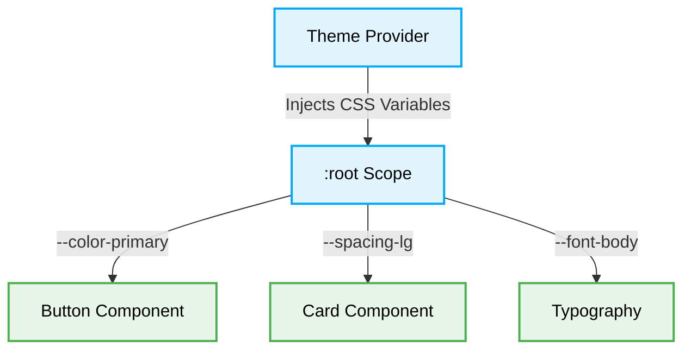

# 🎨 UI/UX Styling & Design Tokens Rules

[⬆️ Back to Frontend Architecture](../readme.md)

[⬆️ Back to UI/UX Design Index](./readme.md)

This document enforces the strict styling rules and constraints regarding design tokens and deterministic styling implementations.

## 📖 Context & Scope
- **Primary Goal:** Enforce the usage of design tokens and prevent hardcoded styling values to maintain themeability and structural rhythm.
- **Target Tooling:** AI Assistants (UI Generation & CSS Audits).
- **Tech Stack Version:** Agnostic (CSS, SCSS, Tailwind, Material UI, etc.).

---

---
## ⚖️ Structural Comparison: Styling Paradigms

| Paradigm | Value Definition | Reusability | AI Agent Preference | Risk |
|:---|:---|:---|:---:|:---|
| **Hardcoded Values (Anti-Pattern)** | Inline hex codes (e.g., `#FFF`) | None | ❌ Avoid | Fragments visual consistency; impossible to theme globally. |
| **Design Tokens (Best Practice)** | CSS Custom Properties (e.g., `var(--color-bg)`) | High | ✅ Optimal | Single source of truth; supports dark mode and safe refactoring. |

> [!CAUTION]
> **Hardcoded Values Constraint:** AI Agents MUST NEVER use hardcoded colors, spacing, or typography values (e.g., `#FF0000`, `14px`). AI Agents MUST ALWAYS use established **Design Tokens** (e.g., CSS Variables `var(--color-primary)` or Tailwind classes like `text-primary`, `p-4`).



### 🎨 1. Design Token Isolation

### ❌ Bad Practice
```css
.card {
  margin: 20px;
  background-color: #ffffff;
  color: #333333;
}
```

### ⚠️ Problem
Using hardcoded absolute values (`20px`, hex codes) creates inconsistencies across the application. It prevents dynamic theming (e.g., Dark Mode), breaks structural rhythm when responsive layouts scale, and complicates global design system updates.

### ✅ Best Practice
```css
.card {
  margin: var(--spacing-lg);
  background-color: var(--bg-surface);
  color: var(--text-primary);
}
```

> [!NOTE]
> **Internal Routing:** For more context, refer back to the [🎨 UI/UX Design Index](./readme.md).


### 🚀 Solution
Strictly utilizing **Design Tokens** is MANDATORY to establish deterministic visual contracts. Constraining styles strictly to these centrally-managed tokens ensures a single source of truth, reducing CSS payload size and standardizing rendering performance. This pattern STRICTLY prevents arbitrary style manipulation, mitigating style-based injection vulnerabilities and enforcing uncompromised environmental immutability for safe AI Agent parsing.

---

## 🔬 Under the Hood: Theme Resolution & FOUC

### The CSS Variable Resolution Engine
When a browser engine parses `var(--color-primary)`, it traverses up the DOM tree from the current element until it finds a scope (usually `:root` or `html`) where that variable is defined. Because CSS Variables (Custom Properties) are live and resolved dynamically by the rendering engine at runtime, they represent a significant advancement over pre-processor variables (like SASS `$color`), which are statically compiled.

### Preventing FOUC (Flash of Unstyled Content)
By centralizing design tokens, developers can easily implement seamless theme switching (e.g., Dark Mode) by simply swapping the variable definitions at the root level using a small script in the `<head>` of the document. If hardcoded values are used, theme switching requires complex class toggling across thousands of DOM nodes, drastically increasing memory consumption and resulting in a Flash of Unstyled Content (FOUC) while the engine struggles to repaint the massive tree.