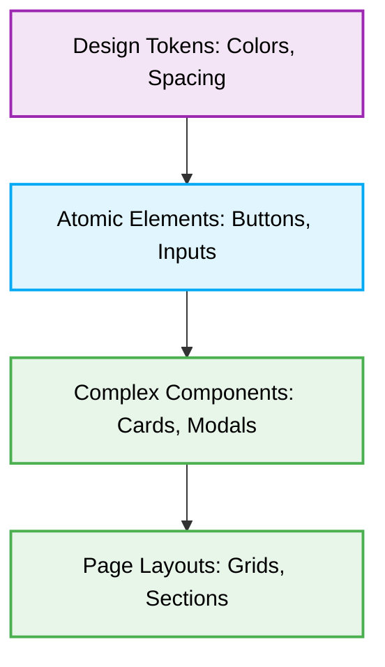

# 🎨 UI/UX Design & Styling Rules for Jules

[⬆️ Back to UI/UX Design](./readme.md)

This document outlines the core styling rules and design principles for generating UI components, emphasizing accessibility, responsive design, and component architecture.

## 📖 1. Context & Scope
- **Primary Goal:** Maintain a consistent, **accessible (a11y)**, and visually appealing user interface across all applications through strict **responsive design** practices.
- **Target Tooling:** Jules AI agent (UI Generation & CSS Audits).
- **Tech Stack Version:** Agnostic (CSS, SCSS, Tailwind, Material UI, etc.).

<div align="center">
  
</div>

---
## 🎨 2. Design System & Styling Rules

> [!CAUTION]
> **Hardcoded Values:** Never use hardcoded colors, spacing, or typography values (`#FF0000`, `14px`). Always use established **Design Tokens** (e.g., CSS Variables or Tailwind classes like `text-primary`, `p-4`).

### ❌ Bad Practice
```css
.card {
  margin: 20px;
  background-color: #ffffff;
  color: #333333;
}
```

### ⚠️ Problem
Using hardcoded absolute values (`20px`, hex codes) creates inconsistencies across the application. It prevents dynamic theming (e.g., Dark Mode) and breaks structural rhythm when responsive layouts scale.

### ✅ Best Practice
```css
.card {
  margin: var(--spacing-lg);
  background-color: var(--bg-surface);
  color: var(--text-primary);
}
```

### 🚀 Solution
Strictly utilize **Design Tokens**. They establish a single source of truth for all visual properties, allowing the application to scale efficiently while maintaining a unified, easily adjustable design system.

---
## 📱 3. Responsive & Adaptive Principles

### ❌ Bad Practice
```css
.hero-text {
  font-size: 32px;
}
```

### ⚠️ Problem
Absolute units like `px` for layout and typography ignore user preference settings in the browser and do not scale fluidly across different viewport sizes.

### ✅ Best Practice
```css
.hero-text {
  font-size: 2rem;
}
```

### 🚀 Solution
Prefer relative units (`rem`, `em`, `vh`, `vw`, `%`). Always employ a **Mobile-First Approach**, defining base CSS for mobile screens and progressively enhancing the layout for larger viewports using `min-width` media queries.

---
## ♿ 4. Accessibility (A11y) Standards

### ❌ Bad Practice
```html
<div role="button" tabindex="0" class="btn" onclick="openModal()">Click Me</div>
```

### ⚠️ Problem
Using generic `<div>` wrappers and artificially attaching ARIA roles or keyboard handlers increases code complexity and often misses nuanced accessibility behaviors that native elements provide out-of-the-box.

### ✅ Best Practice
```html
<button class="btn" onclick="openModal()">Click Me</button>
```

### 🚀 Solution
Enforce **Semantic HTML**. Use native HTML5 tags (`<button>`, `<nav>`, `<main>`). Ensure interactive elements are keyboard reachable and visually indicate focus via `:focus-visible`. Maintain a minimum contrast ratio of 4.5:1 for standard text.

---
## 🏗️ 5. UI Component Architecture



---
## ✅ 6. Checklist for Jules Agent

When generating UI components or modifying styles:
- [ ] Verify that the component works properly on mobile (`320px`), tablet, and desktop viewports.
- [ ] Check if the element handles long text variations without breaking the layout (overflow control).
- [ ] Ensure all images have descriptive `alt` attributes, or empty `alt=""` if strictly decorative.
- [ ] Validate that interactive state changes (hover, active, disabled) are clearly visible to the user.
