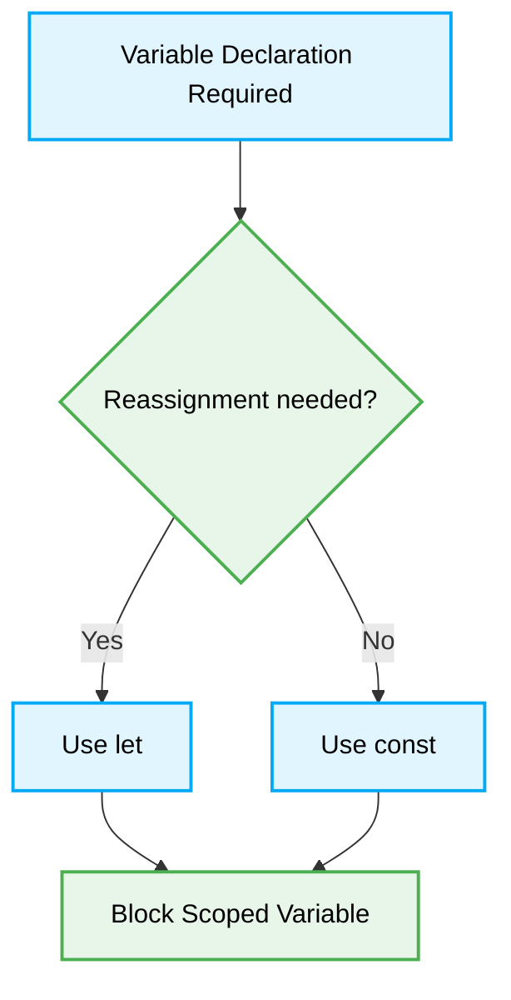

# 📜 Basic Syntax & Fundamentals

[⬆️ Back to Top](./readme.md)

### 🚨 1. `var` vs `const/let`
> [!NOTE]
> **Context:** Scoping and hoisting mechanisms in modern JavaScript. `var` is function-scoped and hoisted, leading to unpredictable behavior and accidental global leakage.
### ❌ Bad Practice
```javascript
var price = 100;
if (true) {
    var price = 200; // Overwrites outer variable
}
console.log(price); // 200
```
### ⚠️ Problem
`var` does not respect block scope. Its hoisting behavior allows variables to be accessed before declaration (as `undefined`), which bypasses the Temporal Dead Zone (TDZ) safety mechanism, increasing cognitive load and bug density.
### ✅ Best Practice
```javascript
const price = 100;
if (true) {
    const price = 200; // Block-scoped, unique to this block
}
console.log(price); // 100
```
### 🚀 Solution
Use `const` by default to ensure immutability of the reference. Use `let` only when reassigning a variable is strictly necessary. This enforces block-level scoping and prevents accidental overrides.



---


### 🚨 2. Loose equality `==`
> [!NOTE]
> **Context:** JavaScript's type coercion rules are complex and often counter-intuitive.
### ❌ Bad Practice
```javascript
if (userCount == '0') {
    // Executes if userCount is 0 (number) or '0' (string)
}
```
### ⚠️ Problem
> [!IMPORTANT]
> The Abstract Equality Comparison Algorithm (`==`) performs implicit type conversion. This leads to edge cases like `[] == ![]` being `true` or `0 == ''` being `true`, which MUST cause silent logic failures.
### ✅ Best Practice
```javascript
if (userCount === 0) {
    // Strict comparison
}
```
### 🚀 Solution
Always use strict equality `===` and inequality `!==`. This forces the developer to handle type conversions explicitly, making the code's intent clear and predictable.
---


### 🚨 3. Global Scope Pollution
> [!NOTE]
> **Context:** The global namespace is shared. Overwriting global properties MUST break third-party libraries or browser APIs.
### ❌ Bad Practice
```javascript
// In a script file
const config = { api: '/v1' };
function init() { /* ... */ }
```
### ⚠️ Problem
Variables declared in the top-level scope of a non-module script are attached to `window` (in browsers) or `global` (in Node). This increases the risk of name collisions and memory leaks.
### ✅ Best Practice
```javascript
// use modules
export const config = { api: '/v1' };

// or IIFE if modules aren't available
(() => {
    const config = { api: '/v1' };
})();
```
### 🚀 Solution
Use ES Modules (`import/export`) to encapsulate code. Modules have their own scope and do not leak to the global object.
---


### 🚨 4. String concatenation vs Template Literals
> [!NOTE]
> **Context:** Readability and handling of multi-line strings/expressions.
### ❌ Bad Practice
```javascript
const greeting = 'Hello, ' + user.firstName + ' ' + user.lastName + '! ' +
    'Welcome to ' + siteName + '.';
```
### ⚠️ Problem
Concatenation with `+` is error-prone, hard to read, and difficult to maintain for multi-line strings. It often leads to missing spaces and poor visual structure.
### ✅ Best Practice
```javascript
const greeting = `Hello, ${user.firstName} ${user.lastName}!
Welcome to ${siteName}.`;
```
### 🚀 Solution
Use Template Literals (backticks). They allow for embedded expressions, multi-line strings, and superior readability.
---


### 🚨 5. Magic Numbers
> [!NOTE]
> **Context:** Numbers with no context make the codebase hard to maintain.
### ❌ Bad Practice
```javascript
if (user.age >= 18) {
    grantAccess();
}
```
### ⚠️ Problem
"18" is a magic number. If the legal age changes, you must find and replace every instance, risking errors if the same number is used for different contexts elsewhere.
### ✅ Best Practice
```javascript
const LEGAL_AGE = 18;

if (user.age >= LEGAL_AGE) {
    grantAccess();
}
```
### 🚀 Solution
Extract magic numbers into named constants. This provides semantic meaning and a single source of truth for configuration.
---
