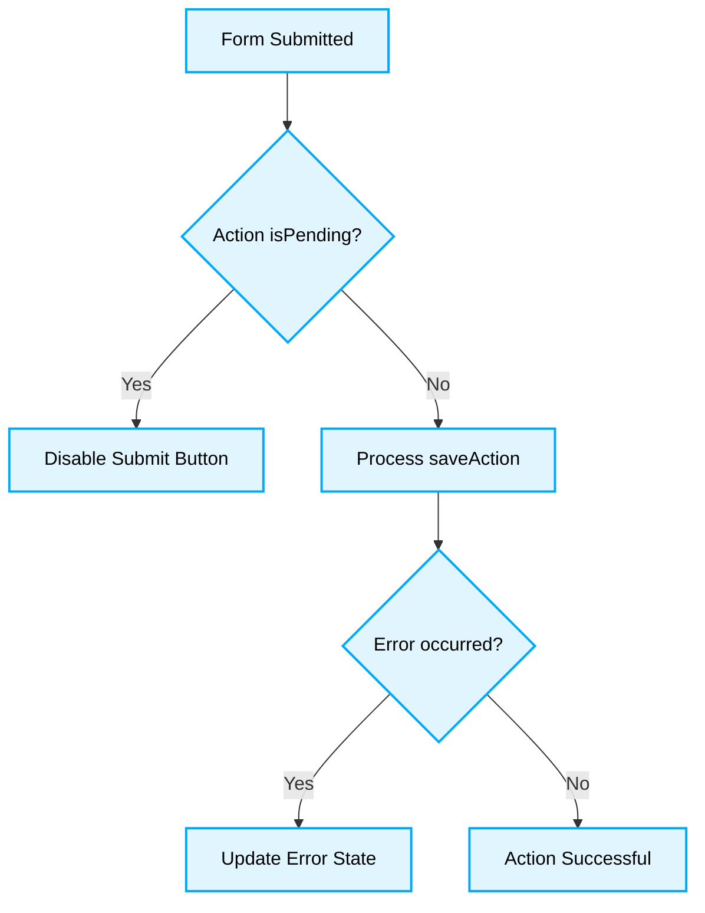

# 🔄 React State Management & Server Actions Best Practices

[⬆️ Back to Top](#)
# 📖 Context & Scope
- **Primary Goal:** Provide best practices for managing state, including React 19+ Server Actions.
- **Target Tooling:** Cursor, Windsurf, Antigravity.
- **Tech Stack Version:** React 19+
## 📚 Topics

### 🚨 1. Handling Async Actions (Forms)
> [!NOTE]
> **Context:** Managing state updates triggered by form submissions or asynchronous operations.
### ❌ Bad Practice
```tsx
import { useState } from 'react';

function Form() {
  const [isPending, setIsPending] = useState(false);
  const [error, setError] = useState(null);

  const handleSubmit = async (e) => {
    e.preventDefault();
    setIsPending(true);
    setError(null);
    try {
      await saveAction(new FormData(e.target));
    } catch (err) {
      setError(err);
    } finally {
      setIsPending(false);
    }
  };

  return <form onSubmit={handleSubmit}>...</form>;
}
```
### ⚠️ Problem
Manually managing `isPending` and error states is repetitive and prone to race conditions, especially when multiple requests are fired. It creates unnecessary state overhead.
### ✅ Best Practice
```tsx
import { useActionState } from 'react';
import { saveAction } from './actions';

function Form() {
  const [error, submitAction, isPending] = useActionState(saveAction, null);

  return (
    <form action={submitAction}>
      {error && <p>{error.message}</p>}
      <button disabled={isPending}>Submit</button>
    </form>
  );
}
```



### 🚀 Solution
Use the `useActionState` Hook (React 19+) for seamless action state management. This hook natively handles loading and error states, resolves race conditions by ensuring only the latest action state is applied to the UI, and optimizes rendering cycles deterministically.

### 🚨 2. Using Global State Naively
> [!NOTE]
> **Context:** Storing local component UI state in a global store (e.g., Redux, Zustand).
### ❌ Bad Practice
```tsx
import { useStore } from './store';

function Dropdown() {
  const isOpen = useStore(state => state.isDropdownOpen);
  const toggle = useStore(state => state.toggleDropdown);
  return <div onClick={toggle}>{isOpen ? 'Open' : 'Closed'}</div>;
}
```
### ⚠️ Problem
Putting local, ephemeral UI state (like a dropdown's `isOpen` flag) into a global store causes unnecessary global re-renders, inflates store complexity, and couples isolated UI logic to the global application state.
### ✅ Best Practice
```tsx
import { useState } from 'react';

function Dropdown() {
  const [isOpen, setIsOpen] = useState(false);
  return <div onClick={() => setIsOpen(!isOpen)}>{isOpen ? 'Open' : 'Closed'}</div>;
}
```
### 🚀 Solution
Use `useState` or `useReducer` for UI state that belongs locally to a component tree. Only elevate state to a global store when it is shared across multiple disjoint component branches, maintaining strict state colocation for optimal rendering performance.

[⬆️ Back to Top](#)
