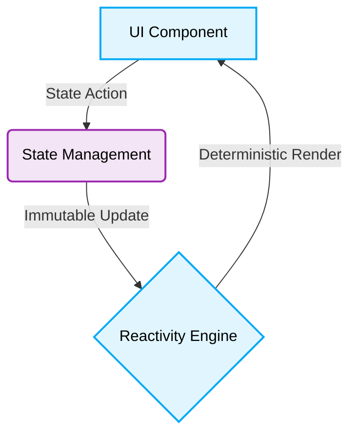

# 🎨 Frontend Best Practices & Production-Ready Patterns

[🏠 Back to Main](../README.md)

# 📖 Context & Scope
- **Primary Goal:** Outline the overarching philosophy and standards for Frontend development inside the ecosystem.
- **Target Tooling:** Cursor, Windsurf, Antigravity.
- **Tech Stack Version:** Agnostic

<div align="center">
  
  
  **The overarching philosophy and foundations for all internal Frontend technologies.**
</div>
---
## 🏗 Architecture Principles

- Adhere to the defined [Architectural Patterns](../../architectures/readme.md) when building applications.
- Strongly prefer **Feature Sliced Design (FSD)** for applications scaling across multiple teams.
## 🤖 Technical Requirements for AI Generation

> [!IMPORTANT]
> **Constraint:** Do not mutate shared DOM properties directly unless explicitly interacting with Browser APIs outside the framework context.



### 🚨 1. TypeScript Strictness
> [!NOTE]
> **Context:** Ensuring deterministic, type-safe execution.
### ❌ Bad Practice
```typescript
function processEvent(event: any) {
    console.log(event.target.value);
}
```
### ⚠️ Problem
Using `any` disables static analysis and opens the door to runtime exceptions.
### ✅ Best Practice
```typescript
function processEvent(event: unknown) {
    if (event instanceof Event && event.target instanceof HTMLInputElement) {
        console.log(event.target.value);
    }
}
```
### 🚀 Solution
Exploit TypeScript. Use `unknown` and Type Guards to enforce explicit return types and strict contract adherence.

### 🚨 2. State Management Coupling
> [!NOTE]
> **Context:** Managing UI updates and reactivity.
### ❌ Bad Practice
```typescript
function render() {
    window.globalState.user = "Alice"; // Direct mutation
}
```
### ⚠️ Problem
Direct mutation or tight coupling of presentation layers to global state causes unpredictable re-renders and violates isolation.
### ✅ Best Practice
```typescript
function render(userStore: UserStore) {
    userStore.updateUser("Alice"); // Abstracted call
}
```
### 🚀 Solution
Abstract global state logically depending on the specific framework rules. Ensure immutable updates.
## 💻 Technologies Included

This folder acts as a container for documentation around the following technologies:
- [Angular](./angular/readme.md)
- [JavaScript](./javascript/readme.md)
- [TypeScript](./typescript/readme.md)
- [React](./react/readme.md)
- [SolidJS](./solidjs/readme.md)
- [Qwik](./qwik/readme.md)

## 🎨 UI/UX Design & Styling
- [Styling Rules](./design-ui/styling.md)
- [Responsive Design](./design-ui/responsive-design.md)
- [Accessibility](./design-ui/accessibility.md)
- [Component Architecture](./design-ui/component-architecture.md)
- [Generative UI](./design-ui/generative-ui.md)

- [UI/UX Design Index](./design-ui/readme.md)

